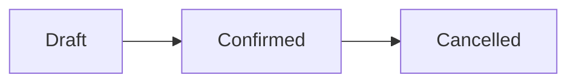

## Overview

2-4 sentences in plain language: what business problem this feature solves, who uses it, and when it's
triggered. Write for the person reading the doc, not the system. Say what the user can do, not how it's built.

## Prerequisites

List anything that must be true before someone can use this feature. This renders as a callout box.

- Profile / permission set required
- Dependent configuration that must already exist (e.g. a Record Type, a Flow, a Queue)

## Steps to Navigate

Numbered, step-by-step instructions exactly as a user would click through Salesforce.

1. Click the gear icon in the top-right, then click **Setup**.
2. Continue numbering every click, field entry, and selection until the task is complete.

## Use Cases

If the feature covers more than one distinct scenario, break EACH one out as its own `###`
sub-section with its own numbered steps (and screenshot blocks where a step needs a picture).
A page with only its happy-path steps documented is incomplete — enumerate the variants a real
user hits: the standard path, the exception path, the correction/undo path, the bulk path.

### Scenario name (e.g. "Approve a standard request")

1. Numbered steps for exactly this scenario.
2. Note where it diverges from the main flow and what the user sees.

### Another scenario (e.g. "Reject and resubmit")

1. ...

## Validations & Business Rules

Any validation rules, required fields, automation (Flow/Apex trigger), or business logic that affects this
feature. This is what an admin/support person needs to know when something doesn't behave as expected.

- Validation rule: `Field__c` is required when `Status__c = 'Active'`
- Automation: a Flow/Trigger runs on save that does X

## Related Features

- Optional: links or references to adjacent features, written as plain text

<!--
CALLOUT BLOCK CONVENTION
------------------------
Use a fenced code block tagged `callout` anywhere you need a "Before you start" / Note / Tip / Warning box:

```callout
type: tip
Any **markdown** body text goes here, on the lines after `type:`.
```

`type` is one of: before | note | tip | warning. (A `deprecated` banner instead comes from this page's own
frontmatter — see `deprecated`/`replacement` above — not from a callout block.)

DIAGRAM BLOCK CONVENTION
------------------------
Use a fenced code block tagged `mermaid` wherever a picture explains the behavior better than
prose — status lifecycles, decision logic, multi-actor handoffs. It renders as a real diagram on
the site (and stays readable as text in the raw Markdown). Prefer:

  - `flowchart LR/TD` for status lifecycles and decision trees
  - `sequenceDiagram` for multi-system handoffs (UI -> Apex -> external service)



Every page documenting a record lifecycle or an automated decision SHOULD have at least one
diagram in Overview or Validations & Business Rules.

SCREENSHOT BLOCK CONVENTION
----------------------------
Use a fenced code block tagged `screenshot` inside "Steps to Navigate" wherever a step needs a picture:

```screenshot
id: feature-name-some-step
alt: Plain-language description of exactly what the screenshot shows
step: The action to perform to reach this screen (what the capture workflow will do)
url_pattern: /lightning/r/Object__c/{recordId}/view
```

- `id` — unique across all docs, kebab-case, prefixed with the page slug (e.g. `order-lifecycle-record-page`).
- `alt` — used as the image's alt text and shown under the placeholder until captured.
- `step` — shown as "Capture: ..." under the placeholder; human-readable description of the action.
- `url_pattern` — the page to navigate to. Use `{recordId}` for a record page — it's resolved automatically
  via SOQL. Enough on its own for a screenshot that is "just a page".
- `actions` — OPTIONAL, for a screenshot that must depict an interaction rather than a page. A list of
  declarative UI steps the capture suite replays in order (from the Home page), then screenshots the result.
  When `actions` is present it takes precedence over `url_pattern` (keep `url_pattern` anyway as a fallback
  description of where the step lives).

```screenshot
id: feature-name-app-launcher
alt: App Launcher open with "Orders" typed into the search box
step: Open the App Launcher and search for Orders
url_pattern: /lightning/app/AppLauncher
actions:
  - open_app_launcher
  - search_app_launcher: Orders
```

Supported action verbs (executed top to bottom; every navigation-type verb waits for the page to be FULLY
rendered — spinners AND skeleton stencils gone — before the next verb runs):

  - `goto: /lightning/...`                         navigate to a relative Lightning URL
  - `open_app_launcher`                            open the waffle-menu App Launcher
  - `search_app_launcher: <text>`                  type into the App Launcher search (opens it if needed)
  - `click_app_launcher_result: <name>`            click an app tile / item link in the open launcher
  - `click_tab: <label>`                           click a nav-bar tab ("More" overflow handled automatically)
  - `click_new`                                    click the New action on the current list view, wait for the form
  - `fill_field: { field: Field_API_Name__c, value: some text }`   fill a form input (label text as fallback)
  - `click_button: <label>`                        click a button by its visible text (e.g. Save, Cancel)
  - `open_record: <ObjectApiName>`                 open the most recent record of that object (SOQL-resolved)
  - `press: <key>`                                 press a keyboard key (e.g. Escape)
  - `wait: <seconds>`                              extra settle time, rarely needed

`build-site.js` renders a real `` once a matching file exists at `docs/images/<id>.png` (or `.jpg`),
otherwise a dashed "Screenshot pending" placeholder with the `alt`/`step` text. `docs/screenshot-manifest.json`
is generated from every `screenshot` block across all pages (including `actions`) — it is the single input
the capture workflow reads; nothing else needs editing to add a new screenshot.
-->
