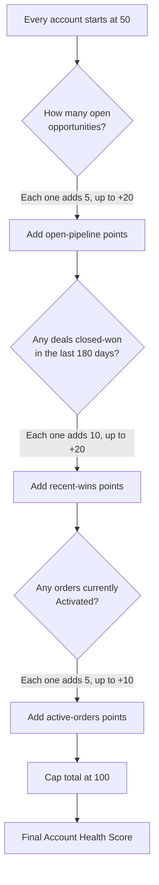

## Overview

Account Health Score gives sales reps and managers a quick, at-a-glance number — from 0 to 100 — summarizing
how an account is trending, without them having to dig through open opportunities, recent deal history, and
order status separately. It's a read-only calculation: looking at it never changes anything on the account,
and it's recomputed fresh from current data every time it's requested rather than stored on the record.



## Prerequisites

- Read access to Accounts, Opportunities, and Orders — the score is calculated on the fly from these records, not from any special configuration
- No permission set, Flow, or Record Type needs to be set up beforehand; there is nothing to enable

## Steps to Navigate

1. Click the **App Launcher** and search for **Accounts**.
2. Open the account record you want to check.
3. The Account Health Score is shown as a number from 0 to 100 wherever the health score component is placed on the record page.

```screenshot
id: account-health-score-record-page
alt: Account record page showing the Account Health Score value
step: Open an Account record to view its Account Health Score
url_pattern: /lightning/r/Account/{recordId}/view
actions:
  - open_record: Account
```

## Use Cases

### A quiet account with no recent activity

1. Open an account that has no open opportunities, no deals closed-won in the last 180 days, and no activated orders.
2. Its Account Health Score is **50** — the baseline every account starts from.

### An account with open pipeline

1. Open an account that has one or more open (not-closed) opportunities.
2. Each open opportunity adds 5 points to the score, up to a maximum of +20 (four or more open opportunities all give the same +20).
3. The score rises above the 50 baseline accordingly, up to 70 from this factor alone.

### An account with recent closed-won deals

1. Open an account that has one or more opportunities closed-won within the last 180 days.
2. Each recent win adds 10 points, up to a maximum of +20 (two or more recent wins both give the same +20).
3. This stacks with the open-pipeline points from the same account.

### An account with active orders

1. Open an account that has one or more Orders with **Status = Activated**.
2. Each activated order adds 5 points, up to a maximum of +10 (two or more activated orders both give the same +10).

### A highly active account — score caps at 100

1. Open an account that has strong open pipeline, recent wins, and activated orders all at once.
2. Even though the three factors could add up to more than 50 points combined, the final score never exceeds **100** — it's capped there regardless of how much activity the account has.

## Validations & Business Rules

- Read-only: the score is never written back to the Account or any other record — it's calculated on every request and only returned to the caller.
- Every account starts from a baseline of 50 points.
- Open pipeline: +5 points per open (not-closed) Opportunity on the account, capped at +20.
- Recent momentum: +10 points per Opportunity closed-won in the last 180 days, capped at +20.
- Active orders: +5 points per Order with Status = Activated, capped at +10.
- The final score is capped at 100 regardless of how the individual factors add up.
- `AccountHealthScoreService.healthFor` accepts a set of Account Ids and can score many accounts in one call; the Lightning-facing `healthForAccount` method scores a single account and is cacheable.

## Related Features

- Account Territory & Tiering — a separate, independent feature on the same Account object; it reads/writes Rating and Description, neither of which this score depends on.
