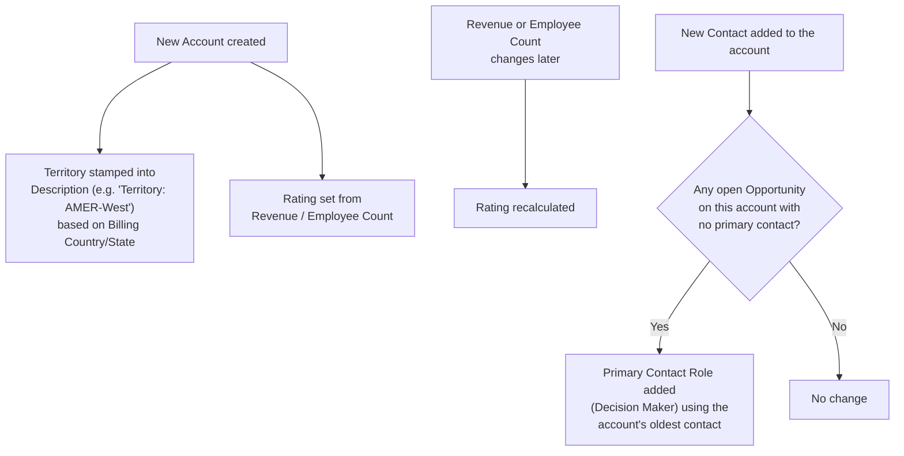

## Overview

When an Account is created, it's automatically assigned a sales **territory** based on its billing location,
and a **tier** — Hot, Warm, or Cold — based on its size (revenue or headcount). The tier keeps itself current
as an account grows: any time revenue or employee count changes, the tier is recalculated. Separately, the
moment a new contact is added to an account, this feature checks every one of that account's open deals and
makes sure each has a primary contact — filling the gap automatically if one is missing. This is a distinct,
independent feature from Account Health Score: tiering and territory are about segmenting and routing
accounts, not scoring their current pipeline activity.



## Prerequisites

- Billing Country and Billing State filled in on new accounts, so territory can be determined accurately
- Annual Revenue and/or Number of Employees populated, so the tier reflects the account's actual size

## Steps to Navigate

1. Click the **App Launcher** and search for **Accounts**.
2. Open an Account record — its **Rating** field shows the current tier (Hot/Warm/Cold), and the top line of
   its **Description** field shows the stamped territory.

```screenshot
id: account-territory-tiering-record-page
alt: Account record page showing the Rating tier field and the Territory line in Description
step: Open an Account record to view its Rating and Description
url_pattern: /lightning/r/Account/{recordId}/view
actions:
  - open_record: Account
```

## Use Cases

### A new US-based account is created

1. An Account is created with a US Billing Country and a recognized Billing State (e.g. California).
2. Its Description is automatically prefixed with a territory line, e.g. `"Territory: AMER-West"`.
3. Its Rating is set based on Annual Revenue or Number of Employees (see the tier table below).

### A new account is created outside any recognized country or state

1. An Account is created with a blank or unrecognized Billing Country (or a US account with a state not on
   the recognized lists).
2. Its territory is stamped as **Unassigned** (or **AMER-Other** for an unrecognized US state).

### An account grows into a new tier

1. An existing account's Annual Revenue or Number of Employees is updated to cross a tier threshold (e.g.
   revenue grows past $10,000,000).
2. Its Rating is automatically recalculated and updated to the new tier — this only happens when one of those
   two fields actually changes, not on every account edit.

### Billing location changes after the account was created

1. An existing account's Billing Country or Billing State is edited.
2. Its territory is **not** recalculated — territory is only stamped once, at creation. The Description field
   will continue to show whatever territory was assigned when the account was first created.

### The first contact is added to an account with an open deal

1. A Contact is added to an Account that has at least one open Opportunity with no primary contact yet.
2. A Contact Role is automatically created on that Opportunity: the account's oldest contact, marked
   **Primary**, with a Role of **Decision Maker**.

### A later contact is added when a primary contact role already exists

1. A second (or later) Contact is added to an account whose open Opportunities already each have a primary
   contact role.
2. Nothing changes — this feature only fills in a **missing** primary role; it never replaces or adds a
   second one.

## Validations & Business Rules

- **Territory is determined once, at Account creation**, from Billing Country and Billing State — it is never
  recomputed on update, even if the billing address changes later.
- **Territory is stored as text at the top of Description** (`"Territory: <value>"`), not as a dedicated
  picklist field — support staff should look in Description to see it.
- **Territory table:**

  | Territory | Condition |
  |---|---|
  | AMER-West | US; state is CA, WA, OR, NV, or AZ |
  | AMER-East | US; state is NY, NJ, MA, CT, or FL |
  | AMER-Central | US; state is TX, IL, CO, or MN |
  | AMER-Other | US; any other or blank state |
  | EMEA | Country is United Kingdom, Ireland, France, Germany, Spain, or Netherlands |
  | APAC | Country is India, Singapore, Japan, or Australia |
  | LATAM | Country is Brazil, Mexico, or Argentina |
  | Unassigned | Any other country, or blank |

  Country matching recognizes `USA`/`US`/`United States of America` as United States and `UK`/`Great Britain`
  as United Kingdom; state matching is exact (e.g. `"california"` in lowercase would not match and falls back
  to AMER-Other).
- **Tier is stored in the standard Rating field** and recalculated on creation and whenever Annual Revenue or
  Number of Employees changes:

  | Rating | Condition (either qualifies) |
  |---|---|
  | Hot | Annual Revenue ≥ $100,000,000 OR Number of Employees ≥ 1,000 |
  | Warm | Annual Revenue ≥ $10,000,000 OR Number of Employees ≥ 100 |
  | Cold | Below both thresholds |

- **Primary contact role backfill:** runs only when a new Contact is inserted, and only creates a role on an
  open Opportunity that has none — it never touches an Opportunity that already has a primary contact, and
  never runs on Contact update/delete.
- **None of this blocks a save or throws a validation error** — territory, tiering, and contact-role backfill
  are all silent, automatic derivations, not enforcement rules.
- This is a separate feature from Account Health Score — the two read and write entirely different fields and
  neither depends on the other.

## Related Features

- Account Health Score — a separate, independent read-only score on the same object; does not read or write Rating, Description, or Contact Roles.
- Lead Scoring, Assignment & Conversion — a newly converted account is tiered immediately as part of lead conversion, using this same tiering logic.
- Opportunity Pipeline Guardrails — an account's tier feeds the customer-tier discount used when pricing an opportunity's products.
