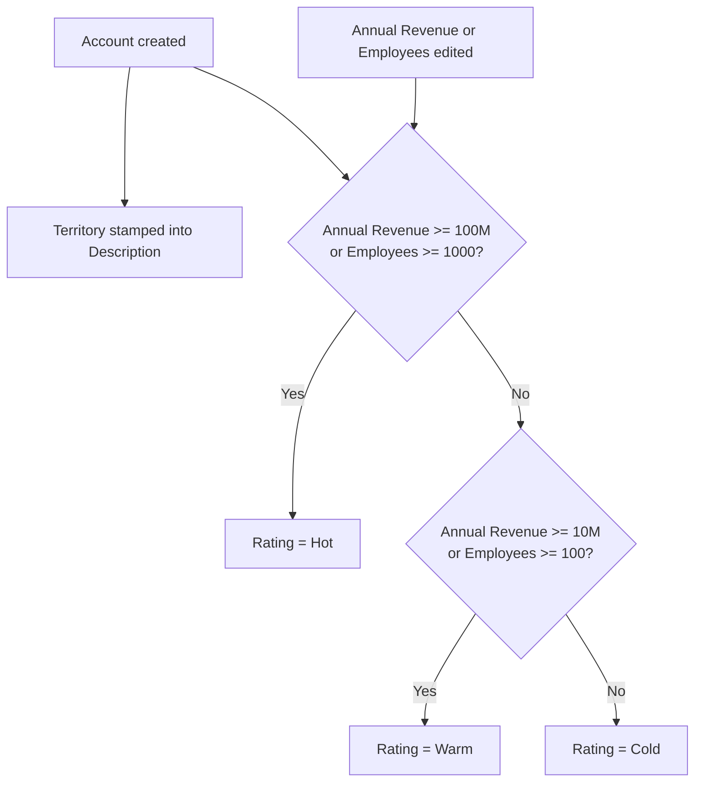

## Overview

Rather than relying on reps to manually classify accounts, the system automatically tags every account with a
sales tier (Hot/Warm/Cold, based on size) and a territory (based on billing address) the moment it's created,
and re-tiers it whenever its size changes. Separately, whenever a new contact is added to an account, the
system makes sure every one of that account's open opportunities has a primary decision-maker contact role, so
forecast and pipeline reports aren't missing that information.



## Prerequisites

- Standard User (or higher) profile to create and edit Accounts and Contacts
- Billing Country / Billing State populated on the Account for the territory stamp to resolve to a real region (otherwise it stamps `Unassigned`)

## Steps to Navigate

1. Click the **App Launcher** and search for **Accounts**.
2. Click **New**, fill in **Account Name**, **Billing Country**, **Billing State/Province**, **Annual Revenue**, and **Number of Employees**.
3. Click **Save**.
4. Reopen the account and check the **Description** field (prefixed with `Territory: <region>`) and the **Rating** field (Hot/Warm/Cold) — both were set automatically.

```screenshot
id: account-tiering-new-account-form
alt: New Account form with Billing Country, Billing State, Annual Revenue and Number of Employees filled in
step: Open the App Launcher, search for Accounts, click New, and fill in the account fields
url_pattern: /lightning/o/Account/new
actions:
  - open_app_launcher
  - search_app_launcher: Accounts
  - click_app_launcher_result: Accounts
  - click_new
```

## Use Cases

### Create a new account and see it auto-territorialized and tiered

1. Create an Account with a Billing Country/State and a size (Annual Revenue or Number of Employees).
2. On save, the **Description** field is prepended with `Territory: <region>` — for example, an account billed to California gets `Territory: AMER-West`; one billed to Germany gets `Territory: EMEA`; one with no recognized country/state gets `Territory: Unassigned`.
3. Also on save, **Rating** is set based on size: Annual Revenue ≥ $100M or 1,000+ employees → `Hot`; Annual Revenue ≥ $10M or 100+ employees → `Warm`; otherwise → `Cold`.

### Update an existing account's size and see it re-tier

1. Open an existing Account and change **Annual Revenue** or **Number of Employees** so it crosses into a different tier band.
2. Click **Save**.
3. **Rating** is recalculated and updated only if the new tier differs from the current one — editing unrelated fields doesn't trigger a re-tier.

```screenshot
id: account-tiering-rating-field
alt: Account detail page highlighting the Rating field after an Annual Revenue update
step: Edit an Account's Annual Revenue to cross a tier threshold and save
url_pattern: /lightning/r/Account/{recordId}/view
```

### Add the first contact to an account with open opportunities

1. Open an Account that has one or more open (not-closed) Opportunities but no primary contact role set on them.
2. Add a new Contact under that Account and click **Save**.
3. For each open opportunity missing a primary contact role, the system automatically creates an Opportunity Contact Role with **Role = Decision Maker** and **Primary = true**, using the account's earliest-created contact.
4. If an open opportunity already has a primary contact role, it's left untouched.

## Validations & Business Rules

- Automation: `AccountTriggerHandler` before-insert stamps territory; after-insert and after-update (when Annual Revenue or Number of Employees changed) re-tier the account. The re-tier update bypasses the Account trigger to avoid recursion.
- Territory mapping (US, by Billing State): CA/WA/OR/NV/AZ → `AMER-West`; NY/NJ/MA/CT/FL → `AMER-East`; TX/IL/CO/MN → `AMER-Central`; any other US state → `AMER-Other`.
- Territory mapping (by Billing Country): United Kingdom/Ireland/France/Germany/Spain/Netherlands → `EMEA`; India/Singapore/Japan/Australia → `APAC`; Brazil/Mexico/Argentina → `LATAM`; anything else unrecognized → `Unassigned`.
- The territory stamp is prepended as `Territory: <value>` to whatever was already in Description (combined text truncated at 32,000 characters) — it does not overwrite prior notes in the field.
- Tier thresholds: Annual Revenue ≥ $100,000,000 or Number of Employees ≥ 1,000 → `Hot`; Annual Revenue ≥ $10,000,000 or Number of Employees ≥ 100 → `Warm`; otherwise → `Cold`. Rating is only written when it differs from the current value.
- Automation: `ContactTriggerHandler` after-insert calls the primary-contact-role sync for every account referenced by the newly inserted contacts.
- Rule: an open opportunity only gets an auto-created primary contact role if it doesn't already have one; the contact used is the account's earliest-created contact, not necessarily the one just added.

```callout
type: note
Account Rating doubles as the account's sales tier and feeds directly into pricing: [[opportunity-pipeline-guardrails]]
gives a discount bump to Hot and Warm accounts. Changing Annual Revenue or Employee Count can therefore change
pricing on that account's open deals the next time they're repriced.
```

## Related Features

- [[lead-scoring-assignment-conversion]] — a newly converted lead's Account is tiered immediately using this same logic.
- [[opportunity-pipeline-guardrails]] — account tier feeds the discount calculation on opportunity and quote lines.
