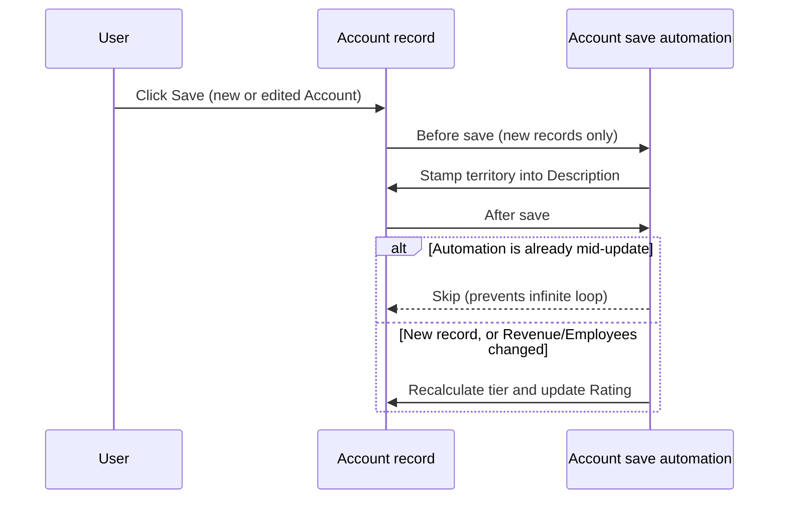

## Overview

Whenever anyone creates or edits an Account and clicks **Save**, Salesforce automatically runs a set of background steps before the record ever reaches the user's screen: it stamps a sales territory on brand-new records, and it recalculates the account's Hot/Warm/Cold tier whenever the record is new or its size (revenue/headcount) changed. Sales and ops teams don't do anything special to trigger this — it's built into every Account save. This page documents the save-time sequencing and the safeguards that keep the automation from re-triggering itself; see [Account Territory & Tier Assignment](account-territory-tier-assignment) for the territory matrix and tier thresholds themselves.



## Prerequisites

```callout
type: note
This is a background automation, not a page users navigate to. It runs every time an Account is created or edited. This page documents the save-time behavior and its safeguards; it does not require any permission set or setup.
```

- No special permission or configuration is needed — it applies to every Account create/edit, by any user
- Nothing to enable or disable manually; the only control is the internal recursion guard described below, which is not user-facing

## Steps to Navigate

1. Open the **Accounts** tab and click **New**, or open an existing Account and click **Edit**.
2. Enter or update the Account's fields as normal — most commonly **Billing Country**, **Billing State/Province**, **Annual Revenue**, or **Number of Employees**.
3. Click **Save**.
4. The automation runs immediately as part of the save — there is no spinner or separate step, and no confirmation message is shown for it.
5. Open the saved record and review **Description** (territory) and **Rating** (tier) to confirm the automation ran.

```screenshot
id: account-automation-save
alt: Account edit form with Annual Revenue and Number of Employees fields populated, about to be saved
step: Edit an Account's Annual Revenue and Number of Employees fields and click Save
url_pattern: /lightning/r/Account/{recordId}/edit
actions:
  - open_record: Account
  - click_button: Edit
  - fill_field: { field: AnnualRevenue, value: "150000000" }
  - fill_field: { field: NumberOfEmployees, value: "1200" }
  - click_button: Save
```

## Use Cases

### New Account is created

1. A user fills out the New Account form and clicks **Save**.
2. Before the record is committed, the territory step runs and writes a `Territory: ...` line into **Description**.
3. Immediately after the record is committed, the tiering step runs and sets **Rating** based on the Account's revenue and headcount.
4. Both steps complete within the same save — the user sees the finished record with **Description** and **Rating** already populated.

### Existing Account is edited without changing size fields

1. A user edits an existing Account — for example, updating **Phone** or **Industry** — and clicks **Save**.
2. The territory step does not run again (it only stamps brand-new records).
3. The tiering step checks whether **Annual Revenue** or **Number of Employees** changed on this save; since they didn't, no re-tiering occurs and **Rating** is left as-is.

### Existing Account is resized (revenue or headcount changes)

1. A user edits an existing Account and changes **Annual Revenue** and/or **Number of Employees**, then clicks **Save**.
2. Because a size field changed, the tiering step recalculates and, if the tier is different, updates **Rating** to match.
3. If the recalculated tier is the same as the current **Rating**, no additional update is written — the automation avoids a redundant save.

### Automation's own update does not re-trigger itself

1. When the tiering step updates an Account's **Rating**, that update is itself a save on the Account object.
2. The automation recognizes it is already in the middle of running for this object and skips re-running territory/tiering logic on its own update, so a single user save never cascades into a second or third automatic save.
3. From the user's perspective this is invisible — they see one save, one resulting **Rating**, with no delay or duplicate history entries.

### Bulk save (e.g. data import or mass update)

1. A user or integration saves many Accounts at once (for example, via Data Loader or a list view mass edit).
2. The automation processes every affected Account in the same batch rather than one at a time, so the same territory/tiering behavior applies uniformly across the whole batch.
3. Only the Accounts in that batch whose tier actually changed receive a follow-up update — accounts with no size change or no tier change are left untouched.

## Validations & Business Rules

- **Trigger events**: the automation runs before a new Account is inserted, after a new Account is inserted, and after an existing Account is updated. It does not run before an update.
- **New records**: territory stamping and tier calculation both run for every newly created Account.
- **Edited records**: tier calculation only re-runs when **Annual Revenue** or **Number of Employees** changed on that save; territory is not re-stamped on edits.
- **Recursion guard**: the tiering step's own update to **Rating** is wrapped so it does not re-enter this same automation — this prevents an infinite save loop and is why a single user save never produces more than one round of territory/tiering.
- **No-op protection**: an Account is only written to a second time if its calculated tier is actually different from its current **Rating** — accounts whose tier hasn't changed are not re-saved.
- For the full territory matrix (which countries/states map to which region) and tier thresholds (revenue/headcount cutoffs for Hot/Warm/Cold), see [Account Territory & Tier Assignment](account-territory-tier-assignment).

## Related Features

- Account Territory & Tier Assignment — the business rules this automation applies (territory matrix, tier thresholds)
