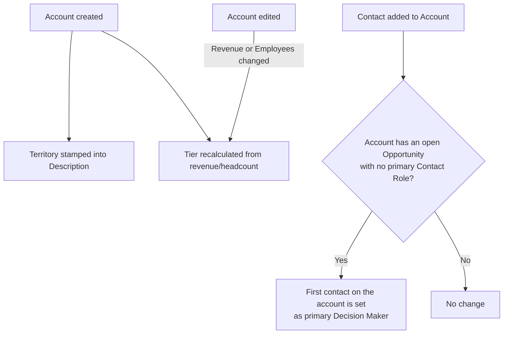
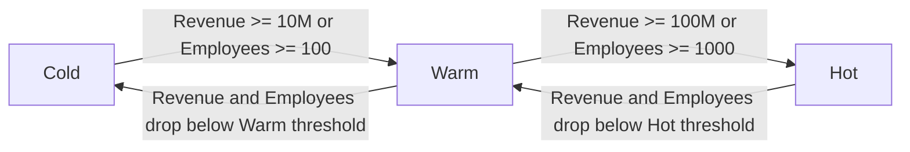

## Overview

Whenever a sales rep or integration creates or edits an Account, or adds a Contact to an Account, several
background checks run automatically — no button to click, no flow to launch. On every Account save the
system tags the record with its sales territory (based on billing country/state) and recalculates the
account's tier (Hot/Warm/Cold) from revenue and headcount. On every new Contact, the system checks whether
that contact should fill a missing "Decision Maker" role on any of the account's open opportunities. This
keeps territory assignment, account tiering, and opportunity contact-role hygiene consistent without anyone
having to remember to do it by hand.



## Prerequisites

- None — this is always-on automation, not a feature a user opts into.
- Territory tagging depends on Billing Country/State being filled in; blank values are tagged "Unassigned."
- Opportunity contact-role sync only acts on **open** (not-closed) opportunities.

```callout
type: note
This automation is entirely background processing. There is nothing to navigate to in order to
"use" it — the sections below describe what happens automatically after normal Account/Contact
data entry, and how to verify the results on the record.
```

## Steps to Navigate

There is no dedicated screen for this automation — it fires on standard Account and Contact save.
To see its effects on a record:

1. Open any **Account** record (App Launcher → **Accounts** → select or create a record).
2. Check the **Description** field for a line starting with `Territory: ` — this is stamped automatically.
3. Check the **Rating** field (Hot / Warm / Cold) — this reflects the account's current tier.

```screenshot
id: account-contact-management-account-fields
alt: Account record detail page showing the Rating field and a Description field beginning with "Territory:"
step: Open an Account record and view the Rating and Description fields
url_pattern: /lightning/r/Account/{recordId}/view
actions:
  - open_record: Account
```

4. On that same Account, open the **Related** tab and add a new **Contact**.

```screenshot
id: account-contact-management-new-contact
alt: New Contact form being filled out under an Account's Related list
step: Create a new Contact related to an Account
url_pattern: /lightning/o/Contact/new
actions:
  - open_record: Account
  - click_tab: Related
```

5. Save the Contact, then open one of the Account's **open Opportunities** and check the
   **Contact Roles** related list for a primary "Decision Maker" entry.

## Use Cases

### New Account is created

1. A user fills out the New Account form with Billing Country and Billing State and clicks **Save**.
2. Before the record is written, `AccountTriggerHandler.beforeInsert` calls
   `AccountTerritoryService.stampTerritoryDescription`, which derives a territory (e.g. `AMER-West`,
   `EMEA`, `APAC`, `LATAM`, `AMER-Other`, or `Unassigned`) from the billing address and prepends
   `Territory: <value>` to the Description field, preserving any existing description text.
3. After the record is inserted, `AccountTriggerHandler.afterInsert` calls
   `AccountTierService.retierAccounts`, which sets **Rating** to `Hot`, `Warm`, or `Cold` based on
   Annual Revenue and Number of Employees.
4. The user sees the Territory line in Description and the calculated Rating immediately after save
   — no separate action required.

### Territory lookup rules

1. US accounts are split into `AMER-West` (CA/WA/OR/NV/AZ), `AMER-East` (NY/NJ/MA/CT/FL),
   `AMER-Central` (TX/IL/CO/MN), or `AMER-Other` if the state isn't in one of those lists.
2. UK, Ireland, France, Germany, Spain, and Netherlands map to `EMEA`.
3. India, Singapore, Japan, and Australia map to `APAC`.
4. Brazil, Mexico, and Argentina map to `LATAM`.
5. Any other or blank country maps to `Unassigned`. Common variants like "USA" or "UK" are
   normalized to their full country name before matching.

### Account is re-tiered after a resize

1. A user edits an existing Account and changes **Annual Revenue** or **Number of Employees**, then saves.
2. `AccountTriggerHandler.afterUpdate` compares the new values to the prior values; only accounts where
   one of those two fields actually changed are passed to `AccountTierService.retierAccounts`.
3. The tier thresholds are: Rating = `Hot` if Annual Revenue ≥ $100,000,000 or Employees ≥ 1,000;
   `Warm` if Annual Revenue ≥ $10,000,000 or Employees ≥ 100; otherwise `Cold`.
4. If the computed tier is unchanged, no update is written — editing unrelated fields (e.g. Phone,
   Industry) never triggers a Rating recalculation.



### New Contact fills a missing primary role on open opportunities

1. A user adds a new Contact and sets its Account lookup, then saves.
2. `ContactTriggerHandler.afterInsert` collects the Account Id(s) involved and calls
   `ContactRoleSyncService.ensurePrimaryRoles`.
3. For each **open** Opportunity on that Account that has **no primary Contact Role yet**, the
   service creates an `OpportunityContactRole` with **Role = "Decision Maker"** and **Primary = true**,
   using the account's earliest-created Contact (not necessarily the one just added, if the account
   already had other contacts).
4. If the Opportunity already has a primary contact role, or the Account has no open Opportunities,
   nothing is created — this is a gap-fill, not an override.

### Bulk import of Accounts or Contacts

1. When Accounts or Contacts are inserted/updated in bulk (e.g. a data load or API integration),
   the same handlers run once per batch, processing the whole list together rather than one record
   at a time.
2. Territory stamping and tiering apply to every Account in the batch; the after-update resize check
   only includes the subset of Accounts in the batch whose Revenue or Employee count actually changed.
3. Contact role sync groups all affected Account Ids from the batch into a single query pass, so a
   bulk contact import checks every impacted account's open opportunities in one operation.

## Validations & Business Rules

- **Recursion guard:** `AccountTierService.retierAccounts` wraps its own `update` with
  `TriggerControl.bypass('Account')` / `clearBypass('Account')` so the Rating write it performs does
  not re-enter `AccountTriggerHandler.afterInsert`/`afterUpdate` and loop.
- **Change-only re-tiering:** `afterUpdate` only re-evaluates Rating for Accounts where
  `AnnualRevenue` or `NumberOfEmployees` changed versus the prior version of the record.
- **Territory field:** territory is written into `Description`, not a dedicated field — it is
  prefixed as `Territory: <value>` ahead of any pre-existing description text, truncated to the
  32,000-character limit of the field.
- **Tier thresholds:** Hot ≥ 100,000,000 revenue or ≥ 1,000 employees; Warm ≥ 10,000,000 revenue or
  ≥ 100 employees; otherwise Cold. Null revenue/employees are treated as 0.
- **Contact role sync only fills gaps:** `ContactRoleSyncService.ensurePrimaryRoles` only creates a
  role when an open Opportunity has zero primary Contact Roles; it never replaces or reassigns an
  existing primary contact.
- **Only open opportunities are affected:** Opportunities with `IsClosed = true` are excluded from
  contact role sync entirely.

## Related Features

- Account tiering thresholds are also used by account tiering reports and views elsewhere in the org.
- Opportunity Contact Roles created here appear on the standard Opportunity Contact Roles related list.
