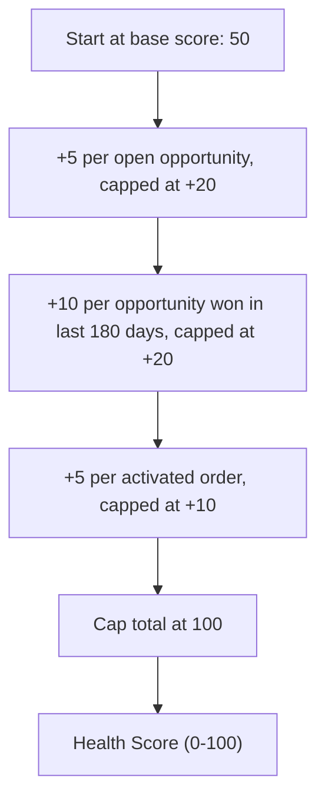

## Overview

Account Health Score turns an account's recent activity into a single number from 0-100, giving sales and account teams a quick read on how engaged an account currently is. The score blends three signals: how much open pipeline the account has, how many deals it has closed-won recently, and how many orders it has activated. Nothing is stored on the Account record — the score is calculated fresh every time it's requested, so it's always up to date.

```callout
type: note
This is a backend calculation exposed to the Lightning UI (`@AuraEnabled(cacheable=true)`), but no page layout or component in this org currently displays it. Until an admin/developer adds a component that calls `AccountHealthScoreService.healthForAccount`, the only way to see a score is to run it directly, as shown below.
```

## Prerequisites

- Read access to the Account, Opportunity, and Order objects — the service is a `with sharing` class, so a user who can't see an account or its related records will get an undercounted (or missing) score
- The AccountHealthScoreService Apex class deployed to the org
- A Lightning page or custom component built to call `healthForAccount(accountId)` — this is required before the score can be shown to end users on an Account record page

## Steps to Navigate

Because no packaged component consumes this method yet, admins and support staff can verify a score today using the Developer Console.

1. Click the gear icon in the top-right, then click **Developer Console**.
2. Click **Debug**, then **Open Execute Anonymous Window**.
3. Enter a script that calls the method and logs the result, for example:
   `System.debug(AccountHealthScoreService.healthForAccount('001XXXXXXXXXXXXXXX'));`
4. Click **Execute**.
5. Open the **Logs** tab, double-click the newest log, and search for the `USER_DEBUG` line to see the returned score.

```screenshot
id: account-health-score-execute-anonymous
alt: Developer Console Execute Anonymous window with a call to AccountHealthScoreService.healthForAccount
step: Open the Developer Console, open Execute Anonymous, and enter a call to healthForAccount
url_pattern: /_ui/common/apex/debug/ApexCSIPage
```

## Use Cases

### Baseline account with no recent activity

1. An admin runs the calculation against an account with no open opportunities, no opportunities won in the last 180 days, and no activated orders.
2. The method returns **50** — every account starts at a base score of 50, and none of the three bonus categories add anything when there's no matching activity.

### Account with active pipeline and recent wins

1. An admin runs the calculation against an account that has 3 open opportunities, 2 opportunities closed-won within the last 180 days, and 1 activated order.
2. The score adds: +15 for open pipeline (5 points × 3 opportunities), +20 for recent wins (10 points × 2, capped at 20), and +5 for order activity (5 points × 1 activated order).
3. The method returns **90** (50 base + 15 + 20 + 5).

### High-performing account hitting the maximum score

1. An admin runs the calculation against an account with heavy activity in all three categories — for example 6 open opportunities, 3 recent wins, and 4 activated orders.
2. Each bonus category hits its individual cap regardless of the higher raw counts: +20 for open pipeline, +20 for recent wins, +10 for order activity.
3. The method returns **100** — the overall score is capped at 100 even though the uncapped total would exceed it.

## Validations & Business Rules

- Every account starts at a base score of **50**.
- Open pipeline bonus: **+5 per open Opportunity** (`IsClosed = false`), capped at **+20** (4 or more open opportunities maxes this bucket).
- Recent momentum bonus: **+10 per Opportunity won** (`IsWon = true`) in the **last 180 days**, capped at **+20** (2 or more recent wins maxes this bucket).
- Order activity bonus: **+5 per Order** with `Status = 'Activated'`, capped at **+10** (2 or more activated orders maxes this bucket).
- The final score is capped at **100**.
- The service is `with sharing` and read-only — it never writes back to the Account record, and nothing is persisted, so the score always reflects current data at the moment it's requested.
- The method is `cacheable=true`, so once a component does call it, Lightning Data Service may cache the returned value client-side until it's invalidated.



## Related Features

- Order Activation & Status — activated orders feed the order-activity portion of the score
- Big Deal Alert — recently won opportunities that drive the momentum portion of the score
