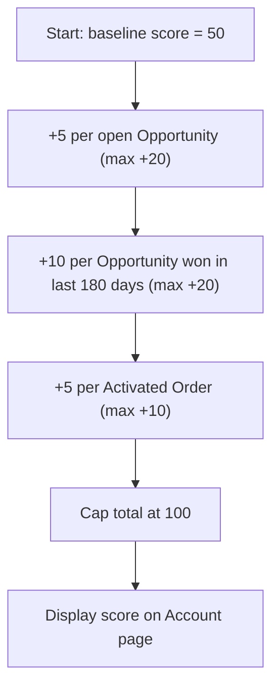

## Overview

Account Health Score gives sales and account teams a single number, from 0 to 100, that summarizes how
"healthy" a customer relationship currently looks. Instead of manually checking open opportunities, recent
wins, and active orders separately, a user can glance at one score to decide whether an account needs
attention. The score is read-only: viewing it never changes any data on the account, and it is recalculated
fresh every time it is requested.

```callout
type: note
The score is calculated on demand from live Opportunity and Order data. It is not stored on the Account
record, so there is no field to report on directly — it only appears wherever a Lightning component or page
is built to call it.
```

## Prerequisites

- Read access to the Account, Opportunity, and Order objects
- The account must exist and be accessible to the running user (standard sharing rules apply, since the
  service runs `with sharing`)
- A Lightning component or app page must be configured to display the score — Salesforce does not show it
  anywhere by default

## Steps to Navigate

1. Open the **Account** record you want to check.
2. Locate the Lightning component or page section that displays **Account Health Score** (this is added to a
   Lightning page layout by an admin; it is not a standard related list).

```screenshot
id: account-health-score-record-page
alt: Account record page showing a health score component in the sidebar
step: Open an Account record that has a health score component on its page layout
url_pattern: /lightning/r/Account/{recordId}/view
```

3. Review the displayed score (0–100). No further action is required — the score refreshes automatically
   whenever the component loads.

## Use Cases

### View the health score for a single account

1. Navigate to an Account record.
2. The health score component calls the account health service and displays the resulting number.
3. A higher score indicates more open pipeline, more recent closed-won business, and more active orders; a
   lower score indicates less recent activity across those three areas.

### Account with no opportunities or orders

1. Open an Account that has no open opportunities, no opportunities won in the last 180 days, and no
   activated orders.
2. The score displays as the baseline value of 50, since none of the bonus criteria add any points.

### Account with strong recent activity

1. Open an Account with several open opportunities, multiple deals won in the last 180 days, and multiple
   activated orders.
2. Each category contributes points on top of the baseline of 50, up to its own cap, so the displayed score
   rises toward the maximum of 100.

## Validations & Business Rules

- The score always starts from a baseline of **50** for every account.
- **Open pipeline:** adds 5 points per open (not-closed) Opportunity on the account, capped at **+20**.
- **Recent momentum:** adds 10 points per Opportunity marked Closed Won with a Close Date in the last 180
  days, capped at **+20**.
- **Order activity:** adds 5 points per Order on the account with Status = **Activated**, capped at **+10**.
- The final score is always capped at **100**, regardless of how much the individual categories would add
  up to.
- The calculation is exposed only as `AccountHealthScoreService.healthForAccount(accountId)`, an
  `@AuraEnabled(cacheable=true)` method — it is read from a Lightning component and never invoked by a Flow,
  trigger, or batch process today.



## Related Features

- No other business pages reference this service yet — it is currently used only through a Lightning
  component that displays the score on the Account record page.
