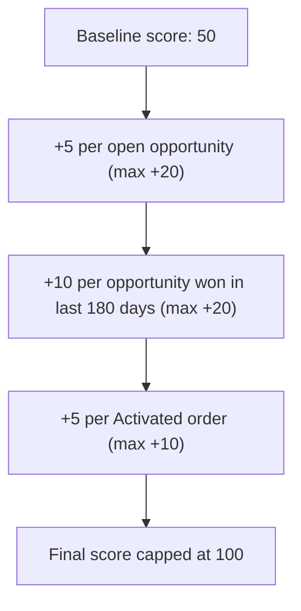

## Overview

The Account Health Score gives a quick, single-number read (0–100) on how an account is trending, based on its
open sales pipeline, recent closed-won deals, and active orders. It's meant for anyone reviewing an account —
sales reps, account managers, or support — who wants a fast signal without digging through related lists. The
score is calculated on demand and never writes back to the account or any other record.

```callout
type: note
This service is exposed to the UI but is not yet wired into a page layout, component, or Lightning
app in this org. There is currently no place in Salesforce where this score is shown to users.
```

## Prerequisites

- Access to view the Account record
- No special permission set — the score is read-only and does not modify data

## Steps to Navigate

There is currently no Salesforce page, component, or tab that displays this score. It exists as a backend
service (`AccountHealthScoreService.healthForAccount`) that a future dashboard or Lightning component can call.
Once a UI surface is built, this section should be updated with the click-through steps to view it.

## Use Cases

### Baseline account with no activity

1. An account with no opportunities and no orders starts at a baseline score of **50**.
2. This represents a "neutral" account — neither at risk nor clearly healthy.

### Account with open pipeline

1. Each open (not-closed) opportunity on the account adds 5 points to the score.
2. This bonus is capped at **+20 points**, so having 4 or more open opportunities gives the same boost as having
   exactly 4.

### Account with recent closed-won deals

1. Each opportunity the account won in the **last 180 days** adds 10 points to the score.
2. This bonus is capped at **+20 points**, so 2 or more recent wins give the maximum boost.

### Account with active orders

1. Each Order on the account with status **Activated** adds 5 points to the score.
2. This bonus is capped at **+10 points**, so 2 or more activated orders give the maximum boost.

### Account with maximum health

1. An account with 4+ open opportunities, 2+ recent closed-won opportunities, and 2+ activated orders reaches
   the maximum possible score.
2. The overall score is always capped at **100**, even if the individual bonuses would add up to more.



## Validations & Business Rules

- The score always starts at a baseline of **50** for every account, regardless of activity.
- Open pipeline bonus: `+5` per open (not-closed) Opportunity, capped at `+20`.
- Recent win bonus: `+10` per Opportunity where `IsWon = true` and `CloseDate` falls within the last 180 days,
  capped at `+20`.
- Order activity bonus: `+5` per Order with `Status = 'Activated'`, capped at `+10`.
- The final score is capped at **100** regardless of how the bonuses total.
- The calculation is read-only: it never inserts, updates, or deletes any record — it only aggregates existing
  Opportunity and Order data.
- Exposed as an `@AuraEnabled(cacheable=true)` method, so a Lightning component can call it directly and cache
  the result client-side.

## Related Features

- Account metrics and reporting features that surface pipeline or order health alongside this score
