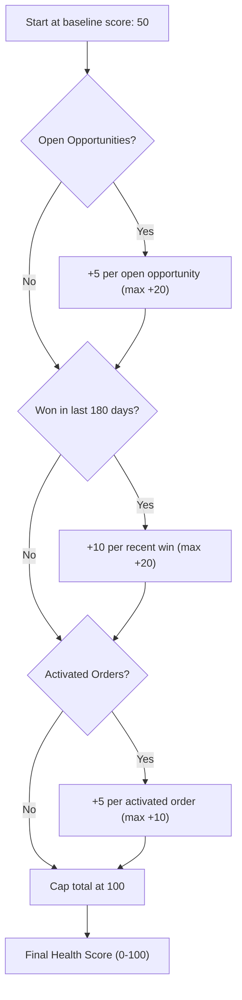

## Overview

Account Health Score gives sales and account teams a quick, at-a-glance read on how an account is trending, without
having to open its related lists and eyeball opportunities and orders one by one. The score is a single number from
0 to 100, calculated on the fly whenever a Lightning page or component asks for it — nothing is stored on the
Account record itself. It rewards accounts that have open pipeline, have recently closed deals, and have activated
orders, so a low score is a signal to check in on the relationship.

```callout
type: note
This is a read-only, calculated value. It is never written back to the Account record, so it won't show up as a
field in list views or reports — it only appears wherever a Lightning page or component is built to display it.
```

## Prerequisites

- Read access to the Account, Opportunity, and Order objects
- A Lightning page or Aura/LWC component configured to call this score (for example, a "Health" tile on the Account
  record page)

## Steps to Navigate

Account Health Score is not a standalone menu item — it's a value surfaced by a component wherever an admin has
placed it, most commonly on the Account record page.

1. Open the **Account** record you want to check.
2. Locate the health score tile or panel on the record page (placement depends on how the page layout/Lightning
   page was configured for your org).
3. Read the score shown, from 0 (lowest) to 100 (highest).

```screenshot
id: account-health-score-record-page
alt: Account record page showing a health score tile
step: Open an Account record and view the health score component on the page
url_pattern: /lightning/r/Account/{recordId}/view
actions:
  - open_record: Account
```

## Use Cases

### Checking the health of an active account

1. Open an Account that has open opportunities, recent wins, and activated orders.
2. The health score panel shows a number close to 100 — the account is contributing across all three signals:
   open pipeline, recent closed-won momentum, and active orders.
3. Use this as a quick confirmation that the relationship is healthy and no follow-up is needed.

### Spotting an account that needs attention

1. Open an Account with no open opportunities, no wins in the last 180 days, and no activated orders.
2. The health score shows the baseline value of 50 — none of the positive signals are contributing.
3. Treat a score at or near the baseline as a prompt to reach out, prospect for new opportunities, or check in on
   stalled orders.

### Reviewing an account with a lot of activity

1. Open an Account with many open opportunities, several recent wins, and multiple activated orders.
2. Each signal contributes to the score but is individually capped, and the total is capped at 100, so a very
   active account still reads as a clean "100" rather than an inflated number.
3. This keeps the score easy to interpret at a glance — 100 always means "very healthy," never an unbounded value.

## Validations & Business Rules

The score always starts from a baseline of 50, then adds points for three signals, each individually capped, and
the final total is capped at 100:

- **Open pipeline**: +5 points per open Opportunity on the account, capped at +20
- **Recent closed-won momentum**: +10 points per Opportunity won in the last 180 days, capped at +20
- **Active orders**: +5 points per Order with Status = `Activated`, capped at +10
- **Overall cap**: the combined score is capped at 100, so an account can never score higher than 100 regardless of
  activity volume
- An account with no open opportunities, no recent wins, and no activated orders scores exactly 50 (baseline only)



- Automation: `AccountHealthScoreService.healthForAccount` is exposed as a cacheable `@AuraEnabled` method, so
  Lightning components can call it directly and Salesforce may cache the result client-side until the underlying
  data changes.

## Related Features

- None yet — this is the first documented page for the Accounts category.
