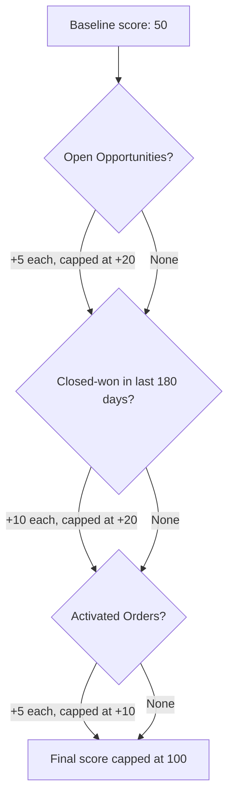

## Overview

Account Health Score is a single number, from 0 to 100, meant to give a quick read on how
engaged and active an Account currently is. It combines three signals: how much open sales
pipeline the Account has, whether the Account has closed deals recently, and whether the
Account has activated orders. The score is calculated on demand from an Apex service — it is
never stored on the Account record, so it always reflects live data at the moment it is
requested.

```callout
type: note
This service exists in the codebase and is ready to call from Lightning, but no page or
component in this org currently displays it. A Lightning page, App Builder component, or LWC
would need to be built to surface the score to users. The steps below describe how the score
behaves once such a component calls it.
```

## Prerequisites

- A Lightning page or custom component must call the `healthForAccount` Apex method to display
  the score — it does not appear anywhere automatically.
- Standard access to view the Account record (the method itself does not check Account-level
  sharing beyond `with sharing`, but it only reads Opportunity and Order data related to the
  Account).

## Steps to Navigate

Since no existing page currently surfaces this score, there are no click-path steps to document
yet. Once a component is added to an Account page:

1. Open the **Account** record.
2. Locate the health score component/panel added to the page layout.
3. The score (0-100) displays for that Account, recalculated each time the page loads.

```screenshot
id: account-health-score-account-page
alt: Account record page showing a health score panel
step: Open an Account record that has a health score component on its page layout
url_pattern: /lightning/r/Account/{recordId}/view
```

## Use Cases

### Baseline score for a quiet Account

1. An Account with no open Opportunities, no recently closed-won Opportunities, and no
   activated Orders starts at a baseline score of **50**.
2. This is the floor score returned for any Account with no positive signals — it never scores
   below 50 from this calculation.

### Open pipeline raises the score

1. Each open (not-closed) Opportunity on the Account adds 5 points to the score.
2. This contribution is capped at **20 points total**, reached once the Account has 4 or more
   open Opportunities.

### Recent closed-won deals raise the score

1. Each Opportunity the Account won (`IsWon = true`) within the last 180 days adds 10 points.
2. This contribution is capped at **20 points total**, reached once the Account has 2 or more
   wins in that window.
3. Deals won more than 180 days ago no longer count toward the score.

### Activated orders raise the score

1. Each Order on the Account with status **Activated** adds 5 points.
2. This contribution is capped at **10 points total**, reached once the Account has 2 or more
   activated Orders.

### Fully engaged Account (maximum score)

1. An Account with 4+ open Opportunities, 2+ recent wins, and 2+ activated Orders reaches the
   maximum score of **100** (50 baseline + 20 + 20 + 10).
2. The score never exceeds 100 regardless of how many additional deals or orders exist.

### Checking scores for a group of Accounts (bulk)

1. The underlying service can score many Accounts in a single call (used internally for lists
   of Accounts rather than one at a time).
2. Each Account in the group is scored independently using the same rules above — there is no
   cross-Account effect.

## Validations & Business Rules

- Base score for every Account is **50**.
- Open Opportunities: `+5` per open Opportunity, capped at `+20`.
- Closed-won Opportunities in the last 180 days: `+10` per Opportunity, capped at `+20`.
- Orders with `Status = 'Activated'`: `+5` per Order, capped at `+10`.
- The final score is capped at a maximum of **100**.
- The calculation is read-only — it never writes back to the Account, Opportunity, or Order
  records.
- The Apex method is marked `cacheable=true`, so a Lightning component calling it may show a
  cached value until the underlying data changes and the cache refreshes.



## Related Features

- Account Metrics — related account-level reporting that may consume similar Opportunity and
  Order data.
