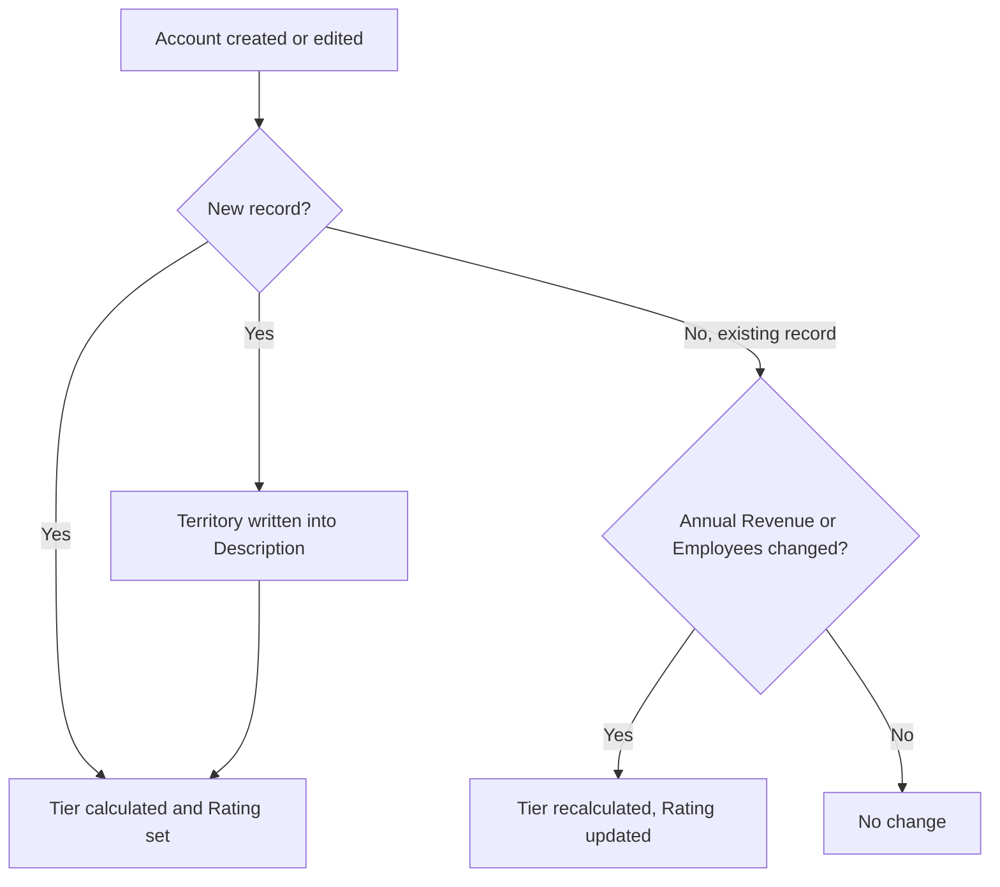

## Overview

Every Account is automatically tagged with a sales **territory** (based on billing country/state) and a **tier** — Hot, Warm, or Cold — based on annual revenue and employee count. Sales and ops teams use these values to route accounts to the right regional rep and to prioritize outreach toward larger prospects. Both values are stamped automatically whenever an Account is created, when its size fields change, or when a Lead converts into a new Account — no manual data entry is required.



## Prerequisites

```callout
type: note
This is a background automation, not a page users navigate to. It runs on every Account create/edit and on Lead conversion. This page documents what it does and where the results show up.
```

- No special permission is required to trigger the automation — it fires for anyone who creates or edits an Account
- For territory tagging to be meaningful, **Billing Country** and **Billing State/Province** should be filled in
- For tiering to be meaningful, **Annual Revenue** and/or **Employees** should be filled in

## Steps to Navigate

1. Open the **Accounts** tab and click **New**, or open an existing Account and click **Edit**.
2. Fill in (or update) **Billing Country**, **Billing State/Province**, **Annual Revenue**, and **Number of Employees**.
3. Click **Save**.
4. On the saved record, review the **Description** field — it now begins with a line such as `Territory: AMER-West`.
5. Review the **Rating** field — it shows the calculated tier: `Hot`, `Warm`, or `Cold`.

```screenshot
id: account-territory-tier-assignment-record-page
alt: Account record page showing the Description field prefixed with a Territory line and the Rating field set to a tier value
step: Open a saved Account record and view the Description and Rating fields
url_pattern: /lightning/r/Account/{recordId}/view
```

## Use Cases

### New Account created in the US

1. A user creates a new Account with **Billing Country** = `United States` and **Billing State** = `CA`.
2. On save, the territory logic recognizes `CA` as a West-coast state and writes `Territory: AMER-West` at the top of the **Description** field, preserving any text that was already there on a new line below it.
3. The tier logic evaluates **Annual Revenue** and **Number of Employees** and sets **Rating** to `Hot`, `Warm`, or `Cold` accordingly.

### New Account created outside a mapped region

1. A user creates an Account with **Billing Country** = `United States` but no matching state (or a state not in the West/East/Central lists) — it is tagged `Territory: AMER-Other`.
2. An Account with a country outside all mapped lists (US, UK, Ireland, France, Germany, Spain, Netherlands, India, Singapore, Japan, Australia, Brazil, Mexico, Argentina) is tagged `Territory: Unassigned`.
3. Users can still manually correct the territory by editing the **Description** field after save; the automation only re-stamps territory on brand-new records, not on every edit.

### Existing Account resized (revenue or headcount changes)

1. A user edits an existing Account and changes **Annual Revenue** or **Number of Employees**.
2. On save, the tier is recalculated for just that account: **Rating** flips to `Hot` once Annual Revenue reaches $100,000,000 or Employees reaches 1,000; to `Warm` once Annual Revenue reaches $10,000,000 or Employees reaches 100; otherwise `Cold`.
3. If neither of those two fields changed, no re-tiering occurs — editing unrelated fields (e.g. Phone, Industry) does not trigger a recalculation.
4. If the newly calculated tier is the same as the current **Rating**, no update is written at all — the automation only touches records whose tier actually changed.

### Bulk retiering after Lead conversion

1. A user (or an automated process) converts one or more qualified Leads into Accounts.
2. Immediately after conversion, every newly created Account is re-queried and re-tiered in one batch so **Rating** reflects the converted Account's revenue and employee data from minute one, without waiting for a separate edit.

## Validations & Business Rules

- **Territory matrix** (`AccountTerritoryService.territoryFor`): country is normalized first (e.g. `USA`, `US`, `United States of America` all map to `United States`; `UK`/`Great Britain` map to `United Kingdom`).
  - United States: `CA/WA/OR/NV/AZ` (or full state name) → `AMER-West`; `NY/NJ/MA/CT/FL` → `AMER-East`; `TX/IL/CO/MN` → `AMER-Central`; any other US state → `AMER-Other`.
  - `United Kingdom, Ireland, France, Germany, Spain, Netherlands` → `EMEA`.
  - `India, Singapore, Japan, Australia` → `APAC`.
  - `Brazil, Mexico, Argentina` → `LATAM`.
  - Any other country (or blank) → `Unassigned`.
  - Territory is written as a `Territory: <value>` line prepended to **Description** (existing Description text is preserved below it, and the combined text is truncated to 32,000 characters). This only runs **before insert** — it does not re-stamp territory when an existing Account's billing address is later edited.
- **Tier thresholds** (`AccountTierService.tierFor`): `Hot` if Annual Revenue ≥ $100,000,000 **or** Employees ≥ 1,000; `Warm` if Annual Revenue ≥ $10,000,000 **or** Employees ≥ 100; otherwise `Cold`. Blank Revenue/Employees are treated as 0.
- **Automation trigger points**: tiering runs after insert for all new Accounts, and after update only for Accounts where **Annual Revenue** or **Number of Employees** changed — other field edits don't trigger a recalculation.
- **Recursion guard**: re-tiering updates the **Rating** field via a direct DML call that is wrapped in a trigger bypass (`TriggerControl.bypass('Account')` / `clearBypass`), preventing the resulting update from re-entering the Account trigger and causing an infinite loop. The trigger handler also checks `TriggerControl.isBypassed('Account')` at the start of both after-insert and after-update.
- **No-op protection**: an Account is only updated if its calculated tier differs from its current **Rating** — accounts whose tier hasn't changed are not written to, avoiding unnecessary DML and audit trail noise.
- **Lead conversion integration**: `LeadConversionService` re-tiers every successfully converted Account immediately after `Database.LeadConvert`, so new customers get an accurate tier without a separate edit.

## Related Features

- Lead Conversion — the process that creates new Accounts and triggers the bulk retiering use case above
