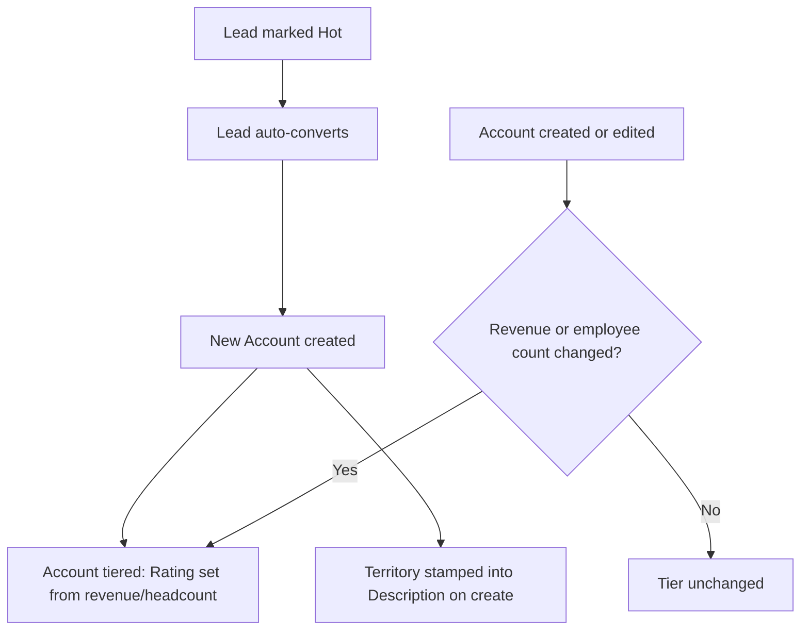
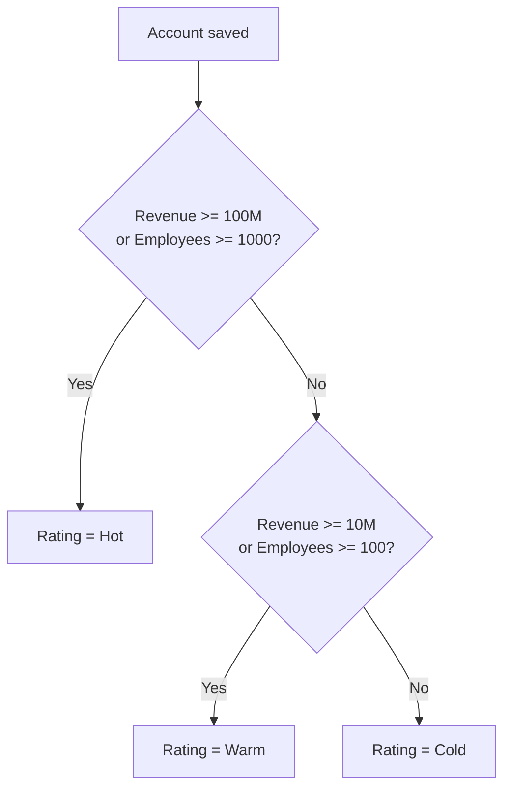

## Overview

Whenever a lead is converted, or an account is created or has its revenue/headcount edited, Salesforce
automatically recalculates two visible things on the Account: its **tier** (stored in the Rating field as
Hot / Warm / Cold, based on annual revenue and employee count) and its **territory** (stamped into the
Description field based on billing country and state). Sales and ops use these fields to route accounts to
the right team and to see, at a glance, whether an account should be treated as strategic. This logic runs
automatically — no one has to remember to set it — so an account's tier and territory reflect its data the
moment it's saved.



## Prerequisites

```callout
type: note
Tiering and territory stamping are automatic — there is nothing to turn on. This section covers the
configuration these automations depend on.
```

- A Lead Status record with `IsConverted = true` must exist, or lead conversion will fail with no
  converted status to apply
- Users need standard **Convert** access on Leads and edit access on Account fields `Rating` and
  `Description`

## Steps to Navigate

### Convert a lead manually

1. Open a **Lead** record.
2. Click **Convert**.
3. Confirm the Account, Contact, and Opportunity details, then click **Convert**.

```screenshot
id: lead-conversion-account-tiering-convert-button
alt: Lead record page with the Convert button highlighted
step: Open a Lead record and locate the Convert button
url_pattern: /lightning/r/Lead/{recordId}/view
```

### View an account's tier and territory

1. Open the **Account** record.
2. Check the **Rating** field for the current tier (Hot / Warm / Cold).
3. Check the **Description** field — the first line reads `Territory: <territory name>`.

```screenshot
id: lead-conversion-account-tiering-account-fields
alt: Account record page showing the Rating field and the Description field with a Territory prefix
step: Open a converted Account and view the Rating and Description fields
url_pattern: /lightning/r/Account/{recordId}/view
```

## Use Cases

### Automatic conversion of a Hot lead

1. A lead's **Rating** changes to `Hot` (set manually or by lead scoring) while it is not yet converted.
2. On save, the system automatically converts the lead using the org's converted Lead Status, creating an
   Opportunity.
3. The new Account is queried back and immediately tiered — no separate step is needed, so the account never
   sits with a blank Rating.

### Manual conversion of a Hot lead

1. A user clicks **Convert** on a Lead whose Rating is `Hot` and that is not already converted.
2. Conversion proceeds and the resulting Account is tiered the same way as the automatic path.
3. If the lead's Rating is **not** `Hot` (or the lead is already converted), it is skipped by the automated
   "now Hot" trigger, but a user can still convert it manually through the standard Convert button — that
   manual conversion is not gated by Rating.

### Account tiering on create

1. A new Account is created (directly, via conversion, or via integration) with `AnnualRevenue` and/or
   `NumberOfEmployees` populated.
2. The system sets **Rating**:
   - `Hot` if Annual Revenue ≥ $100,000,000 **or** Employees ≥ 1,000
   - `Warm` if Annual Revenue ≥ $10,000,000 **or** Employees ≥ 100 (and Hot thresholds not met)
   - `Cold` otherwise
3. Missing revenue or employee values are treated as zero, so a blank account is tiered `Cold`.



### Re-tiering after a size change

1. An existing Account has its **Annual Revenue** or **Number of Employees** edited (for example, after a
   funding round or acquisition).
2. Only accounts whose revenue or employee count actually changed are re-evaluated — editing unrelated
   fields does not trigger a re-tier.
3. If the recalculated tier differs from the current Rating, the Account is updated again with the new
   Rating. This second update does not re-run the tiering logic a second time, so there's no risk of a loop.
4. If the recalculated tier is the same as the current Rating, no update is made.

### Territory assignment by billing address

1. When an Account is **created**, its billing country and state are evaluated and a territory name is
   prepended to the Description field as `Territory: <name>`, followed by any existing Description text on
   a new line.
2. Territory is derived from `BillingCountry` / `BillingState`:
   - United States: West (CA/WA/OR/NV/AZ), East (NY/NJ/MA/CT/FL), Central (TX/IL/CO/MN/Texas/Illinois/Colorado),
     or AMER-Other for any other state
   - UK, Ireland, France, Germany, Spain, Netherlands → EMEA
   - India, Singapore, Japan, Australia → APAC
   - Brazil, Mexico, Argentina → LATAM
   - Any other country, or a blank country → Unassigned
3. Country values of `USA`, `US`, or `United States of America` (any case) are normalized to `United States`
   before matching; `UK` and `Great Britain` are normalized to `United Kingdom`.

```callout
type: warning
Territory is only stamped when an Account is **created**. If a rep later edits the Billing Country or
Billing State on an existing account, the Description field's Territory line is not recalculated — it still
reflects the address the account was created with.
```

## Validations & Business Rules

- Automation: `AccountTriggerHandler.beforeInsert` calls `AccountTerritoryService.stampTerritoryDescription`,
  prepending `Territory: <name>` to Description on every new Account.
- Automation: `AccountTriggerHandler.afterInsert` calls `AccountTierService.retierAccounts` on every newly
  inserted Account.
- Automation: `AccountTriggerHandler.afterUpdate` re-tiers only accounts whose `AnnualRevenue` or
  `NumberOfEmployees` changed since the last save.
- Automation: `AccountTierService.retierAccounts` bypasses the Account trigger while writing the Rating
  update, preventing recursive tiering.
- Automation: `LeadConversionService.convertQualified` auto-converts a Lead only if it is not already
  converted and its Rating is `Hot`; converted Accounts are queried back and tiered in the same operation.
- Automation: `LeadTriggerHandler.afterUpdate` triggers auto-conversion when a Lead's Rating transitions to
  `Hot` and the Lead is not yet converted, bypassing the Lead trigger during conversion to avoid recursion.
- Dependency: Lead conversion requires an active converted Lead Status; if none exists, conversion fails.

## Related Features

- Lead scoring and assignment determine when a Lead's Rating becomes Hot, which is what triggers automatic
  conversion here.
- The Customer Lifecycle Orchestrator's `qualifyAndConvert` entry point wraps this same conversion logic as
  the first step of the full lead-to-cash journey.
