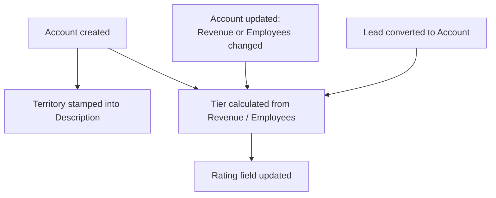

## Overview

Every Account in the org is automatically stamped with a **sales territory** and a **tier** (shown as the Account's Rating field) so reps and ops don't have to set these by hand. Territory is derived from the Account's billing country/state and is written into the Description field as soon as the record is created. Tier is derived from Annual Revenue and Number of Employees, and is recalculated whenever an Account is created, whenever its size fields change on update, or right after a Lead converts into an Account. This keeps routing and pricing decisions consistent with the account's actual geography and size, without relying on a person remembering to classify the account correctly.



## Prerequisites

```callout
type: before
Territory and tiering run automatically on every Account insert/update — there is nothing to turn on. These prerequisites just describe what needs to be filled in for the results to be meaningful.
```

- Billing Country (and Billing State for US accounts) should be populated so the account lands in the correct territory instead of **Unassigned**.
- Annual Revenue and Number of Employees should be populated so the account lands in the correct tier instead of the default **Cold**.

## Steps to Navigate

Territory and tier assignment happen automatically in the background — there are no settings to configure. To see the results on an account:

1. Open the **Accounts** tab and open any account record.
2. Look at the **Rating** field to see the assigned tier (Hot, Warm, or Cold).
3. Look at the **Description** field to see the assigned territory, shown as the first line (for example `Territory: AMER-West`).

```screenshot
id: territory-and-tiering-account-record
alt: Account record page showing the Rating field and a Description field starting with "Territory: AMER-West"
step: Open an Account record and view the Rating and Description fields
url_pattern: /lightning/r/Account/{recordId}/view
actions:
  - open_record: Account
```

## Use Cases

### Creating a new account

1. A user (or an integration, or Lead conversion) creates a new Account record and saves it.
2. Before the record is inserted, the system reads **Billing Country** and **Billing State** and works out the territory (for example `AMER-East`, `EMEA`, `APAC`, `LATAM`, or `Unassigned`).
3. That territory is written as `Territory: <territory>` at the top of the **Description** field, with any text the user already typed into Description preserved underneath it.
4. Immediately after the insert completes, the system reads **Annual Revenue** and **Number of Employees** and calculates the tier (`Hot`, `Warm`, or `Cold`).
5. If the calculated tier differs from the current **Rating**, the Rating field is updated on the account automatically.

### Updating billing address or account size (retiering on change)

1. A user edits an existing Account and changes **Annual Revenue** or **Number of Employees**, then saves.
2. The system compares the new values to the values before the edit. Only accounts where one of these two fields actually changed are re-evaluated — accounts where nothing else changed are left alone.
3. The tier is recalculated for the changed accounts, and Rating is updated only if the new tier differs from the current one.
4. Note: territory is **only** calculated at insert time (in the Description field). Changing Billing Country or Billing State on an existing account does **not** re-stamp the Description — the original territory note remains until the record is otherwise re-territoried by a data fix.

### Converting a Lead into an Account

1. A user converts a Lead into an Account (and optionally a Contact/Opportunity).
2. Once the conversion succeeds, the newly created (or matched) Account is re-tiered using its current Annual Revenue and Number of Employees, the same way as any other size change.
3. This ensures an account that came in through Lead conversion gets an accurate Rating immediately, rather than waiting for the next manual edit.

### Account with missing or unrecognized data

1. If Billing Country is blank or doesn't match any of the configured countries/regions, the account is assigned territory **Unassigned**.
2. If Billing Country is a recognized US variant (`USA`, `US`, `United States of America`) but Billing State isn't one of the mapped West/East/Central values, the account is assigned **AMER-Other**.
3. If Annual Revenue and Number of Employees are both blank, they're treated as `0`, and the account is tiered **Cold** by default.

### Bulk load or data import

1. A user or integration inserts or updates many Accounts at once (for example, a CSV import or an integration sync).
2. Territory stamping and tier calculation both run against the full list of accounts in the trigger context, not one at a time, so the behavior is the same as for a single record — every account in the batch gets its territory and/or tier evaluated.
3. On bulk update, only the subset of records whose Annual Revenue or Number of Employees actually changed is sent for retiering, keeping the update efficient.

## Validations & Business Rules

- **Territory matrix** (`AccountTerritoryService.territoryFor`):
  - United States: mapped by Billing State into `AMER-West` (CA, WA, OR, NV, AZ and full names), `AMER-East` (NY, NJ, MA, CT, FL and full names), `AMER-Central` (TX, IL, CO, MN and full names), or `AMER-Other` if the state isn't in any list.
  - `EMEA`: United Kingdom, Ireland, France, Germany, Spain, Netherlands.
  - `APAC`: India, Singapore, Japan, Australia.
  - `LATAM`: Brazil, Mexico, Argentina.
  - Anything else (or blank country): `Unassigned`.
  - Country is normalized first — `USA`, `US`, and `United States of America` all resolve to `United States`; `UK` and `Great Britain` resolve to `United Kingdom`.
  - Territory is written to **Description** as `Territory: <value>`, prefixed onto any existing Description text, truncated to 32,000 characters.
- **Tier thresholds** (`AccountTierService.tierFor`):
  - **Hot**: Annual Revenue ≥ $100,000,000 **or** Number of Employees ≥ 1,000.
  - **Warm**: Annual Revenue ≥ $10,000,000 **or** Number of Employees ≥ 100 (and not already Hot).
  - **Cold**: everything else, including accounts with no revenue or employee data.
  - Tier is written to the **Rating** field, and only when it actually differs from the current value (avoids no-op updates).
- **Automation / triggers**:
  - `AccountTriggerHandler.beforeInsert` calls territory stamping on every insert.
  - `AccountTriggerHandler.afterInsert` and `afterUpdate` call tiering; `afterUpdate` only includes accounts where Annual Revenue or Number of Employees changed.
  - `AccountTierService.retierAccounts` performs its own DML update guarded by `TriggerControl.bypass('Account')` / `clearBypass`, so the Rating update does not re-trigger territory/tier logic recursively.
  - `AccountTriggerHandler.afterInsert`/`afterUpdate` also check `TriggerControl.isBypassed('Account')` up front and skip tiering entirely if the Account trigger is currently bypassed elsewhere in the transaction.
  - `LeadConversionService` calls `AccountTierService.retierAccounts` directly after a successful conversion, re-querying Annual Revenue, Number of Employees, and Rating for the converted account(s).

## Related Features

- Lead Conversion — triggers a re-tier of the resulting Account once conversion succeeds.
