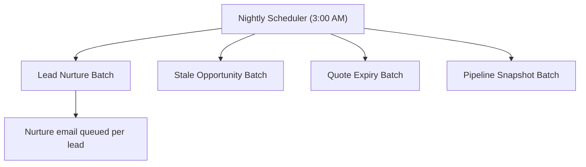

## Overview

Every night, one scheduled job kicks off four maintenance batches that keep the sales pipeline
accurate and keep reps from letting deals go cold. It follows up on unconverted leads that have sat
untouched for two weeks, records a snapshot of open pipeline by stage for trend tracking, expires
quotes that were never signed before their expiration date, and flags or auto-closes opportunities
whose close dates have slipped into the past. Sales reps and managers see the results the next
business day as new Tasks, updated Quote/Opportunity statuses, and a daily pipeline snapshot Task —
no one has to run anything manually.

```callout
type: note
This automation currently has no production trigger wired up — it must be scheduled manually (see
Prerequisites). Until someone schedules it in Setup, none of the behavior below runs.
```



## Prerequisites

- System Administrator access to schedule or monitor Apex jobs (Setup → Apex Jobs / Scheduled Jobs)
- The job must be scheduled once via Setup → Apex Classes → Schedule Apex (or anonymous Apex) pointing at `NightlyPipelineJobsSchedulable`
- Task and email deliverability must be enabled for the org so follow-up Tasks and nurture emails are created/sent

## Steps to Navigate

1. Click the gear icon in the top-right, then click **Setup**.
2. In the Quick Find box, type **Apex Classes** and select it.
3. Click **Schedule Apex**.
4. Enter a job name (e.g. "Nightly Pipeline Jobs").
5. Set the frequency to **Weekly** or **Daily**, and choose a start time (recommended: overnight, e.g. 3:00 AM, to avoid business-hours API limit contention).
6. In **Apex Class**, search for and select `NightlyPipelineJobsSchedulable`.
7. Click **Save**.

```screenshot
id: nightly-pipeline-maintenance-jobs-schedule-apex
alt: Schedule Apex page with NightlyPipelineJobsSchedulable selected and a daily 3 AM start time set
step: Navigate to Setup > Apex Classes > Schedule Apex and fill in the job details
url_pattern: /lightning/setup/ScheduleApex/home
```

8. To confirm the job ran, go to **Setup** → Quick Find → **Apex Jobs**, and look for a completed
   entry for the scheduled job name and its four child batch jobs.

```screenshot
id: nightly-pipeline-maintenance-jobs-apex-jobs-list
alt: Apex Jobs monitoring page showing completed batch job entries for the nightly run
step: Navigate to Setup > Apex Jobs to view completed batch runs
url_pattern: /lightning/setup/AsyncApexJobs/home
```

## Use Cases

### Nurturing a cold, unconverted lead

1. A lead has `IsConverted = false` and hasn't been modified in 14 or more days.
2. The nightly job creates a Task ("Nurture follow-up") assigned to the lead owner, due in 2 days, so the rep has a concrete next action.
3. Separately, a nurture email ("Still exploring? We saved your place") is queued and sent to the lead's email address, if one exists.
4. The rep sees the new Task on their Home page and the lead receives the touch-point email automatically — no manual outreach required.

### Recording the nightly pipeline snapshot

1. The job totals `Amount` for every open (not-closed) Opportunity, grouped by Stage.
2. At the end of the run, it inserts one completed Task titled "Pipeline snapshot <today's date>" with the stage totals listed in the Description field.
3. Sales managers can open this Task from the Activity feed on any record they're following, or search Tasks by subject, to see how the funnel moved day over day — useful for trend review without building a report.

### A presented quote expires unsigned

1. A Quote is in **Presented** status and its `ExpirationDate` has passed.
2. The job flips the Quote's Status to **Denied** (this org's way of marking a quote expired).
3. A Task ("Quote expired — requote: <Quote Name>") is created for the quote owner, due in 2 days, prompting them to issue a new quote.
4. Because the batch bypasses the Quote trigger during this update, no other quote automation (e.g. Opportunity sync logic) fires as a side effect of the expiry — only the intended status change happens.

### An opportunity's close date slips 30+ days

1. An open Opportunity's `CloseDate` is more than 30 days in the past but not yet more than 90 days.
2. The job creates a Task ("Stale deal — revive or close: <Opportunity Name>") for the owner, due in 3 days, prompting them to update or close the deal.
3. The Opportunity itself is left untouched — only a reminder Task is added.

### An opportunity goes stale beyond 90 days (auto-close)

1. An open Opportunity's `CloseDate` is more than 90 days in the past.
2. Instead of a reminder Task, the job automatically sets **Stage** to **Closed Lost** so the pipeline no longer counts a deal that's clearly dead.
3. This update bypasses the Opportunity trigger, so only the stage change is applied without cascading other Opportunity automation.
4. Reps and managers will see the Opportunity move out of open pipeline reports without any manual action — if that's unexpected, check this job first before assuming a rep closed it manually.

## Validations & Business Rules

- **Lead nurture threshold:** Leads must be unconverted (`IsConverted = false`) and unmodified for 14+ days to receive a follow-up Task and nurture email.
- **Pipeline snapshot scope:** Only open (`IsClosed = false`) Opportunities are included in the nightly snapshot totals.
- **Quote expiry condition:** Only Quotes with `Status = 'Presented'` and `ExpirationDate` in the past are moved to `Denied`; the update runs with the Quote trigger bypassed via `TriggerControl.bypass('Quote')` / `clearBypass('Quote')`.
- **Stale opportunity thresholds:** Open Opportunities with `CloseDate` 30+ days past get a reminder Task; those 90+ days past are automatically set to `Closed Lost`. This update bypasses the Opportunity trigger via `TriggerControl`.
- **Batch chunk sizes:** Lead Nurture runs in batches of 200, Stale Opportunity and Quote Expiry in batches of 100, and Pipeline Snapshot in batches of 500 — sized to keep each transaction's DML and heap usage well under governor limits.
- **Email volume isolation:** Lead nurture emails are sent from a separate Queueable job (`LeadNurtureQueueable`), chunked per batch scope, so sending emails never risks the batch transaction's own limits.
- **Not currently scheduled in production:** `NightlyPipelineJobsSchedulable` has no code path invoking it automatically — an administrator must schedule it manually for any of this behavior to take effect.

## Related Features

- Quote lifecycle and status management
- Opportunity stage management and pipeline reporting
- Trigger bypass framework (`TriggerControl`) used across other nightly and record-save automation
