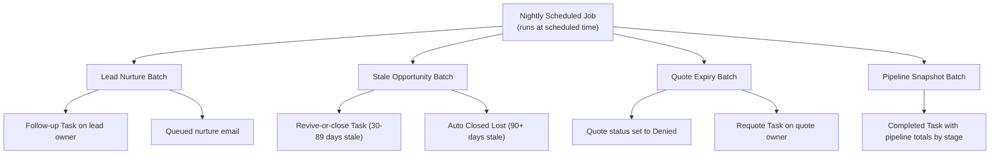

## Overview

Every night, one scheduled job kicks off four housekeeping tasks that keep the sales pipeline honest without anyone having to remember to do it manually: it re-engages leads nobody has touched in two weeks, records a snapshot of where open pipeline stands stage by stage, flips overdue quotes to a closed status, and either nudges or auto-closes opportunities that have sat past their close date. Sales reps and sales ops see the results the next morning as new Tasks, updated statuses, and a running pipeline audit trail — with no manual effort required. An administrator is responsible for scheduling the job; it does not run until someone schedules it in Setup.



## Prerequisites

- System Administrator access to Setup → Apex Jobs and Scheduled Jobs to monitor or reschedule the job.
- The job is not automatic out of the box — an admin must schedule `NightlyPipelineJobsSchedulable` via Apex (Anonymous Apex or Setup's Scheduled Jobs UI) before any of this runs.
- Email deliverability must be enabled for lead nurture emails to actually send to lead contacts.

```callout
type: before
This job must be scheduled before it will run. There is no admin toggle for it — an admin (or a deploy script) runs Anonymous Apex once, for example:
`System.schedule('Nightly sales jobs', '0 0 3 * * ?', new NightlyPipelineJobsSchedulable());`
```

## Steps to Navigate

1. Click the gear icon in the top-right, then click **Setup**.
2. In the Quick Find box, type **Apex Classes** and confirm `NightlyPipelineJobsSchedulable` is deployed.
3. In the Quick Find box, type **Scheduled Jobs** to view jobs that have already been scheduled.

```screenshot
id: nightly-pipeline-maintenance-jobs-scheduled-jobs
alt: Setup's Scheduled Jobs page showing the nightly pipeline job entry
step: Navigate to Setup and open the Scheduled Jobs page
url_pattern: /lightning/setup/ScheduledJobs/home
```

4. To schedule the job (one-time setup, admin only), go to **Setup → Apex Classes → Execute Anonymous** (or use the Developer Console), and run:
   `System.schedule('Nightly sales jobs', '0 0 3 * * ?', new NightlyPipelineJobsSchedulable());`
5. Confirm the job now appears in **Scheduled Jobs** with the next run time.
6. The next morning, review the results directly on records: open a Lead, Quote, or Opportunity and check its **Activity** related list for new Tasks created overnight.

```screenshot
id: nightly-pipeline-maintenance-jobs-activity-tasks
alt: A Lead record's Activity related list showing a "Nurture follow-up" Task created overnight
step: Open a Lead record and view the Activity related list
url_pattern: /lightning/r/Lead/{recordId}/view
```

## Use Cases

### Nurturing a stale, unconverted lead

1. A Lead that has not been modified in 14 or more days and has not converted is picked up automatically the next time the job runs — no user action is needed.
2. The job logs a **"Nurture follow-up"** Task on the Lead, assigned to the lead owner with a due date two days out, so the owner sees it on their next login.
3. Separately, if the Lead has an email address on file, a nurture email ("Still exploring? We saved your place") is queued and sent to the lead automatically.
4. If the Lead has no email address, the Task is still created but no email goes out for that lead.

### Nightly pipeline snapshot

1. Every open (not-closed) Opportunity is totalled up by Stage.
2. A single **Completed** Task is created summarizing total open pipeline dollar amount per stage, dated today, giving sales ops a running day-over-day audit trail with no dashboard required.
3. This Task is informational only — it does not change any Opportunity record.

### Quote expiring past its presented date

1. A Quote sitting in **Presented** status whose Expiration Date has passed is automatically updated to **Denied**, representing "expired" in this org's terminology.
2. A **"Quote expired — requote"** Task is created for the quote owner, due in two days, prompting them to follow up with a new quote.
3. This update bypasses standard Quote automation while it runs, so the status change itself does not re-trigger other quote workflows.

### Stale opportunity — nudge to revive or close

1. An open Opportunity whose Close Date is 30-89 days in the past gets a **"Stale deal — revive or close"** Task assigned to the owner, due in three days.
2. The Opportunity record itself is not changed — this is a reminder only, prompting the owner to update the close date, advance the stage, or close it out manually.

### Stale opportunity — auto-closed after 90 days

1. An open Opportunity whose Close Date is 90 or more days in the past is automatically moved to **Closed Lost** — no nudge Task is created for these, since the deal is considered stale enough to close outright.
2. This update bypasses standard Opportunity automation while it runs, so the stage change itself does not re-trigger other opportunity workflows.
3. Reps should treat a deal that flips to Closed Lost overnight as a signal to review whether it was truly dead or just needed its close date updated before the 90-day mark.

## Validations & Business Rules

- **Lead eligibility**: only Leads where `IsConverted = false` and `LastModifiedDate` is older than 14 days are nurtured; converted or recently-touched leads are skipped.
- **Nurture email**: sent only to Leads with a non-null `Email`; Leads without an email still get the follow-up Task but no email.
- **Quote eligibility**: only Quotes with `Status = 'Presented'` and an `ExpirationDate` in the past are expired; other statuses (e.g. Draft, Accepted) are untouched by this job.
- **Quote status change**: Quote is set to `Denied` and its owner gets a requote Task; the update runs with `TriggerControl.bypass('Quote')` so other Quote-side automation does not fire on this system update.
- **Opportunity staleness threshold**: Opportunities 30-89 days past Close Date get a reminder Task only; Opportunities 90+ days past Close Date are moved straight to `Closed Lost`. Closed Opportunities (`IsClosed = true`) are excluded entirely.
- **Opportunity status change**: the Closed Lost update runs with `TriggerControl.bypass('Opportunity')` so other Opportunity-side automation does not re-fire on this system update.
- **Pipeline snapshot**: only Opportunities with `IsClosed = false` are counted; Amount is treated as 0 when blank. The snapshot Task is purely additive and never modifies Opportunity records.
- **Execution order**: within the nightly job, batches run in this order — Lead Nurture, Stale Opportunity, Quote Expiry, Pipeline Snapshot — so the pipeline snapshot reflects the day's other updates.
- **Scheduling**: none of this runs unless an admin schedules `NightlyPipelineJobsSchedulable` with `System.schedule`; there is no user-facing toggle to turn it on or off.

## Related Features

- Lead conversion and lead assignment — leads nurtured here that later convert stop being picked up by this job.
- Quote lifecycle — see how quotes move through Draft, Presented, Accepted, and Denied outside of this nightly expiry sweep.
- Opportunity lifecycle and stage management — how stages and close dates are otherwise maintained day to day.
