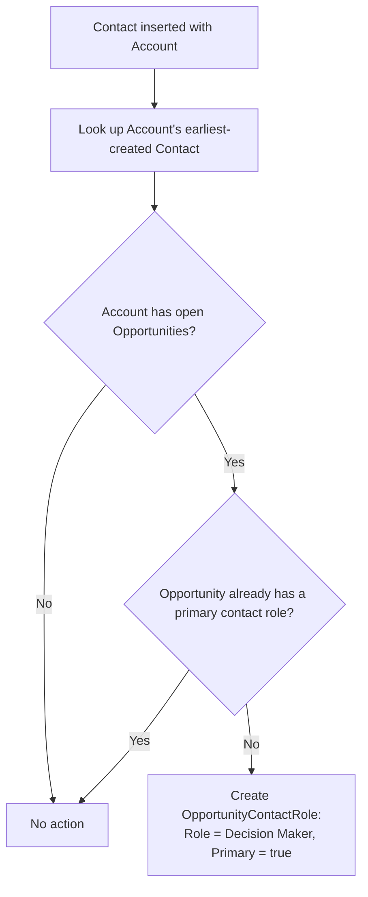

## Overview

Sales teams often create an Opportunity before any Contact exists on the Account, which leaves the
Opportunity without a primary contact. This automation closes that gap automatically: every time a
Contact is saved (inserted) with an Account, the system checks that Account's open Opportunities and,
for any that are missing a primary contact role, assigns one automatically using the Account's
earliest-created Contact as the "Decision Maker." No user action is required — this runs silently in
the background on every Contact insert.



## Prerequisites

```callout
type: note
This automation is fully system-driven — there is no permission set or setup step a user needs to enable
it. It fires automatically whenever a Contact is inserted.
```

- A Contact must have its Account field populated for this logic to run
- The Account must have at least one open Opportunity that is missing a primary `OpportunityContactRole`

## Steps to Navigate

This is background automation with no dedicated screen to open. It runs whenever a Contact is created
through any normal path:

1. Navigate to an **Account** record.
2. In the Related list, click **New** under Contacts (or create the Contact from the Contacts tab and set its Account lookup).
3. Fill in the Contact's required fields (e.g. **Last Name**) and set **Account Name** to the account.
4. Click **Save**.

```screenshot
id: contact-automation-new-contact-form
alt: New Contact form with the Account Name field populated
step: Open the New Contact form from an Account's Contacts related list and fill in Last Name and Account Name
url_pattern: /lightning/o/Contact/new
actions:
  - open_app_launcher
  - search_app_launcher: Contacts
  - click_app_launcher_result: Contacts
  - click_new
  - fill_field: { field: LastName, value: Automation Test Contact }
```

Once saved, the automation runs immediately and silently — there is nothing further to click.

## Use Cases

### First contact added to an account with an open opportunity

1. An Account has one open Opportunity and no Contacts yet.
2. A user creates the Account's first Contact and saves it.
3. The automation finds the open Opportunity has no primary contact role, and creates one: the new
   Contact is set as **Role = Decision Maker**, **Primary = true**.
4. On the Opportunity's **Contact Roles** related list, the Contact now appears as the primary role —
   no manual step was needed.

```screenshot
id: contact-automation-opportunity-contact-role
alt: Opportunity Contact Roles related list showing the auto-created Decision Maker primary role
step: Open the Opportunity record and view the Contact Roles related list after saving a new Contact on its Account
url_pattern: /lightning/r/Opportunity/{recordId}/view
```

### Opportunity already has a primary contact role

1. An Account already has a Contact assigned as the primary role on its open Opportunity.
2. A second Contact is added to the same Account and saved.
3. Because the Opportunity already has a primary `OpportunityContactRole`, the automation makes no
   change — the existing primary role is left exactly as it was.

### Account has no open opportunities

1. A Contact is created on an Account that has no open Opportunities (e.g. all are Closed Won/Lost, or
   none exist yet).
2. The automation finds no open Opportunities to evaluate, so no `OpportunityContactRole` is created.
3. If an Opportunity is opened on that Account later, no retroactive role is created at that time —
   this logic only runs on Contact save, not on Opportunity creation.

### Bulk contact import across multiple accounts

1. A user or integration inserts many Contacts at once (e.g. a data import) spanning several Accounts.
2. The automation processes all affected Accounts together in a single pass: it looks up the earliest
   Contact per Account and the open Opportunities per Account in bulk queries, then inserts all missing
   primary contact roles in one DML operation.
3. This keeps the automation within governor limits regardless of batch size, since accounts and
   opportunities are queried and updated in sets rather than one at a time.

### Correcting an incorrectly assigned primary contact

1. The automation always picks the Account's **earliest-created** Contact as Decision Maker — it does
   not know which contact is actually the business decision maker.
2. If the wrong Contact was assigned, a user can manually edit the `OpportunityContactRole` record from
   the Opportunity's Contact Roles related list and change the Contact or Role.
3. The automation will not overwrite or re-create a role once one exists as primary — manual corrections
   are safe and permanent unless the role record is deleted (at which point the Opportunity would again
   qualify as missing a primary role on the next Contact insert for that Account).

## Validations & Business Rules

- Trigger: `ContactTrigger` runs `after insert` only — updates to existing Contacts (e.g. changing the
  Account lookup) do not re-trigger this logic.
- The "primary" Contact chosen is always the Account's Contact with the earliest `CreatedDate`, re-queried
  fresh from all Contacts on the Account — not necessarily the Contact that was just inserted.
- Only Opportunities where `IsClosed = false` are considered; closed Opportunities are never modified.
- Only Opportunities with zero existing `IsPrimary = true` Contact Roles are affected; an Opportunity with
  an existing primary role is left untouched.
- The created `OpportunityContactRole` always uses `Role = 'Decision Maker'` and `IsPrimary = true`.
- Contacts without an Account (`AccountId = null`) are ignored entirely.

## Related Features

- Opportunity Contact Roles — the related list on an Opportunity where the auto-created primary role appears
- Account management — Contacts must be associated to an Account for this automation to apply
