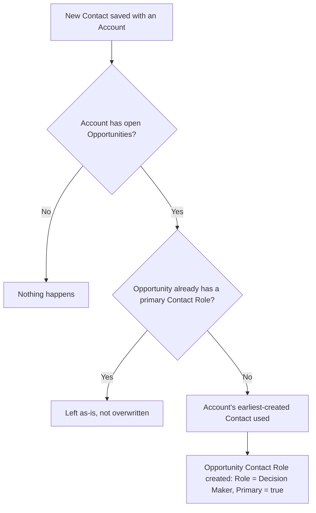

## Overview

Sales teams rely on every open opportunity having a primary contact role so reports, forecasting, and quote generation know who the deal is being sold to. In practice, reps often create the Account and Opportunity first and add a Contact later, leaving the opportunity without a primary contact. Contact Role Sync closes that gap automatically: whenever a new contact is saved on an account, the system checks that account's open opportunities and, for any that don't already have a primary contact role, creates one using the account's earliest-created contact. No user action is required — the sales rep simply sees a **Decision Maker** contact role appear on the opportunity's Contact Roles related list.



## Prerequisites

- The new Contact record must have its Account field populated — contacts with no account are ignored.
- The account must have at least one open (`IsClosed = false`) Opportunity for a role to be created.

```callout
type: note
This runs automatically after a Contact is inserted — there is nothing to configure or click to trigger it. The steps below describe how a user creates the contact that sets the sync in motion, and how to review the result.
```

## Steps to Navigate

1. Open an **Account** record.
2. In the **Contacts** related list, click **New Contact**.
3. Fill in the required contact fields (the Account field is pre-populated from the record you're on) and click **Save**.

```screenshot
id: contact-role-sync-new-contact
alt: New Contact form open from an Account record with the Account field pre-filled
step: Click New on the Contacts related list of an Account and open the new-contact form
url_pattern: /lightning/o/Contact/new
actions:
  - open_record: Account
  - click_tab: Related
```

4. Open the account's related **Opportunity** record.
5. Scroll to the **Contact Roles** related list to see the automatically created primary role.

```screenshot
id: contact-role-sync-opportunity-contact-roles
alt: Opportunity Contact Roles related list showing a Decision Maker marked as Primary
step: Open an Opportunity and view its Contact Roles related list
url_pattern: /lightning/r/Opportunity/{recordId}/view
actions:
  - open_record: Opportunity
```

## Use Cases

### Standard: first contact fills the gap

1. An Account has one open Opportunity with no primary contact role.
2. A user adds the first Contact to that Account and saves.
3. The sync finds the open Opportunity has no primary role, so it creates an `OpportunityContactRole` on that Opportunity with the new Contact, `Role = 'Decision Maker'`, `IsPrimary = true`.
4. The user sees the new role appear on the Opportunity's Contact Roles list without taking any action there.

### Already has a primary contact — no overwrite

1. An Account's Opportunity already has a primary contact role (set manually by a rep, or from an earlier sync).
2. A second Contact is added to the same Account.
3. Because the Opportunity already has a primary role, the sync skips it entirely — the existing role is left untouched and no duplicate is created.
4. To change who the primary contact is, a user must edit the Contact Role manually on the Opportunity; the sync will not do this for them.

### No open opportunities yet

1. A Contact is added to an Account that has no Opportunities, or only Opportunities that are already Closed Won/Closed Lost.
2. The sync finds no open opportunities to act on, so nothing is created.
3. If an Opportunity is created later on that Account, it will not retroactively get a contact role from this sync — the sync only runs when a Contact is inserted, not when an Opportunity is created.

### Bulk contact import across multiple accounts

1. A data load or bulk API job inserts contacts for many accounts at once.
2. The sync processes all affected accounts together: for each account it looks up that account's earliest-created contact (by `CreatedDate`) and checks all of that account's open opportunities missing a primary role.
3. Every qualifying opportunity across every account gets its primary contact role created in a single pass, so the feature scales with bulk operations instead of running once per record.

### Multiple existing contacts — the earliest one wins

1. An Account already has two or more Contacts, and its Opportunity has no primary contact role yet (for example, the role was deleted).
2. A new, third Contact is added to the Account, which fires the sync.
3. The sync does not use the newly added Contact — it looks up the Account's earliest-created Contact (`ORDER BY CreatedDate ASC`) and uses that one as the primary role's Contact.
4. A user expecting the just-added contact to become primary should check who the account's original contact is, or manually correct the role if a different contact should be primary.

## Validations & Business Rules

- Trigger scope: the `ContactTrigger` fires on Contact **after insert** only (not on update, so re-parenting a contact to a different account does not re-run the sync) and hands the inserted records to `ContactTriggerHandler`, which only considers contacts where `AccountId` is populated.
- Opportunity scope: only opportunities where `IsClosed = false` are evaluated; closed opportunities are never touched.
- No-overwrite rule: an opportunity is skipped if it already has any `OpportunityContactRole` with `IsPrimary = true` — the sync never replaces an existing primary role.
- Contact selection: when an account has multiple contacts, the one with the earliest `CreatedDate` is used as the primary contact, regardless of which contact triggered the sync.
- Role value: created roles always use `Role = 'Decision Maker'` and `IsPrimary = true`.
- Bulk-safe: the logic is written to process a set of Account Ids and a set of Opportunities in bulk, so it behaves correctly for both single-record saves and bulk data loads.

## Related Features

- Opportunity Contact Roles — the related list this feature keeps populated
- Account and Contact management — the source records that drive this sync
