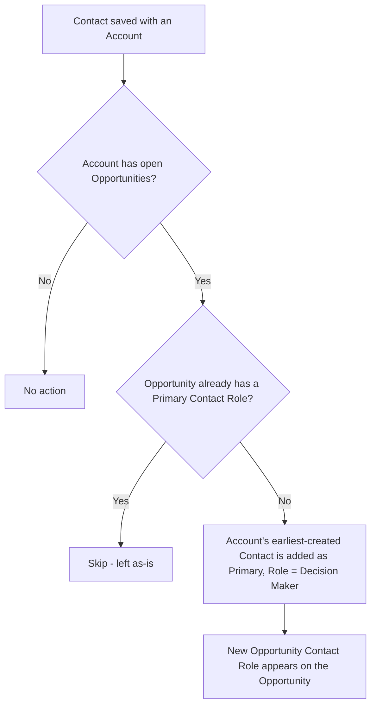

## Overview

Sales reps frequently create an Opportunity before any Contact exists on the Account, which leaves the
Opportunity without a primary Contact Role — a common data-hygiene gap that shows up in pipeline reports
and forecasting. This feature closes that gap automatically: whenever a Contact is added to an Account,
the system checks every open Opportunity on that Account and, if one is missing a primary Contact Role,
creates one and marks it "Decision Maker." No manual step is required — the rep just adds the Contact as
normal and the Opportunity's Contact Roles related list fills in on its own.



## Prerequisites

- Create/Edit access to Contact records
- Read/Create access to Opportunity Contact Role
- The Contact must be linked to an Account (AccountId populated) for the sync to run

```callout
type: note
This runs automatically after a Contact is saved — there is nothing to turn on or configure in Setup.
```

## Steps to Navigate

1. Open the **Account** record that the Contact belongs to (or will belong to).
2. In the **Contacts** related list, click **New**.
3. Fill in the Contact's details, making sure the Account lookup is populated, then click **Save**.

```screenshot
id: opportunity-contact-role-sync-new-contact
alt: New Contact form open from an Account's Contacts related list, with the Account field populated
step: From an Account record, click New in the Contacts related list to open the new Contact form
url_pattern: /lightning/o/Contact/new
```

4. Open one of the Account's open **Opportunity** records.
5. Scroll to the **Contact Roles** related list to see the automatically created row.

```screenshot
id: opportunity-contact-role-sync-contact-roles-list
alt: Opportunity record showing a Contact Roles related list with an auto-created Primary row marked Decision Maker
step: Open an open Opportunity on the Account and view the Contact Roles related list
url_pattern: /lightning/r/Opportunity/{recordId}/view
```

## Use Cases

### Standard path — first contact on an account with an open opportunity

1. A rep creates an Opportunity for a brand-new Account that has no Contacts yet.
2. The rep adds the Account's first Contact.
3. The sync finds the open Opportunity has no primary Contact Role and creates one, linking the new
   Contact with Role = "Decision Maker" and Is Primary = checked.
4. The rep sees the Contact Role appear on the Opportunity without doing anything extra.

### Opportunity already has a primary contact

1. An Opportunity already has a Contact Role marked Is Primary on it (set manually or by an earlier sync run).
2. A new Contact is added to the same Account.
3. The sync checks that Opportunity, sees it already has a primary Contact Role, and leaves it untouched —
   no duplicate or replacement row is created.

### Bulk contact import

1. A data load or integration inserts many Contacts across several Accounts in one batch.
2. The sync groups the inserted Contacts by Account and processes every affected Account's open
   Opportunities in a single pass.
3. Each open Opportunity that was missing a primary Contact Role gets exactly one new row; Opportunities
   that already had one are skipped, regardless of batch size.

### Closed opportunities are left alone

1. An Account's only Opportunity is already Closed Won or Closed Lost.
2. A new Contact is added to that Account.
3. The sync only looks at open (`IsClosed = false`) Opportunities, so nothing is created on the closed one.

### Correcting the wrong primary contact

1. The sync always assigns the **earliest-created** Contact on the Account as the primary — not
   necessarily the Contact that was just added. If an older, less-relevant Contact already existed on the
   Account, that older Contact is the one used, even for a newly created Opportunity.
2. This is a one-time creation only: the sync never updates or removes an existing Contact Role, so it will
   not "fix" or replace a row once one exists.
3. To correct the assigned Contact or Role, a user edits the Opportunity Contact Role record directly from
   the Opportunity's Contact Roles related list.

## Validations & Business Rules

- Automation: an `after insert` trigger on Contact (`ContactTrigger` → `ContactTriggerHandler.afterInsert`)
  runs `ContactRoleSyncService.ensurePrimaryRoles` for every distinct Account represented in the inserted
  Contacts.
- The service only considers **open** Opportunities (`IsClosed = false`) on the affected Accounts.
- An Opportunity is skipped if it already has any Contact Role with `IsPrimary = true`; the check is
  per-Opportunity, so partial coverage (some Opportunities already fixed, others not) is handled correctly.
- The Contact chosen as primary is the Account's Contact with the **earliest `CreatedDate`**, not
  necessarily the Contact that triggered the sync.
- The created Opportunity Contact Role always uses `Role = 'Decision Maker'` and `IsPrimary = true`.
- The sync only fires on Contact **insert** — updating a Contact's Account afterward, or deleting the
  primary Contact Role, does not re-trigger it.

## Related Features

- Opportunity Contact Roles related list on the Opportunity record
- Account-to-Contact relationship setup
