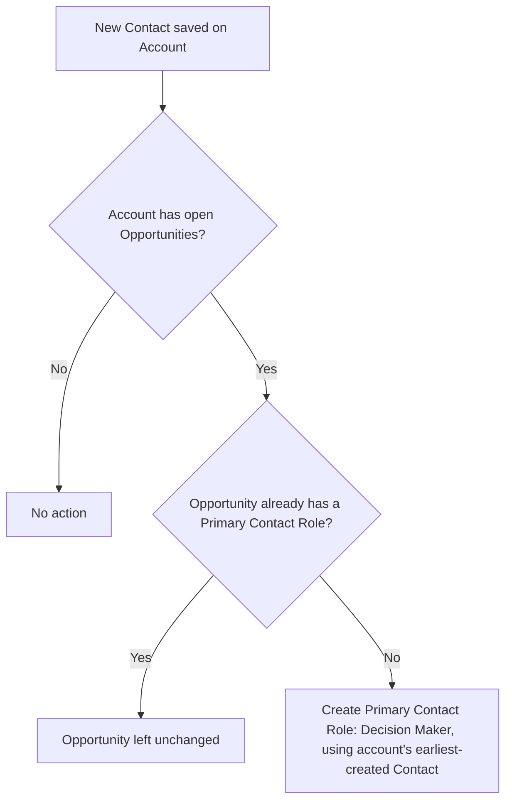

## Overview

Sales reps often close deals with no primary contact recorded on the opportunity, which breaks reporting and
downstream automation that depends on knowing who the deal was made with. This feature closes that gap
automatically: whenever a new contact is saved on an account, the system checks every open opportunity on that
account and, if none of them already has a primary contact role, assigns one using the account's contact. No
manual step is required — reps just add the contact as normal and the primary role appears on the opportunity's
Contact Roles related list.



## Prerequisites

```callout
type: note
This automation runs on Contact insert only — it does not re-run when an existing opportunity is later reopened
or when a contact is edited after creation.
```

- Ability to create Contacts on an Account (standard Contact create access)
- The account must have at least one open (not closed) Opportunity for the automation to have anything to update

## Steps to Navigate

1. Open the **Account** the contact belongs to.
2. In the **Contacts** related list, click **New Contact**.
3. Fill in the contact's details and click **Save**.

```screenshot
id: primary-contact-role-automation-new-contact
alt: New Contact form open from an Account record page
step: Open an Account and create a new Contact
url_pattern: /lightning/r/Account/{recordId}/view
actions:
  - open_record: Account
  - click_related_list_new: Contacts
```

4. Open any open **Opportunity** on that account and check the **Contact Roles** related list — the new contact
   now appears with the **Decision Maker** role marked as **Primary**, provided no other contact was already
   marked primary.

```screenshot
id: primary-contact-role-automation-contact-roles-list
alt: Opportunity Contact Roles related list showing a contact marked as Primary with role Decision Maker
step: Open an Opportunity on the account and view the Contact Roles related list
url_pattern: /lightning/r/Opportunity/{recordId}/view
```

## Use Cases

### First contact added to an account with open opportunities

1. An account has one or more open opportunities and no contacts yet.
2. A user creates the account's first contact.
3. The trigger fires on insert, finds every open opportunity on the account with no existing primary contact
   role, and inserts a `OpportunityContactRole` record with `Role = 'Decision Maker'` and `IsPrimary = true`
   using that new contact.
4. Every qualifying open opportunity on the account now shows a primary contact.

### Additional contact added when a primary role already exists

1. An account already has a contact and an open opportunity that already has a primary contact role (set
   manually or by a prior run of this automation).
2. A second contact is added to the same account.
3. Because the opportunity's contact roles query already finds an existing primary role, that opportunity is
   skipped — the new contact is **not** added as primary and the existing primary role is left untouched.

### Account with only closed opportunities

1. An account's opportunities are all closed (won or lost).
2. A new contact is added to the account.
3. The query for open opportunities (`IsClosed = false`) returns nothing for that account, so no contact role
   is created. Closed opportunities are never modified by this automation.

### Bulk contact import

1. A data load or integration inserts many contacts across many accounts in a single transaction.
2. The trigger handler collects the account Ids from the whole batch in one pass, and the service processes
   all affected accounts and opportunities together in bulk (bulk SOQL and a single bulk DML insert of contact
   roles), rather than once per record.
3. Each account in the batch is evaluated independently using the same rules above — the first contact created
   for that account (by `CreatedDate`) is the one used for any opportunity that still needs a primary role.

## Validations & Business Rules

- Automation: `ContactTrigger` (after insert) calls `ContactTriggerHandler.afterInsert`, which calls
  `ContactRoleSyncService.ensurePrimaryRoles` for the set of affected Account Ids.
- Only opportunities where `IsClosed = false` are considered; closed opportunities are never touched.
- An opportunity is only updated if it currently has **zero** contact roles where `IsPrimary = true` — if a
  primary contact role already exists (from this automation, manual entry, or another process), the
  opportunity is left as-is.
- When multiple contacts exist on the same account, the contact used as the primary role is always the one
  with the earliest `CreatedDate` on that account, not necessarily the contact that was just added.
- The new contact role is always created with `Role = 'Decision Maker'` and `IsPrimary = true` — this value is
  not configurable from the UI.
- This logic only runs on Contact insert; it does not run on Contact update, Opportunity creation, or
  Opportunity reopen, so an opportunity created or reopened after the account's contacts already exist will not
  retroactively get a primary contact role from this automation.

## Related Features

- Opportunity Contact Roles related list on the Opportunity record
