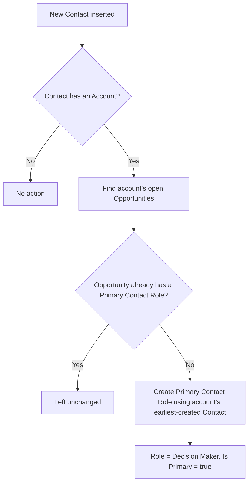

## Overview

Sales reps often close opportunities without ever setting a primary contact role, which leaves reporting and handoff processes without a clear point of contact. This feature closes that gap automatically: whenever a new contact is saved to an account, the system checks every open opportunity on that account and, if any of them is missing a primary contact role, assigns one using the account's earliest-created contact. No manual step is required — it runs silently in the background the moment a contact record is inserted.



## Prerequisites

```callout
type: note
This automation runs automatically on Contact creation — there is no setting or permission to enable it. The items below describe when it actually produces a result.
```

- A Contact must be created with an **Account Name** value set
- The related account must have one or more Opportunities that are still open (not closed/won/lost)

## Steps to Navigate

This feature has no separate configuration screen — it fires automatically. To see it in action:

1. Navigate to an **Account** record that has at least one open opportunity without a primary contact.
2. From the account's **Related** tab, click **New Contact** (or create a Contact directly and set its Account lookup to this account).
3. Fill in the required Contact fields (e.g. **Last Name**) and click **Save**.

```screenshot
id: primary-contact-role-sync-new-contact
alt: New Contact form open from an Account record, with the Account field populated
step: Open an Account record and create a new related Contact
url_pattern: /lightning/r/Account/{recordId}/view
actions:
  - open_record: Account
  - click_button: New Contact
```

4. Open the account's open **Opportunity** and go to the **Contact Roles** related list to confirm a **Decision Maker** contact role was added automatically, marked as **Primary**.

```screenshot
id: primary-contact-role-sync-contact-roles
alt: Opportunity Contact Roles related list showing an automatically created Primary contact role
step: Open the account's open Opportunity and view the Contact Roles related list
url_pattern: /lightning/r/Opportunity/{recordId}/view
actions:
  - open_record: Opportunity
```

## Use Cases

### Standard case: account's first contact fills a missing role

1. An account has one open opportunity with no primary contact role.
2. A user creates a new contact under that account.
3. The system finds the account's earliest-created contact (in this case, the one just created, since it's the only one) and inserts an `OpportunityContactRole` on the opportunity with **Role = Decision Maker** and **Is Primary = true**.
4. The opportunity now shows a primary contact without anyone having set one manually.

### Account already has a contact, a second contact is added

1. An account already has Contact A (created first) and its open opportunity already has a primary contact role.
2. A user adds Contact B to the same account.
3. Because the opportunity already has a primary contact role, no new role is created — the existing primary role is left untouched. The sync only fills gaps, it never overwrites an existing primary role.

### Bulk contact import

1. A data load or integration inserts many contacts across multiple accounts in a single transaction.
2. The trigger collects all affected Account Ids from the whole batch, and the sync service processes every account's open opportunities in one pass (bulkified queries, single `insert` DML).
3. Each account with at least one qualifying open opportunity gets its primary role gap filled, regardless of how many contacts were inserted at once.

### No-op case: contact created without an account, or no open opportunities

1. A contact is created without an Account value, or its account has no open opportunities.
2. No `OpportunityContactRole` records are created — there is nothing for the sync to act on.

## Validations & Business Rules

- Automation: `ContactTrigger` fires on **after insert** of Contact and calls `ContactTriggerHandler.afterInsert`, which collects the Account Ids from the inserted contacts.
- `ContactRoleSyncService.ensurePrimaryRoles` determines each account's "first" contact by `CreatedDate ASC` — the longest-standing contact on the account is used as the assigned contact, not necessarily the one just created.
- Only **open** opportunities (`IsClosed = false`) are considered; closed opportunities are never touched.
- An opportunity is only updated if it currently has **zero** contact roles marked `IsPrimary = true` — existing primary roles are never replaced or duplicated.
- The created role always uses **Role = "Decision Maker"** and **Is Primary = true**; there is no way to configure a different default role.
- This logic only runs on Contact insert — it does not run when a Contact's Account is later changed, when an Opportunity is created after the contact already exists and becomes open, or when an existing primary contact role is deleted.

## Related Features

- Opportunity Contact Roles — the standard Salesforce related list this feature keeps populated
- Account and Contact management — this sync depends on the standard Account-Contact relationship
