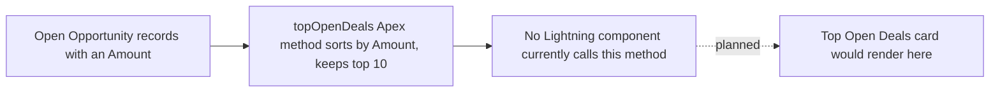

## Overview

`SalesMetricsService` includes a `topOpenDeals()` method meant to give reps and managers a quick
list of the biggest deals currently in play — the 10 open Opportunities with the highest Amount,
each showing its Name, Amount, Stage, and Account. It is designed to complement the **Pipeline by
Stage** card on the [Sales Pipeline Dashboard](sales-pipeline-dashboard) by answering "which specific
deals matter most right now" rather than just totals per stage.

```callout
type: warning
This method is fully implemented and safe to call, but no Lightning component in the org currently
renders it. The `pipelineDashboard` component (the "Pipeline Dashboard" widget on the Sales Pipeline
Dashboard page) only wires up `pipelineByStage()` today — it does not display a Top Open Deals list.
Until a component is built or updated to call `topOpenDeals()`, this data is not visible to end users
anywhere in the UI.
```



## Prerequisites

- Read access to Opportunity records (the underlying Apex class runs "with sharing", so results only include Opportunities the calling user can see)
- A Lightning component that calls `SalesMetricsService.topOpenDeals()` must be placed on a page — none exists in the org today

## Steps to Navigate

There is currently no page or component in the org that surfaces this data to end users. The only
way to see the method's output today is for an admin or developer to invoke it directly:

1. Click the gear icon in the top-right, then click **Developer Console**.
2. In Developer Console, click **Debug**, then **Open Execute Anonymous Window**.
3. Enter a script such as `System.debug(SalesMetricsService.topOpenDeals());` and click **Execute**.
4. Open the debug log for the execution to view the returned list of the 10 largest open Opportunities.

```screenshot
id: top-open-deals-widget-execute-anonymous
alt: Developer Console Execute Anonymous window with a script calling SalesMetricsService.topOpenDeals()
step: Open Developer Console, open the Execute Anonymous window, and run a script calling topOpenDeals()
url_pattern: /lightning/setup/DeveloperConsole
```

## Use Cases

### Reviewing top deals via Execute Anonymous (current state)

1. An admin or developer runs `SalesMetricsService.topOpenDeals()` from Developer Console as described above.
2. The debug log returns up to 10 Opportunity records — the ones with the highest `Amount` among all open (`IsClosed = false`) deals that have a non-null `Amount` — each including `Id`, `Name`, `Amount`, `StageName`, and the related `Account.Name`.
3. Because the class runs `with sharing`, the list only includes Opportunities the running user's sharing access allows them to see; a rep will not see deals outside their visibility even when running this manually.

### Fewer than 10 qualifying deals

1. If fewer than 10 open Opportunities have a non-null Amount, the method returns only the Opportunities that exist — there is no padding or placeholder rows.
2. If no open Opportunities have an Amount set, the method returns an empty list.

### If a component is later built to call this method

1. Once an admin or developer adds a component that wires up `topOpenDeals()` (for example, an update to the `pipelineDashboard` component or a new component) and places it on a Home, App, or Record page, reps and managers would see a "Top Open Deals" list next to or below the Pipeline by Stage card.
2. Each row would show the deal's Name, Amount, Stage, and Account, sorted highest Amount first, limited to 10 rows — matching exactly what the Apex method already returns today.

## Validations & Business Rules

- Query filter: only Opportunities where `IsClosed = false` and `Amount != null` are considered; closed deals and open deals with a blank Amount are excluded.
- Sort and limit: results are ordered by `Amount` descending and capped at the first 10 rows — there is no configuration to change this limit without modifying the Apex class.
- Sharing: the class is declared `with sharing`, so the query enforces the running user's record-level sharing and role hierarchy access; it does not bypass sharing rules.
- Caching: the method is `@AuraEnabled(cacheable=true)`, so once a component does call it, results will be cached client-side by Lightning Data Service until the underlying Opportunity data changes.
- No UI wiring: as of now, no `.js` file in the org imports `SalesMetricsService.topOpenDeals` — this is a gap between what the Apex layer supports and what any page actually displays.

## Related Features

- [Sales Pipeline Dashboard](sales-pipeline-dashboard) — the "Pipeline by Stage" card built from the same `SalesMetricsService` class; a natural place a future Top Open Deals list could be added alongside it.
