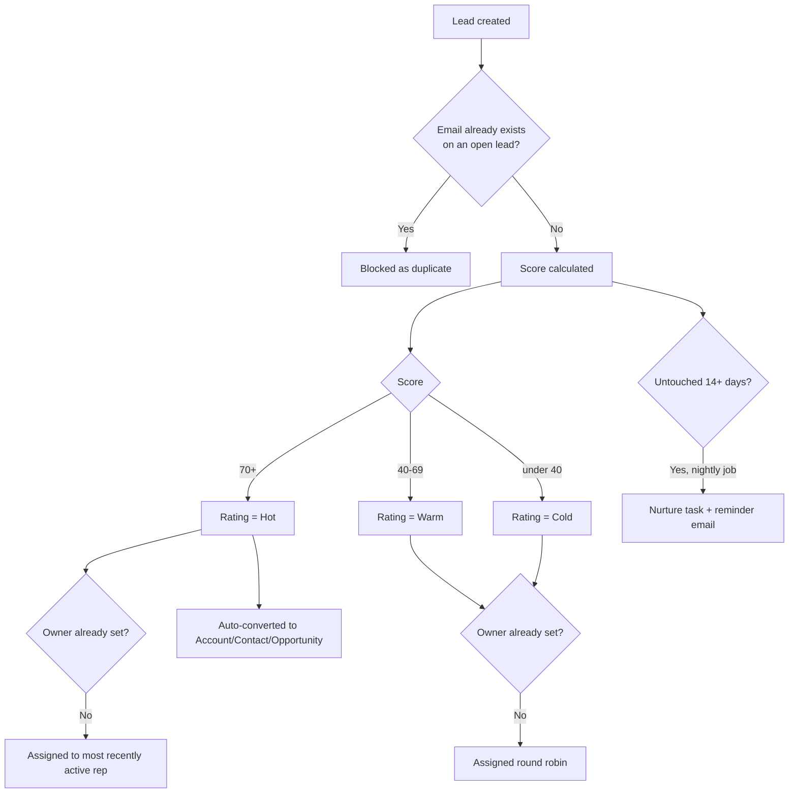

## Overview

Every Lead that enters the org — whether typed in by a rep, or submitted through the company website or a
partner's system — is automatically scored, checked for duplicates, and routed to an owner without anyone
having to do it by hand. Leads that score high enough are converted to an Account/Contact/Opportunity the
moment they qualify. Leads that sit untouched for two weeks get an automatic follow-up task and a nurture
email so they don't fall through the cracks.



## Prerequisites

- Standard User (or higher) profile to create and edit Leads
- At least one active Standard User in the org, so scored/assigned leads have somewhere to route
- A Lead Status value marked "Converted" in Setup (**Setup → Lead Statuses**), used as the target status when a Hot lead auto-converts
- The website/partner intake path requires an integration user authenticated against the org's REST API

## Steps to Navigate

1. Click the **App Launcher** and search for **Leads**.
2. Click **New**.
3. Fill in **Last Name**, **Company**, **Email**, and any of **Phone**, **Industry**, **Annual Revenue**, **Number of Employees**, **Lead Source** — these fields drive the automatic score.
4. Click **Save**.
5. Reopen the lead and check the **Rating** field (Hot/Warm/Cold) and **Owner** field — both were set automatically on save.

```screenshot
id: lead-scoring-new-lead-form
alt: New Lead form with Company, Email, Industry, and Annual Revenue fields filled in
step: Open the App Launcher, search for Leads, click New, and fill in the lead fields
url_pattern: /lightning/o/Lead/new
actions:
  - open_app_launcher
  - search_app_launcher: Leads
  - click_app_launcher_result: Leads
  - click_new
```

## Use Cases

### Create a lead manually and let it get scored and assigned

1. From the Leads tab, click **New** and fill in the lead details.
2. Click **Save**.
3. The lead is scored before it saves: points are added for a business email domain (rather than gmail/yahoo/hotmail/outlook), a valid phone number, an Industry of Technology/Finance/Healthcare/Manufacturing, Annual Revenue bands, headcount of 200+, and a Lead Source of Web or Partner Referral.
4. If the total score is 70 or higher, **Rating** is set to `Hot`; 40–69 is `Warm`; below 40 is `Cold`.
5. If the lead didn't already have an owner, it's assigned: Hot leads go to whichever active Standard User logged in most recently; Warm/Cold leads are spread round robin across up to 10 active Standard Users.

### Submit a lead through the website or a partner system

1. The marketing site or partner integration posts to the `/leads/capture` REST endpoint with `firstName`, `lastName`, `company`, `email`, `phone`, and `source`.
2. If `lastName` or `company` is blank (or under 2 characters), the call is rejected with a 400 and the body `lastName and company are required`.
3. If `email` isn't a valid address, the call is rejected with a 400 and the body `invalid email`.
4. If a matching, unconverted lead with that email already exists, the call is rejected with a 409 and the body `duplicate of <existing Lead Id>` instead of creating a second record.
5. Otherwise the lead is created (Lead Source defaults to `Web` if not supplied), scored, and its new Salesforce Id is returned to the caller.

### Duplicate lead is blocked on manual entry

1. A rep creates a lead using an email address that already belongs to another open (unconverted) lead.
2. On save, the record is blocked with the error **"A lead with this email already exists (`<Id>`)."**
3. The rep should instead open the existing lead referenced in the error rather than creating a new one.

### A lead reaches Hot and is auto-converted

1. A lead is created or edited such that its Rating changes to `Hot` (for example, Annual Revenue is updated to qualify).
2. On save, since the lead just became Hot and isn't already converted, it is automatically converted to an Account, Contact, and Opportunity in the same transaction.
3. The new Account is immediately re-tiered (see [[account-tiering-territory]]) so its Rating reflects the account's size right away, not after the next batch run.
4. The rep sees the lead marked Converted and can find the resulting Opportunity from the Lead's conversion detail.

```screenshot
id: lead-scoring-converted-lead
alt: Converted Lead detail page showing the linked Account, Contact, and Opportunity
step: Open a Lead that has Rating = Hot and has been converted
url_pattern: /lightning/r/Lead/{recordId}/view
```

### A stale lead gets an automatic nurture task and email

1. Every night, a batch job looks for unconverted leads that haven't been modified in 14 or more days.
2. For each one, it creates a **Nurture follow-up** task on the lead, due in 2 days, assigned to the lead's owner.
3. It then sends the lead a reminder email (subject **"Still exploring? We saved your place"**) if the lead has an email address on file.
4. The owner sees the new task on their task list the next morning and can decide whether to re-engage or let the lead continue nurturing.

### View the Hot Leads scorecard

1. An admin adds the **Hot Leads** component to the Home page, a Lead record page, or an app page via Lightning App Builder.
2. Anyone viewing that page sees up to 25 of the most recently created Hot, unconverted leads, listed as Name — Company (Lead Source).

```screenshot
id: lead-scoring-hot-leads-scorecard
alt: Hot Leads component listing recently created Hot-rated leads
step: Open a Home page that has the Hot Leads component added
url_pattern: /lightning/page/home
```

## Validations & Business Rules

- Validation: a new/updated Lead is blocked with **"A lead with this email already exists (`<Id>`)."** when another unconverted Lead already has the same email (case-insensitive).
- Automation: `LeadTriggerHandler` before-insert runs dedupe, scoring, and assignment; before-update rescores when Email, Industry, Annual Revenue, or Number of Employees changes; after-update auto-converts any lead that just became Hot and isn't already converted.
- Scoring inputs and point values: +25 business email / +10 other valid email; +10 valid phone (7+ digits); +20 Industry in Technology/Finance/Healthcare/Manufacturing; +25 Annual Revenue ≥ $50M, +15 ≥ $5M, +5 ≥ $500K; +10 Number of Employees ≥ 200; +10 Lead Source of Web or Partner Referral. Score is capped at 100.
- Rating thresholds: score ≥ 70 → Hot, ≥ 40 → Warm, otherwise Cold.
- Assignment: leads that already have an owner are left alone unless they're Hot. Hot leads always go to the most-recently-logged-in active Standard User. Leads without an owner are otherwise spread round robin (in-memory cursor, resets each transaction) across up to 10 active Standard Users, most-recent-login first.
- Automation: conversion only happens for `IsConverted = false` leads with `Rating = 'Hot'`; conversion always creates an Opportunity and uses the org's `IsConverted = true` Lead Status as the converted status.
- Integration: `POST /services/apexrest/leads/capture` — 400 for missing `lastName`/`company` or invalid `email`, 409 for a duplicate email, otherwise 200 with the new Lead Id in the body.
- Automation: nightly batch (see [[nightly-sales-operations]]) creates a "Nurture follow-up" task and sends a reminder email for any unconverted lead untouched for 14+ days.

```callout
type: note
Lead conversion uses partial-success semantics — if a particular lead fails to convert (for example, missing
required fields on the resulting Account), that failure doesn't stop other qualifying leads in the same batch
from converting, but it also doesn't display an error to the user converting them automatically.
```

## Related Features

- [[account-tiering-territory]] — newly converted accounts are tiered immediately using the same logic as the nightly retier.
- [[nightly-sales-operations]] — the nurture batch that follows up on stale leads runs as part of the nightly job chain.
