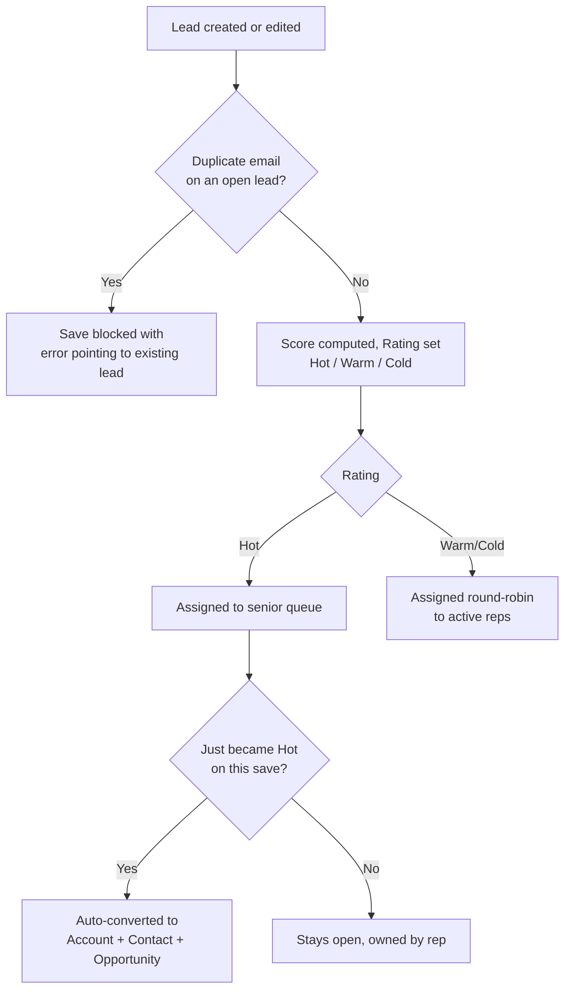

## Overview

This feature covers the full journey of a lead from first contact to conversion. Leads can arrive
two ways: typed in directly by a rep, or submitted by an external website/partner system through a
REST integration. However a lead arrives, the same automation kicks in behind the scenes — it is
checked for duplicates, scored 0-100 based on firmographic and contact-quality signals, banded into
a Rating (Hot / Warm / Cold), routed to an owner, and — if it scores Hot — automatically converted
into an Account, Contact, and Opportunity so a rep can start selling immediately. Sales reps see the
result of this pipeline (Rating, Owner, and a "Hot Leads" scorecard); they don't need to score or
assign leads by hand.



## Prerequisites

```callout
type: before
The REST capture endpoint (`/services/apexrest/leads/capture`) is meant for server-to-server
integrations (a marketing site, a partner portal). It has no CRUD/FLS enforcement of its own beyond
field validation, so only grant the calling integration user the Lead permissions it actually needs.
```

- Manage access to the Lead object (standard Create/Edit) to view or correct leads
- For the REST endpoint: an integration user or connected app authorized to call
  `/services/apexrest/leads/capture`
- At least one active user with the Standard user type, so round-robin assignment has someone to
  assign non-Hot leads to
- A converted `LeadStatus` record must exist in the org (used automatically during auto-conversion)

## Steps to Navigate

1. In the App Launcher, search for and open **Leads**.
2. Click **New** to create a lead by hand, or wait for one to arrive automatically from the web
   capture integration.
3. Fill in **Last Name**, **Company**, **Email**, **Phone**, **Industry**, **Annual Revenue**, and
   **Number of Employees** where known — these fields drive the automatic score.
4. Click **Save**. The lead's **Rating** and **Owner** fields populate automatically; no further
   action is needed to score or route it.

```screenshot
id: lead-capture-and-qualification-new-lead-form
alt: New Lead form with Last Name, Company, Email, Phone, Industry, Annual Revenue and Number of Employees fields visible
step: Open the Leads tab and click New to view the lead entry form
url_pattern: /lightning/o/Lead/new
actions:
  - open_app_launcher
  - search_app_launcher: Leads
  - click_tab: Leads
  - click_new
```

5. To see which leads the pipeline has flagged as Hot right now, add the **Hot Leads** component
   (found on the Lead home page or a dashboard) — it lists the 25 most recently created Hot,
   unconverted leads.

```screenshot
id: lead-capture-and-qualification-hot-leads-scorecard
alt: Hot Leads card showing a list of recently created Hot-rated leads with company and source
step: View the Hot Leads scorecard component on the Lead home page
url_pattern: /lightning/o/Lead/home
```

## Use Cases

### Standard path: a rep enters a new lead

1. Rep clicks **New** on the Lead tab and fills in Last Name, Company, and as many scoring fields
   (Email, Phone, Industry, Annual Revenue, Number of Employees, Lead Source) as they know.
2. On save, the lead is checked for an existing open (unconverted) lead with the same email. None is
   found, so the save proceeds.
3. The score is computed and **Rating** is set to Hot, Warm, or Cold.
4. **Owner** is set automatically: Hot leads go to the most recently active user among the 10 most
   recently logged-in Standard users (acting as a senior/priority queue); Warm and Cold leads are
   spread round-robin across that same pool of active reps.
5. If the lead landed on Hot, it is immediately converted (see "Automatic conversion of a Hot lead"
   below) — the rep sees Account, Contact, and Opportunity records already created against the lead.

### Exception path: duplicate email is rejected

1. A rep or integration submits a lead whose email matches an existing **unconverted** lead.
2. The save is blocked. On the UI, the rep sees a page-level error naming the existing lead's record
   Id; the REST endpoint returns HTTP 409 with the message `duplicate of <existing lead Id>` (or, for
   UI saves, `A lead with this email already exists (<Id>)`).
3. The rep opens the existing lead named in the error instead of creating a new one.
4. Note: this check only looks at leads that have not yet been converted — the same email on an
   already-converted lead (now an Account/Contact) does not block a new lead.

### Web/partner intake via REST

1. An external system (marketing site or partner portal) POSTs First Name, Last Name, Company, Email,
   Phone, and Source to `/services/apexrest/leads/capture`.
2. If Last Name or Company is missing or shorter than 2 characters, the call returns HTTP 400 with
   `lastName and company are required`.
3. If Email fails basic format validation, the call returns HTTP 400 with `invalid email`.
4. If Email matches an existing open lead, the call returns HTTP 409 with `duplicate of <existing lead Id>`.
5. Otherwise the lead is scored and inserted; the endpoint returns the new Lead Id as plain text.
   Lead Source defaults to `Web` if the caller doesn't supply one.
6. Note: leads created this way still go through the standard trigger automation on insert (dedupe
   is effectively re-checked, scoring is applied, and it is assigned/converted like any other lead) —
   the REST endpoint's own dedupe/score calls only decide whether to accept the callout itself.

### Correction path: editing a lead updates its score

1. A rep edits an existing, unconverted lead and changes Email, Industry, Annual Revenue, or Number
   of Employees.
2. On save, only leads whose scoring inputs actually changed are rescored — editing unrelated fields
   (e.g. Description, or Phone on its own) does not trigger rescoring; only changes to Email,
   Industry, Annual Revenue, or Number of Employees do.
3. If the recalculated score crosses into Hot for the first time on this save, the lead is
   auto-converted the same way it would be on insert.
4. If a Hot lead is edited and its score would drop, the Rating field still updates — but note owner
   reassignment on update only happens for the still-Hot case; a lead dropping out of Hot keeps its
   current owner rather than being handed back into the round-robin.

### Automatic conversion of a Hot lead

1. Whenever an update causes a lead's Rating to change to Hot (from anything else) and the lead is
   not already converted, conversion runs automatically right after the save — no manual "Convert"
   click is required.
2. The lead is converted using the org's converted Lead Status, creating an Account, a Contact, and
   (since opportunity creation is not skipped) an Opportunity.
3. The resulting Account is immediately re-tiered by the account tiering logic, so its Account Tier
   reflects its revenue/headcount from the moment it's created — see [[account-tiering]].
4. If a batch of leads is updated together and only some cross into Hot, only those leads are
   converted; leads that were already Hot before this save are left untouched by this automatic step.
5. Manual conversion (clicking **Convert** on a lead that is Warm/Cold, or was already Hot before this
   update) still works the normal Salesforce way and is not affected by this automation.

## Validations & Business Rules

- **Duplicate check**: a lead is rejected if its Email (case-insensitive) matches an existing lead
  where `IsConverted = false`. Applies on insert through the standard trigger, and separately as a
  pre-check inside the REST capture endpoint.
- **Scoring model** (`LeadScoringService.computeScore`), max 100, banded at `Rating`:
  - Business email (not gmail/yahoo/hotmail/outlook): +25; any other valid email: +10
  - Valid phone (7+ digits after stripping non-numeric characters): +10
  - Industry in Technology, Finance, Healthcare, or Manufacturing: +20
  - Annual Revenue: +25 at $50M+, +15 at $5M+, +5 at $500K+
  - Number of Employees ≥ 200: +10
  - Lead Source is Web or Partner Referral: +10
  - Rating bands: **Hot** ≥ 70, **Warm** ≥ 40, otherwise **Cold**
- **Rescoring on update**: only runs when Email, Industry, Annual Revenue, or Number of Employees
  changes between the old and new record.
- **Assignment**: Hot leads are assigned to the single most-recently-logged-in active Standard user
  (top of an ordered pool of up to 10); all other leads round-robin across that same pool of up to 10
  active Standard users. If no active Standard users exist, assignment is skipped and Owner is left
  unchanged.
- **Auto-conversion**: triggers only in the after-update context, only for leads whose Rating just
  became Hot on this save, and only if the lead is not already converted. Conversion creates an
  Opportunity (not skipped) and uses whichever Lead Status is marked as the converted status in Setup.
- **REST endpoint validations** (`/services/apexrest/leads/capture`): Last Name and Company each
  required with a minimum length of 2 characters; Email must match a standard email pattern; returns
  HTTP 400 for validation failures, HTTP 409 for a duplicate email, and HTTP 200 with the new Lead Id
  otherwise.
- Automation runs in the Lead trigger's before-insert (dedupe, score, assign), before-update (rescore
  when inputs change), and after-update (auto-convert newly-Hot leads) contexts; the after-update
  conversion step temporarily bypasses the Lead trigger so the conversion's own DML doesn't recurse
  back into this same automation.

## Related Features

- Account tiering re-evaluates the newly created Account's tier as soon as a lead converts — see [[account-tiering]].
- Manual lead conversion (Salesforce's standard Convert button) remains available for leads this pipeline doesn't auto-convert.
