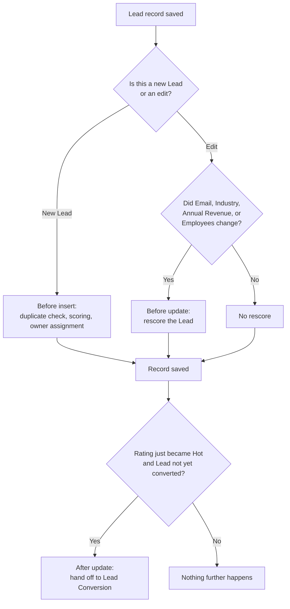

## Overview

Every time a Lead record is saved anywhere in Salesforce — through the UI, a data import, an API
call, or an integration — one piece of automation quietly runs first: the Lead trigger. It doesn't
contain any business logic itself; it's the dispatcher that decides which processing runs based on
whether the Lead is being created or edited, and hands off to the actual dedupe, scoring,
assignment, and conversion logic described on the related pages below. Sales users never see this
step directly — they only see its results (a **Rating**, an **Owner**, or a duplicate error)
appear the instant they click Save.



```callout
type: note
This page documents the trigger itself — the entry point that runs on every Lead save. For the
full detail on what duplicate checking, scoring, and assignment actually do, see
[[lead-capture-scoring-assignment]]. For what happens once a Lead converts, see
[[lead-conversion-account-tiering]].
```

## Prerequisites

- Any user with access to create or edit Leads triggers this automation automatically — there is
  no separate setup, permission, or toggle to turn it on.
- The automation depends on the Lead dedupe, scoring, assignment, and conversion services being
  active in the org; these are documented separately (see Related Features).

## Steps to Navigate

There's nothing to configure or launch — this automation runs in the background on every Lead
save. The steps below show how a user encounters it in normal use.

1. Open the **Leads** tab in the App Launcher.
2. Click **New**, fill in a Lead (or open and edit an existing one), and click **Save**.
3. The automation runs immediately as part of the save — the record reopens with **Rating** and
   **Owner** already populated (for a new Lead), or with **Rating** refreshed (for an edit to a
   scoring-relevant field).

```screenshot
id: lead-capture-automation-new-lead-save
alt: New Lead form with required fields filled in, about to be saved
step: Open the Leads tab, click New, fill in Last Name, Company, and Email
url_pattern: /lightning/o/Lead/new
actions:
  - open_app_launcher
  - search_app_launcher: Leads
  - click_app_launcher_result: Leads
  - click_new
  - fill_field: { field: LastName, value: Chen }
  - fill_field: { field: Company, value: Northwind Traders }
  - fill_field: { field: Email, value: chen@northwindtraders.com }
```

4. Open the saved Lead record to see the automatically-set **Rating** and **Owner** fields.

```screenshot
id: lead-capture-automation-record-page
alt: Lead record page showing Rating and Owner already populated after save
step: Open the newly created Lead record
url_pattern: /lightning/r/Lead/{recordId}/view
actions:
  - open_record: Lead
```

## Use Cases

### A brand-new Lead is created

1. A user saves a new Lead (or one arrives via data load or API insert).
2. Before the record is committed, the trigger's before-insert step runs: it checks for a
   duplicate email against existing open Leads, computes a 0–100 score and sets **Rating**, and
   assigns an **Owner**.
3. If a duplicate is found, the save is blocked entirely and none of the Lead's fields are
   changed — see the duplicate scenario on [[lead-capture-scoring-assignment]] for what the user
   sees.
4. Otherwise the Lead saves with **Rating** and **Owner** already populated in the same
   transaction — no second save or background job is needed.

### An existing Lead is edited and a scoring input changes

1. A user edits an unconverted Lead's **Email**, **Industry**, **Annual Revenue**, or **Number of
   Employees** and saves.
2. Before the update commits, the trigger detects that one of those four fields changed and
   recomputes the score, updating **Rating** if the band shifted.
3. If the new **Rating** is Hot and it just became Hot (it wasn't Hot before this save), the after
   update step below also fires once the update completes.

### An existing Lead is edited but nothing scoring-relevant changes

1. A user edits a Lead's **Phone**, **Description**, or any other field that isn't one of the four
   scoring inputs, and saves.
2. The before-update step runs but finds no scoring-relevant change, so it skips rescoring
   entirely — **Rating** is left exactly as it was.
3. No after-update conversion check is relevant either, since **Rating** didn't change.

### A Lead's Rating newly becomes Hot

1. A save (either the initial insert, or an edit that triggers a rescore) results in **Rating**
   changing to `Hot` for a Lead that is not already converted, and that wasn't already `Hot`
   before this save.
2. After the update commits, the trigger hands that Lead off to the Lead Conversion process (see
   [[lead-conversion-account-tiering]] for what happens next — Account/Contact/Opportunity
   creation and account tiering).
3. This handoff is wrapped in a bypass so that the conversion's own Lead updates don't cause the
   Lead trigger to re-enter and re-run scoring/assignment on the same records again.

### A Lead is already Hot and is edited again without changing Rating

1. A user edits a Lead that is already `Hot` (e.g. updates the Phone field) and saves.
2. Since **Rating** doesn't newly transition to `Hot` on this save (it was already `Hot` before
   the edit), the after-update conversion handoff does not fire again — a Lead is only handed off
   to conversion the moment it first becomes Hot, not on every subsequent save.

## Validations & Business Rules

- The trigger fires in three contexts and does no work itself — it only routes to
  `LeadTriggerHandler`:
  - **Before insert**: duplicate check, scoring, and owner assignment.
  - **Before update**: rescoring, but only when `Email`, `Industry`, `AnnualRevenue`, or
    `NumberOfEmployees` changed since the last save.
  - **After update**: hands off any Lead whose `Rating` just became `Hot` (and that is not yet
    converted) to the Lead Conversion process.
- **Recursion guard**: the after-update handoff to Lead Conversion is bracketed by a bypass flag
  (checked and set/cleared around the call) so that DML performed during conversion cannot cause
  this same trigger to fire again recursively on the same records.
- **System-only entry point**: this trigger is never called directly by other Apex — it only runs
  as a database-level trigger whenever a Lead record is saved, regardless of the source (UI, data
  load, API, or integration).
- For the exact scoring formula, rating thresholds, assignment rules, and duplicate rule, see
  [[lead-capture-scoring-assignment]]. For conversion eligibility and account tiering, see
  [[lead-conversion-account-tiering]].

## Related Features

- Lead Capture, Scoring & Assignment — the before-insert/before-update logic this trigger routes to
- Lead Conversion & Account Tiering — the after-update handoff target when a Lead becomes Hot
- Lead Follow-up Reminder — reacts to the Rating this automation sets
