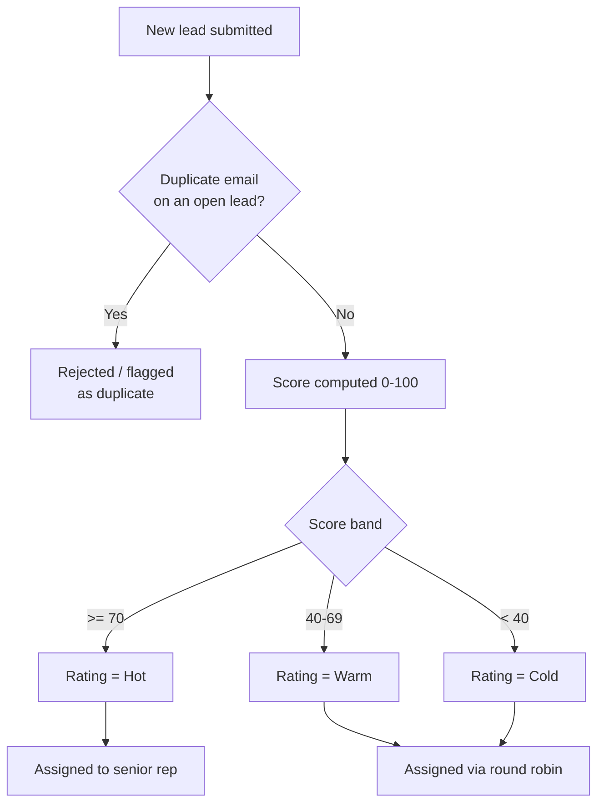

## Overview

This feature covers how a new Lead enters Salesforce and becomes sales-ready: it is checked for
duplicates, scored 0-100 based on firmographics and contact quality, banded into a Hot / Warm / Cold
rating, and assigned to an owner. Marketing and partner integrations use this path when a web form or
partner system submits a lead through the REST capture endpoint; internal users go through the same
scoring and assignment logic automatically whenever a Lead record is created or updated in the UI or via
data load. Sales reps see the resulting Hot leads surfaced on the **Hot Leads** scorecard component.



## Prerequisites

```callout
type: note
Two separate entry points feed this feature: the internal Lead trigger (fires for every Lead
created or edited in Salesforce) and the external REST capture endpoint (`/services/apexrest/leads/capture`)
used by web forms and partner systems. Both call the same dedupe and scoring services.
```

- "Manage Leads" or equivalent access to create and edit Lead records
- Web forms or partner systems posting to the REST endpoint must send `firstName`, `lastName`,
  `company`, `email`, `phone`, and `source` as JSON in an HTTP POST
- Duplicate checking relies on the Lead's `Email` field being populated
- Assignment requires at least one Active, Standard-profile user in the org; if none exist, leads
  are left unassigned

## Steps to Navigate

1. Open the **Leads** tab in the App Launcher.
2. Click **New** to create a Lead manually, or wait for a Lead to arrive from a web form/partner feed
   through the REST capture endpoint.
3. Fill in at minimum **Last Name**, **Company**, and **Email**, then click **Save**.
4. Salesforce automatically checks for a duplicate email, computes a score, sets the **Rating**
   field, and assigns an **Owner** — no further action is needed.

```screenshot
id: lead-capture-scoring-assignment-new-lead-form
alt: New Lead form with Last Name, Company, and Email fields filled in
step: Open the Leads tab, click New, and fill in Last Name, Company, and Email
url_pattern: /lightning/o/Lead/new
actions:
  - open_app_launcher
  - search_app_launcher: Leads
  - click_app_launcher_result: Leads
  - click_new
  - fill_field: { field: LastName, value: Rivera }
  - fill_field: { field: Company, value: Acme Robotics }
  - fill_field: { field: Email, value: rivera@acmerobotics.com }
```

5. Open the saved Lead record to confirm the **Rating** and **Owner** fields were set automatically.

```screenshot
id: lead-capture-scoring-assignment-record-page
alt: Lead record page showing the Rating and Owner fields populated after save
step: Open the newly created Lead record
url_pattern: /lightning/r/Lead/{recordId}/view
actions:
  - open_record: Lead
```

6. To see recently created Hot leads in one place, add the **Hot Leads** component (Lead Scorecard)
   to a Home page or App page via Lightning App Builder.

```screenshot
id: lead-capture-scoring-assignment-scorecard
alt: Hot Leads scorecard component listing recent Hot-rated leads with company and source
step: View the Hot Leads scorecard component on a Home page
url_pattern: /lightning/page/home
```

## Use Cases

### Standard capture through the UI or data load

1. A user creates a Lead directly in Salesforce, or a Lead is created via data import.
2. Before the record is saved, Salesforce checks whether an unconverted Lead already exists with the
   same email address. If not, it computes a score from the Lead's email domain, phone, industry,
   annual revenue, employee count, and lead source, and sets **Rating** to Hot, Warm, or Cold.
3. Immediately after scoring, Salesforce assigns an **Owner**: Hot leads go to the most recently
   active Standard user (acting as a senior-rep proxy); Warm and Cold leads round-robin across up to
   10 active Standard users.
4. The Lead is saved with **Rating** and **Owner** already set — the rep sees a fully qualified,
   assigned record with no manual triage step.

### Web form / partner submission via REST capture

1. An external web form or partner system posts `firstName`, `lastName`, `company`, `email`, `phone`,
   and `source` to the `/leads/capture` REST endpoint.
2. Salesforce validates that **Last Name** and **Company** are at least 2 characters and that
   **Email** is a valid address; if either check fails, the endpoint returns an HTTP 400 error and no
   Lead is created.
3. Salesforce checks for an existing unconverted Lead with the same email. If one exists, the
   endpoint returns an HTTP 409 error containing the existing Lead's Id instead of creating a
   duplicate — the calling system is expected to treat this as "already captured."
4. If the email is unique, Salesforce scores the new Lead and inserts it with **LeadSource** defaulted
   to "Web" when no source was supplied. The endpoint returns the new Lead's Id.
5. Note: leads created through this endpoint are scored but not yet routed to an owner — the REST
   path does not call the assignment service, so these leads land unassigned until the standard Lead
   trigger runs on a later edit, or a user assigns them manually.

### Duplicate detected on manual entry

1. A user manually creates or edits a Lead using an email address that already exists on another
   open (unconverted) Lead.
2. On save, Salesforce blocks the record with an error message identifying the existing Lead's Id, so
   the user can navigate to and update the original record instead of creating a second one.
3. The user resolves the conflict by opening the referenced Lead and updating it there, or by
   correcting the email if it was a typo, then re-saving.

### Rescoring after key details change

1. A user edits an existing, unconverted Lead and changes **Email**, **Industry**, **Annual Revenue**,
   or **Number of Employees**.
2. Because a scoring input changed, Salesforce recomputes the score and updates **Rating** on save —
   leads that were Cold or Warm can move up (or down) a band as more firmographic detail is added.
3. If the Lead's rating changes to Hot as a result, it becomes eligible for auto-conversion (see
   Validations & Business Rules) and will appear on the Hot Leads scorecard.
4. Editing unrelated fields (e.g. Phone, Description) does not trigger a rescore.

## Validations & Business Rules

- Validation: `LastName` and `Company` must each be at least 2 characters, and `Email` must match a
  standard email pattern, before a Lead can be captured through the REST endpoint (HTTP 400 otherwise).
- Duplicate rule: an incoming Lead is a duplicate when an existing, unconverted Lead already has the
  same email address (case-insensitive). Manual/UI creation is blocked outright with an error; the REST
  endpoint instead returns HTTP 409 with the existing Lead's Id.
- Scoring (`LeadScoringService.computeScore`), maximum 100 points:
  - Business email domain (not gmail/yahoo/hotmail/outlook): +25; any other valid email: +10
  - Valid phone number (7+ digits): +10
  - Industry is Technology, Finance, Healthcare, or Manufacturing: +20
  - Annual Revenue ≥ $50M: +25; ≥ $5M: +15; ≥ $500K: +5
  - Number of Employees ≥ 200: +10
  - Lead Source is "Web" or "Partner Referral": +10
- Rating bands: score ≥ 70 → **Hot**; score ≥ 40 → **Warm**; below 40 → **Cold**.
- Assignment (`LeadAssignmentService.assignOwners`): only runs for leads without an owner, or for any
  Lead whose Rating is Hot (Hot leads are re-routed even if already owned). Hot leads go to the most
  recently active Standard-profile user; all others round-robin across up to 10 active Standard users.
  If no active Standard users exist, leads are left unassigned.
- Rescoring on edit: an update only triggers rescoring when Email, Industry, Annual Revenue, or Number
  of Employees changes — other field edits do not recompute the score or Rating.
- Automation: the `LeadTrigger` on Lead runs `LeadTriggerHandler`, which dedupes and scores on before
  insert, rescores on before update when key fields change, and — on after update, when a Lead's
  Rating newly becomes Hot and it is not yet converted — hands off to the Lead Conversion process to
  auto-convert qualified leads. This conversion step is wrapped in a trigger bypass so it cannot
  re-trigger the Lead automation recursively.
- The `LeadCaptureRestResource` endpoint is a REST-only entry point; it is not called by any other
  Apex in this org today, so it only fires when an external system posts to it directly.

## Related Features

- Lead Follow-up Reminder — consumes the Hot rating this feature sets to prompt sales follow-up
- Lead Conversion — auto-converts leads once their Rating becomes Hot (triggered from this feature's after-update logic)
