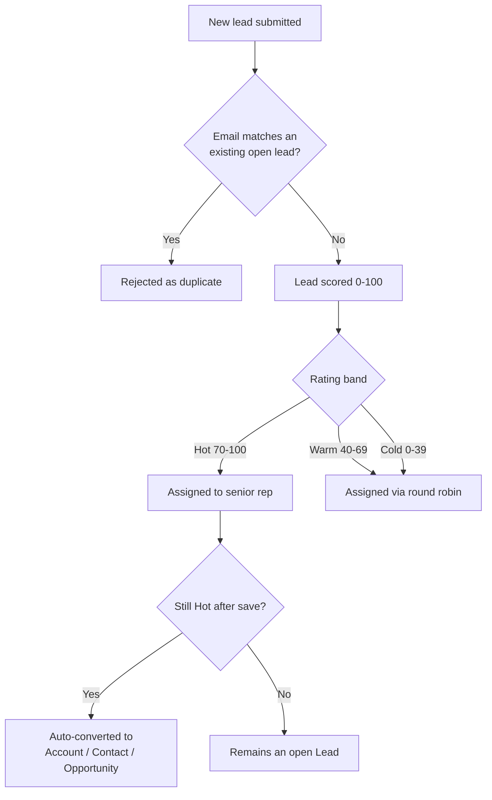

## Overview

Every new lead — whether typed in by a rep or submitted by a web form/partner system through the API —
goes through the same four automated steps before a human ever touches it: duplicate check, scoring,
owner assignment, and (if it scores Hot) automatic conversion. This keeps sales reps from chasing leads
that already exist, gives them a consistent 0–100 quality signal instead of guesswork, spreads new leads
fairly across the team while fast-tracking the best ones to a senior rep, and turns a qualified lead into
an Account/Contact/Opportunity the moment it earns a Hot rating — without waiting for someone to notice.



## Prerequisites

- Standard Lead create/edit access (profile or permission set)
- For the REST capture endpoint: an integration user with a Connected App / named credential authorized to call `/services/apexrest/leads/capture`
- At least one active Standard-user rep must exist for round-robin/senior-queue assignment to have someone to assign to
- A Lead Status record with `IsConverted = true` must be configured (standard Salesforce setup) for conversion to succeed

```callout
type: note
Everything on this page runs automatically. There are no buttons to click to trigger scoring, assignment,
or conversion — they happen on insert/update. The steps below cover creating a lead and reviewing the
results, since that's the only manual interaction available.
```

## Steps to Navigate

1. From the App Launcher, open the **Leads** tab.
2. Click **New**.
3. Enter **Last Name**, **Company**, **Email**, **Phone**, **Lead Source**, and (optionally) **Industry**, **Annual Revenue**, and **Number of Employees** — these last three feed the score.
4. Click **Save**.
5. Salesforce saves the lead, then immediately runs duplicate check, scoring, and assignment before the record page loads — the **Rating** and **Owner** fields you see already reflect the outcome.

```screenshot
id: lead-capture-new-lead-form
alt: New Lead form with Company, Email, Industry, Annual Revenue, and Number of Employees fields filled in
step: Open the Leads tab, click New, and fill in the lead fields
url_pattern: /lightning/o/Lead/new
actions:
  - click_tab: Leads
  - click_new
```

```screenshot
id: lead-capture-record-after-save
alt: Saved Lead record page showing the Rating field set to Hot and Owner assigned
step: Save the lead and view the record page showing Rating and Owner
url_pattern: /lightning/r/Lead/{recordId}/view
actions:
  - open_record: Lead
```

6. To see recently scored Hot leads in one place, add the **Hot Leads** component (Lead Scorecard) to a Home page or App page via the Lightning App Builder — it lists the 25 most recent unconverted leads rated Hot.

```screenshot
id: lead-capture-hot-leads-scorecard
alt: Hot Leads card listing recent Hot-rated leads with name, company, and source
step: View the Hot Leads scorecard component on a Home or App page
url_pattern: /lightning/page/home
```

## Use Cases

### Standard capture through the UI

1. A rep creates a lead manually with Last Name, Company, and Email filled in.
2. On save, `LeadTriggerHandler.beforeInsert` runs: it checks for a duplicate email, computes a score, and assigns an owner — all before the record is committed.
3. The rep sees the final **Rating** and **Owner** on the saved record; no further action is needed.

### Inbound capture via the REST API (web form / partner integration)

1. An external system posts firstName, lastName, company, email, phone, and source to `/services/apexrest/leads/capture`.
2. `LeadCaptureRestResource` validates that Last Name and Company are present (at least 2 characters) and that the email is well-formed; if not, it returns HTTP 400 with a message describing the problem.
3. It checks for an existing unconverted lead with the same email. If one exists, it returns HTTP 409 with the message `duplicate of <existing lead Id>` and does not create a new record.
4. Otherwise it scores the lead and inserts it (Lead Source defaults to `Web` if the caller didn't supply one), returning the new lead's Id as the response body.
5. The new lead still passes through the standard trigger on insert, so it is also assigned an owner at that point.

```callout
type: warning
The REST endpoint is currently not called by any part of this org — no Flow, LWC, or scheduled job
invokes it today. It is only reachable if an external system is configured to call it directly, or in the
future if it's wired into a web-to-lead style integration.
```

### Duplicate submission is rejected

1. A second lead comes in (via UI or API) with the same email address as an existing, unconverted lead.
2. Through the UI, the save is blocked: the lead record shows the error "A lead with this email already exists (`<Id>`)." and no record is created.
3. Through the API, the call returns HTTP 409 with `duplicate of <Id>` instead of a new lead Id.
4. Once the original lead is converted, its email no longer counts as a duplicate — the same email can be captured again as a fresh lead.

### Scoring drives the Rating band

1. Every lead is scored 0–100 based on: business email domain (+25, or +10 for any valid but free/consumer email), valid phone (+10), target industry — Technology, Finance, Healthcare, or Manufacturing (+20), annual revenue tiers (+5 to +25), headcount ≥ 200 (+10), and Lead Source of Web or Partner Referral (+10).
2. The total maps to a Rating: **Hot** (≥ 70), **Warm** (40–69), or **Cold** (< 40).
3. If a rep later edits Email, Industry, Annual Revenue, or Number of Employees on an existing lead, the score is recalculated automatically on save — the Rating can move up or down a band as a result.

### Owner assignment: senior queue vs. round robin

1. If the lead's Rating is **Hot**, it is assigned to the single most recently active Standard user — treated as the senior rep on point for top prospects.
2. If the lead is **Warm** or **Cold**, it is assigned to the next rep in a round-robin rotation across up to 10 active Standard users (ordered by most recent login), so new leads are spread evenly.
3. If a lead already has an owner and its Rating is not Hot, assignment is skipped — it won't be reassigned out from under whoever already owns it. A lead that becomes Hot is always reassigned to the senior rep, even if it already had an owner.
4. If there are no active Standard users at all, assignment is skipped entirely and the lead keeps its default owner.

### Auto-conversion when a lead turns Hot

1. When an update causes a lead's Rating to change from something else to **Hot** (and it isn't already converted), the system automatically converts it — creating an Account, a Contact, and an Opportunity via standard lead conversion.
2. The conversion uses whichever Lead Status is marked as the converted status in Setup.
3. Leads that are Hot at the moment of initial insert are **not** auto-converted by this path — only a Rating change from non-Hot to Hot on an update triggers it. A lead saved for the first time already Hot will need to change (or be re-saved after another field change) to trigger conversion, or be converted manually.
4. After conversion, the new Account(s) are immediately re-tiered by Account Tiering based on their revenue and headcount, so the Account's tier is correct from the moment it's created rather than waiting for a separate batch job.

## Validations & Business Rules

- REST capture requires Last Name and Company to be at least 2 characters, and a syntactically valid email; failing either returns HTTP 400.
- REST capture rejects a submission whose email matches an existing, unconverted lead with HTTP 409.
- UI/trigger-path duplicate check (`LeadDedupeService.flagDuplicates`) blocks the save with a field error rather than an HTTP status, since it runs in `beforeInsert`.
- Duplicate matching is by email only, case-insensitive, and only considers leads where `IsConverted = false`.
- Scoring (`LeadScoringService.computeScore`) is capped at 100 and recalculates on insert, and on update only when Email, Industry, Annual Revenue, or Number of Employees changes.
- Rating thresholds: Hot ≥ 70, Warm ≥ 40, Cold < 40.
- Owner assignment only reassigns an already-owned lead when its Rating is Hot; otherwise an owned lead is left alone.
- Auto-conversion (`LeadConversionService.convertQualified`) only fires in `afterUpdate`, only for leads whose Rating just transitioned into Hot, and only if the lead isn't already converted. It temporarily bypasses the Lead trigger during the conversion DML to avoid re-entrant scoring/assignment on the converted record.
- Converted Accounts are automatically re-tiered (Hot/Warm/Cold) using the same revenue/headcount thresholds as standard Account tiering.

## Related Features

- Account Tiering — determines the Hot/Warm/Cold tier stamped on Accounts created from lead conversion.
- Opportunity creation from lead conversion (created automatically by `Database.LeadConvert`, not covered on this page).
