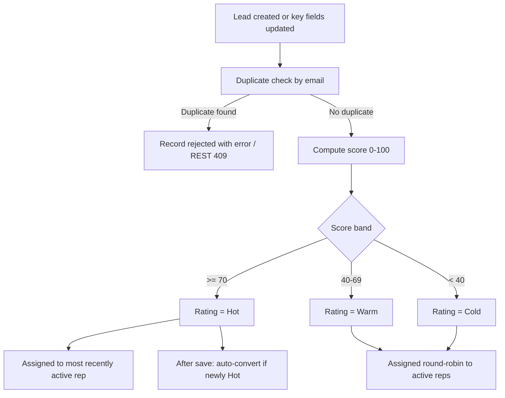

## Overview

Every Lead that enters Salesforce — whether typed in by a user, imported, or submitted through the
external web/partner capture API — is automatically deduplicated, scored, rated, and assigned to an
owner before a sales rep ever sees it. This all runs from a single `LeadTrigger` on the Lead object,
which fires on every insert and update and hands off to `LeadTriggerHandler` — there is no separate
setup step for the trigger itself; it is always active once deployed. Scoring rates each Lead 0–100 from firmographic fit (industry,
revenue, headcount) and contact quality (business email, valid phone), then buckets it into a
**Rating** of Hot, Warm, or Cold. Hot and target-industry leads are routed to the most recently
active rep (the "senior" handler); everything else is spread round-robin across active reps so no
single person is overloaded. A **Hot Leads** card is available for Lightning pages so reps can see
the newest high-scoring leads at a glance.



## Prerequisites

- Ability to create or import Leads (standard Lead create/edit access).
- For the external capture API: an authenticated integration user with access to the
  `/services/apexrest/leads/capture` REST endpoint.
- At least one active User with `UserType = Standard` and `IsActive = true`, so assignment has a
  rep to route leads to.

```callout
type: note
The `LeadCaptureRestResource` REST endpoint is not currently called by any other component in this
org — it is only reachable by an external system calling the REST API directly. This page documents
it as designed; confirm with your integration owner whether it is actively wired up to a web form.
```

## Steps to Navigate

Scoring, deduplication, and assignment all run automatically in the background — there is nothing to
click to "run" them. The steps below show how a user triggers the logic through normal Lead creation,
and how to view the Hot Leads card.

1. Click the **App Launcher** and search for **Leads**.
2. Click **New** on the Leads list view.
3. Fill in **Last Name**, **Company**, and any firmographic fields you have (Industry, Annual
   Revenue, Number of Employees, Phone, Email).
4. Click **Save**. The Rating and Owner fields are set automatically before the record is written.

```screenshot
id: lead-capture-scoring-new-lead-form
alt: New Lead form with Company, Last Name, Industry, and Email fields filled in
step: Open the New Lead form and fill in firmographic fields
url_pattern: /lightning/o/Lead/new
actions:
  - open_app_launcher
  - search_app_launcher: Leads
  - click_app_launcher_result: Leads
  - click_new
  - fill_field: { field: LastName, value: Prospect }
  - fill_field: { field: Company, value: Acme Robotics }
```

5. To see the Hot Leads widget, open a Home page, App page, or Lead record page that has the **Hot
   Leads** component added, or add it yourself via the Lightning App Builder.

```screenshot
id: lead-capture-scoring-hot-leads-card
alt: Hot Leads lightning card listing the most recent Hot-rated leads with name, company, and source
step: View the Hot Leads card on a Lightning page
url_pattern: /lightning/page/home
```

## Use Cases

### Standard web/manual lead capture (dedupe, score, assign)

1. A user creates a new Lead, or a Lead is inserted via data import, with an email address that does
   not match any existing unconverted Lead.
2. On save, `LeadTriggerHandler.beforeInsert` runs: it checks for a duplicate by email, computes the
   0–100 score, sets **Rating**, and assigns an **Owner**.
3. If the Lead scores 70+ (Hot) or is in a target industry, it is assigned to the most recently
   active rep. Otherwise it is assigned round-robin across up to 10 active Standard-profile users.
4. The record saves normally with Rating and Owner already populated.

### Duplicate lead rejected (manual/trigger path)

1. A user creates a Lead using an email address that already belongs to an existing, unconverted
   Lead.
2. `LeadDedupeService.flagDuplicates` finds the match (case-insensitive) and adds a validation error
   to the record: "A lead with this email already exists (`<existing Lead Id>`)."
3. The save is blocked; the user sees the error on the Email field's record and must either use a
   different email or work the existing Lead instead.

### External capture API — new lead accepted

1. An external system (web form or partner integration) sends an HTTP POST to
   `/services/apexrest/leads/capture` with `firstName`, `lastName`, `company`, `email`, `phone`, and
   optionally `source`.
2. `LeadCaptureRestResource.capture` validates that `lastName` and `company` are present (2+
   characters) and that the email is a valid format; if either check fails it returns HTTP 400 with
   an explanatory message and creates nothing.
3. If validation passes, it checks for an existing unconverted Lead with the same email.
4. If none is found, it scores the new Lead (setting Rating) and inserts it, defaulting
   **LeadSource** to `Web` when the caller didn't supply one. It returns the new Lead's Id.

```callout
type: warning
The REST endpoint scores the Lead before insert but does **not** call `LeadAssignmentService` —
leads created through this API are inserted without an Owner override from the scoring/assignment
logic, unlike leads created through the standard trigger path. Confirm this is the intended behavior
for your integration, since it means API-captured leads may land with a default owner instead of
being routed to a rep.
```

### External capture API — duplicate rejected

1. An external system POSTs a lead whose email matches an existing unconverted Lead.
2. `LeadCaptureRestResource.capture` returns HTTP 409 with the body `duplicate of <existing Lead
   Id>` and does not insert a new record.

### Lead updated — rescoring on key field changes

1. A user edits an existing Lead and changes **Email**, **Industry**, **Annual Revenue**, or
   **Number of Employees**.
2. `LeadTriggerHandler.beforeUpdate` detects the change and re-runs `LeadScoringService.scoreLeads`
   for that record only, updating **Rating** to match the new inputs.
3. Editing any other field (e.g. Phone, Description) does not trigger rescoring.

```callout
type: note
Owner assignment only happens on insert. Editing scoring-relevant fields updates the Rating on an
existing Lead, but it does **not** re-run `LeadAssignmentService` — the Lead is not reassigned to a
new owner just because it becomes Hot on update. Reassignment for newly-Hot leads on update instead
triggers auto-conversion (see below), not re-routing.
```

### Lead becomes Hot on update — auto-conversion

1. A Lead is edited (directly, or as a side effect of the rescoring above) such that its **Rating**
   changes to `Hot` when it was previously something else, and the Lead is not already converted.
2. `LeadTriggerHandler.afterUpdate` detects the transition, temporarily bypasses the Lead trigger for
   this transaction, and calls `LeadConversionService.convertQualified` to convert the newly-Hot
   Lead.
3. The bypass is cleared once conversion completes, so subsequent, unrelated Lead updates continue to
   run scoring and dedupe normally.

See the lead conversion documentation for what happens during conversion itself.

### No active reps available for assignment

1. A Lead is inserted (via UI, import, or trigger) but there are no Users with
   `IsActive = true` and `UserType = 'Standard'` in the org.
2. `LeadAssignmentService.assignOwners` finds no eligible reps and returns without changing any
   Lead's Owner — the Lead keeps its default owner (typically the creating user or integration user).

## Validations & Business Rules

- Validation: `lastName` and `company` must each be at least 2 non-blank characters (checked both in
  the REST endpoint and implicitly required by the Lead object for standard creation).
- Validation: `email` must match a standard email pattern to be accepted by the REST capture endpoint.
- Duplicate rule: an incoming Lead is treated as a duplicate whenever its email (case-insensitive)
  matches an existing **unconverted** Lead. On the trigger path this blocks the save with a field
  error; on the REST path it returns HTTP 409 instead of inserting.
- Scoring inputs and weights (`LeadScoringService.computeScore`, max 100, capped at 100):
  - Business email (not gmail/yahoo/hotmail/outlook): +25; any other valid email: +10
  - Valid phone (7+ digits after stripping non-numeric characters): +10
  - Industry in Technology, Finance, Healthcare, or Manufacturing: +20
  - Annual Revenue ≥ $50M: +25; ≥ $5M: +15; ≥ $500K: +5
  - Number of Employees ≥ 200: +10
  - Lead Source is `Web` or `Partner Referral`: +10
- Rating bands: score ≥ 70 → **Hot**; 40–69 → **Warm**; below 40 → **Cold**.
- Automation: `LeadTriggerHandler` runs dedupe + scoring + assignment on insert; on update it
  rescores only when Email, Industry, Annual Revenue, or Number of Employees changed; on update it
  also auto-converts any Lead that just became Hot (and is not already converted), via
  `LeadConversionService`, with the Lead trigger bypassed during the conversion DML to avoid
  re-entrant scoring/assignment.
- Assignment: Hot or target-industry Leads go to the most recently active (by `LastLoginDate`)
  active Standard-profile user; all other new Leads round-robin across up to 10 active
  Standard-profile users. Assignment only runs on insert, not on update.
- The **Hot Leads** card (`leadScorecard` LWC, calling `LeadScoringService.getRecentHotLeads`) shows
  up to the 25 most recently created, unconverted Leads rated Hot, with Name, Company, Rating, Lead
  Source, and Created Date.

## Related Features

- Lead Follow-up Reminder — a separate Flow keyed off Rating = Hot at creation time.
- Lead conversion — what happens once a qualified Lead is converted (triggered here automatically
  when a Lead's Rating transitions to Hot on update).
