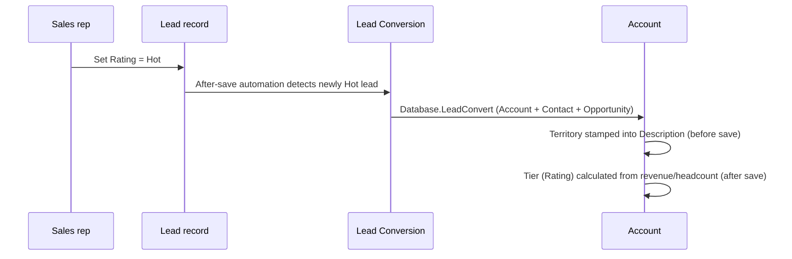
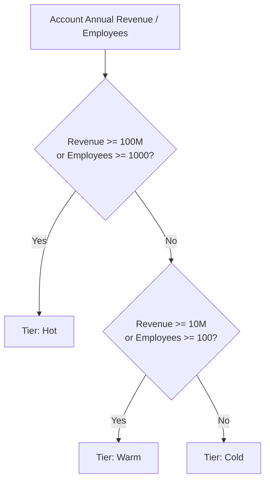

## Overview

This feature moves a qualified lead into a real customer record and immediately tells reps and
ops how important that customer is and who should own it. The moment a Lead's **Rating**
changes to **Hot** (or an admin/integration explicitly converts a batch of Hot leads), the lead
is converted into an Account, Contact, and Opportunity, and the new Account is stamped with a
**Rating**-based tier (Hot/Warm/Cold, driven by annual revenue and employee count) and a
**Territory** derived from its billing country/state. Tiering and territory assignment also run
independently any time an Account is created or its sizing fields (revenue, employee count) or
billing address change, so the tier and territory shown on an account never go stale.



## Prerequisites

```callout
type: note
Conversion and tiering both run automatically in the background. There is no dedicated
screen — reps trigger conversion simply by rating a lead Hot, and admins can also drive
conversion directly through Apex for integrations or data loads.
```

- The Lead's **Rating** field must be `Hot` and the Lead must not already be converted.
- A converted **Lead Status** (a Lead Status record with `IsConverted = true`) must exist in the
  org — it is used as the target status for every conversion.
- For territory assignment to produce anything other than **Unassigned**, the Account's
  **Billing Country** (and, for US accounts, **Billing State**) should be filled in.

## Steps to Navigate

Conversion happens automatically, but a rep can also trigger it manually from the Lead record,
and an admin can review the resulting Account fields.

1. Open the **Leads** tab and open a Lead record.
2. Edit the **Rating** field and set it to **Hot**, then click **Save**.
3. Conversion runs automatically after save — no further click is required.

```screenshot
id: lead-conversion-account-tiering-lead-rating
alt: Lead record with the Rating field set to Hot before saving
step: Open a Lead record, edit Rating, and set it to Hot
url_pattern: /lightning/r/Lead/{recordId}/view
```

4. To see the result, open the **Accounts** tab and open the newly created Account.
5. Check the **Rating** field (the tier) and the **Description** field (which now starts with
   `Territory: <name>`).

```screenshot
id: lead-conversion-account-tiering-account-record
alt: Account record page showing the Rating field and a Description that begins with Territory
step: Open the Account created from the converted Lead and view its Rating and Description fields
url_pattern: /lightning/r/Account/{recordId}/view
```

## Use Cases

### Standard conversion of a Hot lead

1. A sales rep changes a Lead's **Rating** to `Hot` and saves.
2. The Lead trigger detects the Lead just became Hot and is not already converted, and calls
   lead conversion for that Lead.
3. `Database.convertLead` creates the Account, Contact, and Opportunity (opportunity creation is
   not suppressed).
4. The new Account is queried back with its revenue and headcount, and re-tiered so its
   **Rating** reflects the sizing rules below — even though the Account trigger's own after-insert
   tiering already ran once, this second pass ensures the tier reflects the latest values.

### Lead does not qualify for conversion

1. A Lead's **Rating** is set to `Warm` or `Cold`, or the Lead is edited without Rating changing
   to Hot.
2. Conversion is never attempted — the automation only reacts to a Lead's Rating newly
   becoming `Hot`.
3. If a Lead is already converted, or its Rating is anything other than `Hot`, it is silently
   skipped even if it's included in a manual/bulk conversion call.

### Bulk conversion via an integration or admin script

1. An admin or integration calls the conversion logic directly with a list of Leads (for example,
   from anonymous Apex or a batch job) instead of relying on the trigger.
2. Every Lead in the list is filtered down to those that are `Hot` and not yet converted; the
   rest are dropped from the batch with no error.
3. `Database.convertLead` runs with `allOrNone = false`, so one failed conversion in the batch
   (for example, a duplicate rule block) does not roll back the others.
4. All successfully created Accounts are collected and re-tiered together in a single pass.

### Account created or edited directly (no lead involved)

1. A user or integration creates an Account directly (e.g. via data load), or edits an existing
   Account's **Annual Revenue** or **Number of Employees**.
2. On create, the territory is stamped into **Description** before the record is saved, and the
   tier is calculated immediately after insert.
3. On update, the tier is only recalculated if **Annual Revenue** or **Number of Employees**
   actually changed — editing unrelated fields does not trigger a re-tier.
4. Editing **Billing Country** or **Billing State** on an existing Account does **not**
   automatically refresh the `Territory:` line in Description — that stamp is only written on
   insert.

### Tier or territory looks wrong to a support/ops user

1. An ops user notices an Account's **Rating** doesn't match its revenue/headcount, or its
   **Description** shows the wrong territory.
2. Since re-tiering only fires on insert or when revenue/headcount change, a Rating mismatch
   after a bulk data correction (e.g. fixing revenue without touching headcount) will not
   self-correct until one of those two fields is edited and saved again.
3. Territory is calculated from **Billing Country** and **Billing State** at the moment the
   Account is inserted; moving an existing account to a new region will not update the stored
   `Territory:` text in Description without a manual re-save flow or admin script that re-runs
   `AccountTerritoryService`.

## Validations & Business Rules



- **Conversion eligibility**: only Leads with `Rating = 'Hot'` and `IsConverted = false` are
  converted; all others are skipped without error.
- **Conversion target status**: whichever Lead Status has `IsConverted = true` in the org is used
  as the converted status for every conversion in the batch.
- **Opportunity creation**: conversion always creates an Opportunity (`setDoNotCreateOpportunity(false)`).
- **Partial success**: bulk conversions run with `allOrNone = false` — some Leads in a batch can
  fail conversion while others succeed.
- **Tier (Rating) thresholds** on Account:
  - `AnnualRevenue >= $100,000,000` **or** `NumberOfEmployees >= 1000` → **Hot**
  - `AnnualRevenue >= $10,000,000` **or** `NumberOfEmployees >= 100` → **Warm**
  - Otherwise → **Cold**
  - Blank revenue or employee count is treated as `0` for this calculation.
- **Re-tier triggers**: tiering runs after every Account insert, after any update where
  `AnnualRevenue` or `NumberOfEmployees` changed, and again immediately after a Lead converts to
  that Account.
- **Recursion guard**: re-tiering updates `Account.Rating` via DML, so the Account trigger is
  bypassed for the duration of that update to prevent it from re-entering itself.
- **Territory assignment** (billing geography, evaluated on insert only):
  - United States: `CA/WA/OR/NV/AZ` → **AMER-West**; `NY/NJ/MA/CT/FL` → **AMER-East**;
    `TX/IL/CO/MN` → **AMER-Central**; any other US state → **AMER-Other**.
  - `United Kingdom, Ireland, France, Germany, Spain, Netherlands` → **EMEA**.
  - `India, Singapore, Japan, Australia` → **APAC**.
  - `Brazil, Mexico, Argentina` → **LATAM**.
  - Any other or blank country → **Unassigned**.
  - Country values of `USA`, `US`, `United States of America` are normalized to `United States`;
    `UK` and `Great Britain` are normalized to `United Kingdom` before matching.
- **Territory storage**: the territory is written as a `Territory: <name>` line prepended to the
  Account's **Description** field (existing description text is preserved below it), truncated to
  32,000 characters. There is no separate Territory field — this text in Description is the only
  record of the assigned territory.

## Related Features

- Lead Follow-up Reminder — reacts to the same `Rating = Hot` signal on Lead creation, independently of conversion.
