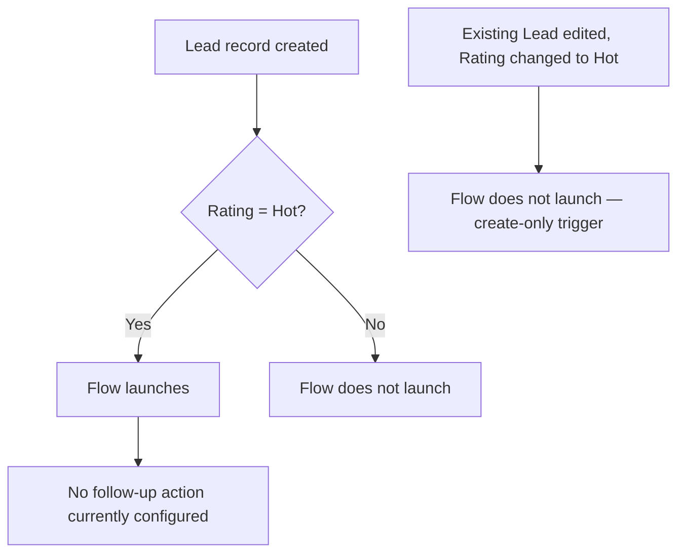

## Overview

Lead Follow-up Reminder is a background automation intended to draw sales reps' attention to
newly created leads that are rated **Hot**, so the most promising leads don't sit untouched. It
runs automatically the moment a Lead record is created — no one has to click anything to trigger
it.

As currently configured, the flow only defines the trigger condition (a Lead created with
Rating = Hot). It does not yet contain any follow-up action — such as a task, notification, or
field update. See [Validations & Business Rules](#validations--business-rules) for what this
means in practice today.

## Prerequisites

```callout
type: note
This automation runs entirely in the background. There is no menu item, button, or setting a
user needs to turn on — it fires automatically based on the Lead's data at creation time.
```

- The Lead's **Rating** field must be set to `Hot` at the moment the record is created.
- No special permission set is required to trigger this flow — it fires for any Lead a user is
  able to create, regardless of who creates it.

## Steps to Navigate

This feature has no dedicated screen of its own — it runs automatically when a Lead is created.
To trigger it as a sales rep:

1. Open the **Leads** tab and click **New**.
2. Fill in the required Lead fields.
3. Set the **Rating** field to **Hot**.
4. Click **Save**.

```screenshot
id: lead-followup-reminder-new-lead-rating
alt: New Lead form with the Rating field set to Hot before saving
step: Open the Leads tab, click New, and set Rating to Hot on the new Lead form
url_pattern: /lightning/o/Lead/new
```

An admin can inspect or extend the automation itself:

1. Click the gear icon in the top-right, then click **Setup**.
2. In the Quick Find box, type **Flows** and select **Flows**.
3. Click **Lead Followup Reminder** to open it in Flow Builder.

```screenshot
id: lead-followup-reminder-flow-builder
alt: Flow Builder canvas showing the Lead Followup Reminder record-triggered flow
step: Open Setup, go to Flows, and click into the Lead Followup Reminder flow
url_pattern: /lightning/setup/Flows/home
```

## Use Cases

### Creating a Hot lead

1. A sales rep (or an integration) creates a new Lead and sets **Rating** to `Hot`.
2. On save, the flow's entry criteria match and the flow launches after the record is committed.
3. Today, the flow performs no further action once it launches — the Lead is saved normally and
   no task, alert, or field change is visibly added as a result of this automation.

### Creating a Warm or Cold lead

1. A sales rep creates a new Lead with **Rating** left blank, or set to `Warm` or `Cold`.
2. The entry criteria do not match, so the flow does not launch at all for this record.

### Changing Rating to Hot after creation

1. A sales rep creates a Lead with **Rating** set to `Warm`, saves it, then later edits the record
   and changes **Rating** to `Hot`.
2. The flow does **not** run in this case — it is configured to fire only on record **creation**,
   not on updates. Only the Rating value present at the moment of creation is evaluated.



## Validations & Business Rules

- **Trigger**: Record-Triggered Flow on `Lead`, configured for **After Save**, **Create** only.
- **Entry condition**: `Rating = "Hot"` (evaluated only against the values present when the record
  is first created).
- **Current behavior**: the flow contains no actions after its trigger — no Task is created, no
  email or notification is sent, and no field is updated. Support and admin staff should be aware
  that, as built today, sales reps receive no visible reminder from this automation even when it
  fires; any reminder process for Hot leads is currently manual until actions are added to this
  flow.
- Because the trigger is create-only, re-rating an existing Lead to `Hot` will never launch this
  flow — only brand-new Hot leads are evaluated.

## Related Features

- None documented yet.
