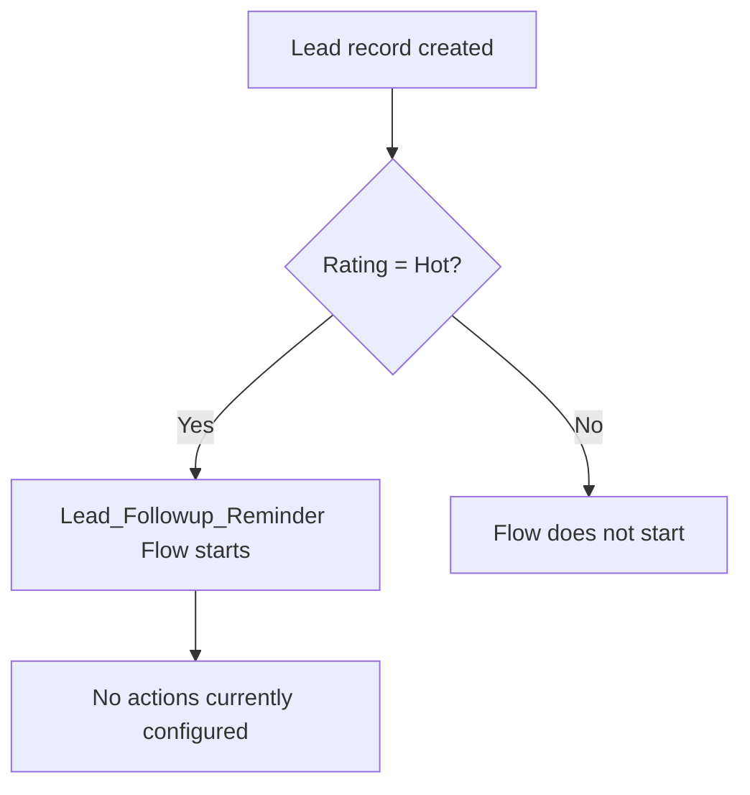

## Overview

This feature is intended to alert sales users when a new Lead comes in with a **Rating** of **Hot**,
so the lead gets a timely follow-up before it goes cold. It is implemented as a record-triggered Flow
that fires immediately after a Lead is created.

```callout
type: warning
The **Lead_Followup_Reminder** Flow is currently active and will fire on every Hot Lead creation, but
it has no actions configured yet (no email alert, task, or notification is created). At this time,
creating a Hot Lead does not produce any visible reminder to the user — this page documents the
trigger condition as configured in the org today.
```

## Prerequisites

- The **Rating** field on the Lead must be set to `Hot` at the time the Lead is created.
- No additional permission set is required to trigger this Flow — it runs automatically in the
  background whenever a matching Lead is inserted.

## Steps to Navigate

The reminder is not something a user manually navigates to — it is triggered automatically by
creating a Lead. To create a Lead that meets the trigger criteria:

1. Click the **App Launcher** and search for **Leads**.
2. Click **New** on the Leads list view.
3. Fill in the required Lead fields (Company, Last Name, etc.).
4. Set the **Rating** field to **Hot**.
5. Click **Save**.

```screenshot
id: lead-followup-reminder-rating-field
alt: Lead creation form with the Rating field set to Hot
step: Open the New Lead form and set the Rating field to Hot
url_pattern: /lightning/o/Lead/new
actions:
  - open_app_launcher
  - search_app_launcher: Leads
  - click_app_launcher_result: Leads
  - click_new
  - fill_field: { field: Rating, value: Hot }
```

## Use Cases

### Hot Lead created

1. A user (or an integration) creates a new Lead record with **Rating** set to **Hot**.
2. Immediately after the record saves, the **Lead_Followup_Reminder** Flow evaluates the entry
   condition (`Rating = "Hot"`) and starts an interview.
3. Currently, the Flow performs no further action — no email, task, or Chatter notification is sent.
   The Lead is saved normally with no visible difference to the user.

### Lead created with a different Rating

1. A user creates a Lead with **Rating** set to `Warm`, `Cold`, or left blank.
2. The Flow's entry condition is not met, so the Flow does not start an interview for this record.

### Rating changed to Hot after creation

1. A user edits an existing Lead and changes **Rating** to `Hot`.
2. Because the Flow's trigger type is **Create only**, this update does not start the Flow — the
   reminder logic only evaluates on initial Lead creation, not on subsequent edits.



## Validations & Business Rules

- Automation: **Lead_Followup_Reminder** is an auto-launched, record-triggered Flow on the Lead
  object, configured with `RecordAfterSave` and `Create`-only trigger type.
- Entry condition: the Flow's filter formula is `{!$Record.Rating} = "Hot"` — it only starts for
  Leads created with Rating already set to Hot.
- The Flow does not re-evaluate on Lead updates, so a Lead whose Rating is changed to Hot after
  creation will not trigger this Flow.
- As configured, the Flow has no downstream elements (no Assignment, Decision, Create Records, or
  Send Email actions), so no follow-up reminder is actually delivered to any user today.

## Related Features

- Lead conversion and qualification processes that make use of the Lead Rating field
