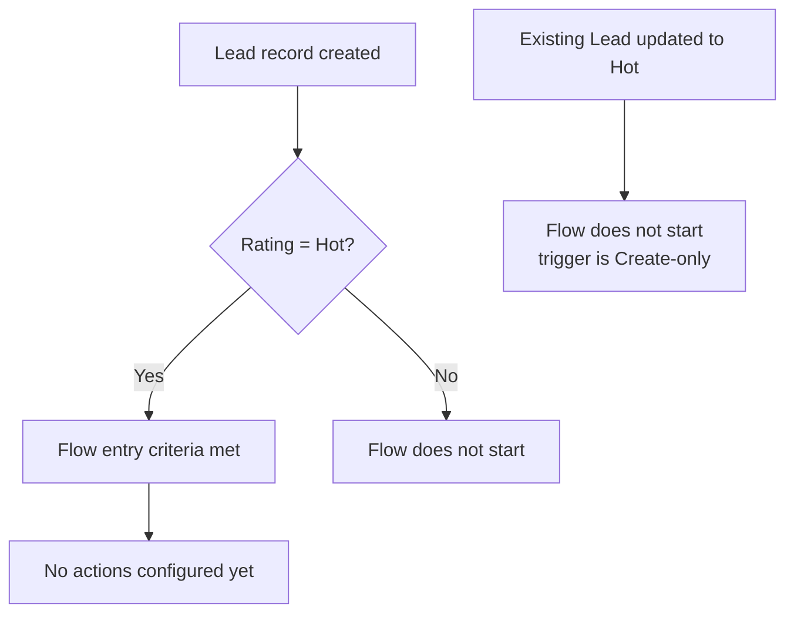

## Overview

Lead Followup Reminder is a record-triggered flow that fires automatically whenever a new Lead is
created with its **Rating** field set to **Hot**. It exists to flag high-priority leads the moment
they enter the system, so sales reps don't let a hot prospect sit untouched. Salespeople and lead
owners don't interact with this flow directly — it runs silently in the background after a Lead is
saved.

```callout
type: note
This flow currently only defines its trigger and entry criteria — no follow-up action (task,
email, or notification) has been configured inside it yet. Today it evaluates every new Lead
against the Hot-rating condition but does not create a reminder as a result. Treat this page as
documenting the automation's current entry criteria; no visible reminder will appear for users
until follow-up actions are added.
```

## Prerequisites

- "Manage Flow" or "Customize Application" permission to view, activate, or edit the flow in Setup
- The Lead record must have a **Rating** value of exactly **Hot** (the standard Rating picklist also
  offers Warm and Cold, which do not meet this flow's entry criteria)
- The flow only evaluates Leads at the moment of **creation** — it does not re-evaluate existing
  Leads when their Rating is changed later

## Steps to Navigate

Because this is a background automation rather than a screen users click through, "navigating" it
means locating and reviewing it in Setup.

1. Click the gear icon in the top-right, then click **Setup**.
2. In the Quick Find box, type **Flows** and select **Flows** under Process Automation.
3. Click **Lead Followup Reminder** in the list of flows to open it in Flow Builder.

```screenshot
id: lead-followup-reminder-setup-list
alt: Setup Flows list showing Lead Followup Reminder in the list of active flows
step: Open Setup, search for Flows, and view the Flows list
url_pattern: /lightning/setup/Flows/home
actions:
  - goto: /lightning/setup/Flows/home
```

4. Review the **Start** node to see the object (Lead), trigger (A record is created), and the entry
   condition (Rating equals Hot).

```screenshot
id: lead-followup-reminder-canvas
alt: Flow Builder canvas showing the Start element for Lead Followup Reminder with its entry condition
step: Open the Lead Followup Reminder flow and view its Start element
url_pattern: /builder_platform_interaction/flowBuilder.app
```

## Use Cases

### A new Hot lead is created

1. A user (or an integration, such as a web-to-lead form or import) creates a new Lead record.
2. On save, the flow evaluates the Lead's **Rating** field.
3. If Rating is **Hot**, the entry criteria is met and the flow's interview starts for that Lead.
4. No further action currently runs — the flow has no configured elements beyond its Start node, so
   nothing changes on the Lead and no task or notification is created yet.

### A new lead is created with Warm, Cold, or blank rating

1. A user creates a new Lead where Rating is **Warm**, **Cold**, or left blank.
2. The flow's entry criteria (`Rating = "Hot"`) is not met, so the flow does not start for this Lead.
3. No reminder-related processing of any kind occurs for this record.

### An existing lead is later changed to Hot

1. A user edits an existing Lead (created earlier as Warm or Cold) and changes its Rating to **Hot**.
2. Because the flow's trigger is scoped to record **creation** only (not updates), the flow does not
   run for this change.
3. The Lead is only ever evaluated by this flow at the moment it was first created.



## Validations & Business Rules

- Automation: `Lead_Followup_Reminder` is an auto-launched, record-triggered flow (`RecordAfterSave`)
  on the Lead object, restricted to the **Create** trigger type only.
- Entry condition: `Rating = "Hot"` — evaluated once, at creation, using the Lead's Rating value at
  save time.
- The flow contains no downstream elements (no Create Records, Send Email, Task creation, or
  notification actions) — meeting the entry criteria currently has no observable effect for end
  users.
- Because the trigger type is Create-only, changing a Lead's Rating to Hot after it already exists
  will not retroactively trigger this flow.

## Related Features

- Lead management and Lead conversion — this flow evaluates Leads at the same creation point where
  Lead assignment and ownership are typically set.
- Other alert-style flows in this org (such as Big Deal Alert, Quote Expiry Alert, and Product
  Retirement Notice) follow a similar record-triggered pattern for surfacing time-sensitive records.
