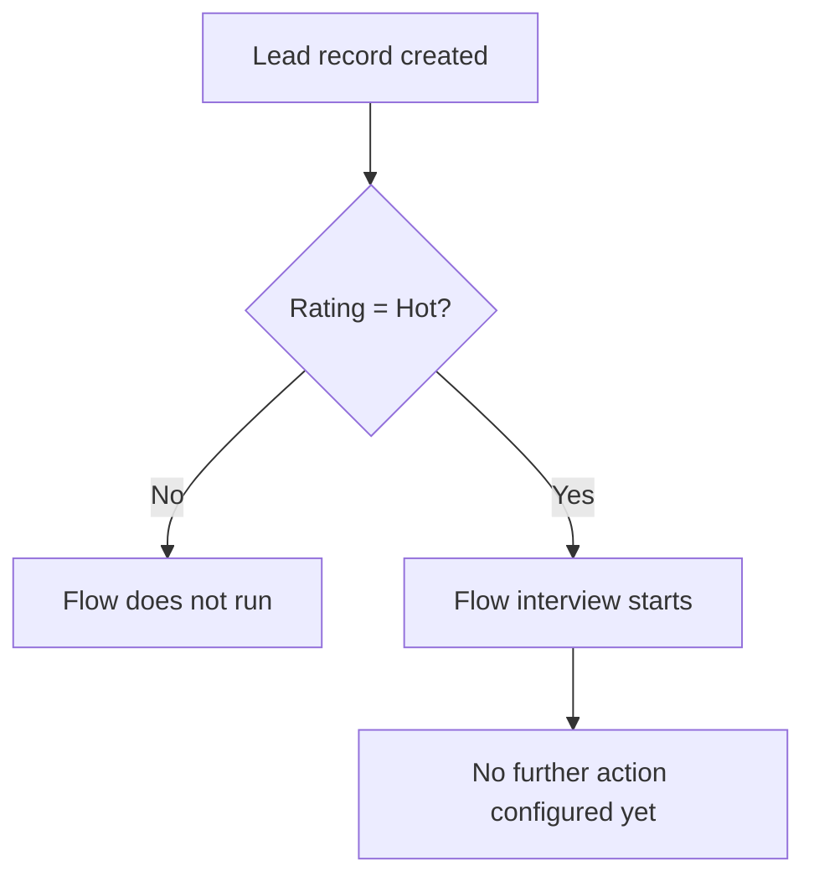

## Overview

Lead Follow-up Reminder is a background automation built to catch high-value leads the instant they enter Salesforce. It runs automatically whenever a new Lead is created with its **Rating** field set to **Hot** — no one has to click anything for it to fire. The intent of the automation is to make sure hot prospects are flagged for quick follow-up rather than sitting unnoticed in a queue.

```callout
type: warning
This flow currently only defines its **entry criteria** (new Lead created with Rating = "Hot"). No downstream action — such as creating a task, sending an email alert, or notifying a queue — has been built into the flow yet. Today, the automation evaluates the condition but does not perform a visible follow-up action.
```

## Prerequisites

- No special permission is required to trigger this automation — it runs automatically as part of saving a Lead record.
- The Lead's **Rating** field must be set to **Hot** at the time the record is created.

## Steps to Navigate

The automation has no manual entry point of its own — it runs whenever a Lead is created that matches its criteria. To reach the point where it fires:

1. Click the App Launcher and open the **Leads** tab.
2. Click **New** to create a Lead record.
3. Fill in the required Lead fields (Company, Last Name, etc.).
4. Set the **Rating** field to **Hot**.
5. Click **Save**.

```screenshot
id: lead-followup-reminder-rating-field
alt: New Lead form with the Rating field set to Hot before saving
step: Open the New Lead form and set Rating to Hot
url_pattern: /lightning/o/Lead/new
actions:
  - open_app_launcher
  - search_app_launcher: Leads
  - click_app_launcher_result: Leads
  - click_new
  - fill_field: { field: Rating, value: Hot }
```

## Use Cases

### New Hot lead created

1. A user (or an integration) creates a Lead record and sets **Rating** to **Hot**.
2. Immediately after the record saves, the flow's entry criteria evaluate to true and the flow interview starts.
3. No further action is currently configured in the flow, so nothing else visibly happens on the record — the automation exists only as a trigger point today.

### Lead created with a different Rating

1. A user creates a Lead with **Rating** left blank, or set to **Warm** or **Cold**.
2. The entry criteria evaluate to false and the flow does not start at all.

### Rating changed to Hot after creation

1. A user creates a Lead without a Hot rating, then later edits the record and changes **Rating** to **Hot**.
2. The flow does **not** fire, because it only listens for record **creation**, not updates. Only the Rating value present at the moment of Save (create) is evaluated.

### Bulk lead creation (e.g. import or API)

1. Multiple Lead records are inserted in bulk, some with Rating = Hot and some without.
2. Salesforce evaluates the entry criteria for each record individually — only the records that are Hot at creation start the flow interview.



## Validations & Business Rules

- Automation: `Lead_Followup_Reminder` is an active, auto-launched flow that runs **after save**, only on **record creation** (not on edits).
- Entry criteria: fires only when `Rating` equals `"Hot"` at the moment the Lead is created.
- Because the trigger type is Create-only, changing a Lead's Rating to Hot after it already exists will not invoke this automation.
- As of this writing, the flow contains no actions beyond its entry check — it does not yet create a task, send a notification, or update any field. Any actual "reminder" a user sees today must come from another process.

## Related Features

- None documented yet.
