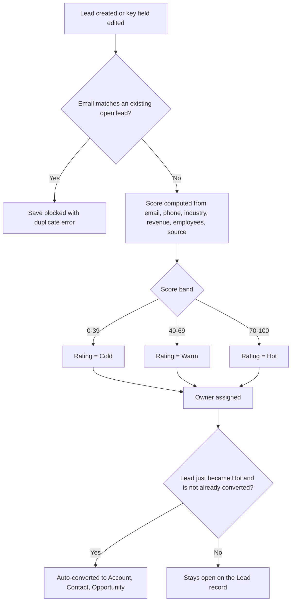

## Overview

Every time a lead is created or updated, Salesforce automatically checks it for duplicates, scores it from 0–100 based on firmographics and contact quality, assigns it to an owner, and — if the score is high enough — converts it into an Account, Contact, and Opportunity without anyone touching a button. Salespeople and lead-qualification staff use this to skip manual triage entirely: by the time a lead shows up in their queue it already has a Rating, an owner, and (if it qualified) a converted Account. A companion **Hot Leads** scorecard component can be dropped onto any page so reps can see the newest Hot leads at a glance.



## Prerequisites

```callout
type: note
Nothing needs to be turned on for scoring, routing, and auto-conversion — this automation runs on every
save automatically. The only setup step is adding the Hot Leads scorecard component to a page if you
want reps to see it.
```

- Standard 'Create' and 'Edit' access to the Lead object
- At least one active Standard-license user (used to route Hot and round-robin leads)
- A Lead Status value flagged "Converted" in Setup, so auto-conversion has a status to convert into
- Access to Lightning App Builder if you're adding the Hot Leads scorecard to a page

## Steps to Navigate

Lead scoring, routing, and conversion happen automatically — there's nothing to click to trigger them.
To see the results:

1. Open any **Lead** record. The **Rating** field shows **Hot**, **Warm**, or **Cold**.
2. Open a **Lead list view** (e.g. "My Leads") and add the **Rating** and **Owner** columns to see how leads have been scored and routed.
3. If a lead was auto-converted, open it — it now shows as **Converted**, with links to the new **Account**, **Contact**, and **Opportunity**.

```screenshot
id: lead-management-rating-field
alt: A Lead record page showing the Rating field set to Hot
step: Open a Lead record and view the Rating field
url_pattern: /lightning/o/Lead/list
```

To add the Hot Leads scorecard to a page (admin task):

1. Click the gear icon in the top-right, then click **Edit Page** (or open **Lightning App Builder** from Setup).
2. Drag the **Hot Leads** component from the Custom Components list onto the page.
3. Click **Save**, then **Activate** if this is the first time the page has been activated.

```screenshot
id: lead-management-scorecard-app-builder
alt: Lightning App Builder with the Hot Leads component dragged onto a Home page
step: Open Lightning App Builder for a Home page and drag the Hot Leads component onto the layout
url_pattern: /lightning/app/AppLauncher
actions:
  - open_app_launcher
  - search_app_launcher: Home
```

## Use Cases

### Standard path — new lead is scored, routed, and left open

1. A lead is created (manually, via import, or via an integration) with a business email, a target industry, and mid-size revenue.
2. The system computes a score from email quality, phone presence, industry, annual revenue, employee count, and lead source, then sets **Rating** to Cold, Warm, or Hot based on the score band.
3. The lead is assigned an owner: Hot or target-industry leads go to the most recently active rep; everything else round-robins across active reps so no one is overloaded.
4. If the resulting Rating is not Hot, the lead simply sits on the rep's queue for manual follow-up.

### Duplicate path — a lead with an existing email is rejected

1. A new lead is submitted with an email address that already exists on another **open (unconverted)** lead.
2. The save is blocked with the error "A lead with this email already exists (`<Id>`)".
3. The submitter (or integration) should instead update the existing lead rather than create a new one.

### Correction path — editing a lead's firmographic data re-scores it

1. A rep edits an existing lead's **Email**, **Industry**, **Annual Revenue**, or **Number of Employees**.
2. Because one of those scoring inputs changed, the lead is automatically re-scored and its **Rating** may move up or down a band.
3. Editing any other field (e.g. Phone, description, or Lead Source alone) does **not** trigger a re-score — the trigger only re-runs scoring when the four fields above change.

### Auto-conversion path — a lead crosses into Hot

1. A lead's Rating changes from Warm/Cold to **Hot** (either at creation, or after an edit pushes its score to 70+) and the lead is not already converted.
2. The system automatically converts it: an Account, Contact, and Opportunity are created via standard lead conversion, using whichever Lead Status is flagged as the converted status.
3. The new Account is immediately re-tiered by the account tiering logic, so its Tier reflects its revenue/employee/rating profile from the moment it's created — no manual re-tiering needed.
4. The rep sees the lead marked Converted, with the new Account/Contact/Opportunity linked from the lead record.

### Bulk path — mass import or mass update of leads

1. A batch of leads is inserted or updated together (e.g. a data import or a mass edit from a list view).
2. Deduplication, scoring, assignment, and auto-conversion all run per-record across the whole batch in the same trigger execution — there's no separate "bulk mode" to enable, and no per-record limit other than standard governor limits.
3. Any records that fail the duplicate-email check are rejected individually with their own error; the rest of the batch still processes normally.

### Reviewing Hot leads via the scorecard

1. A rep opens the page where the **Hot Leads** component has been placed (Home, App, or a Lead record page).
2. The component lists the 25 most recently created, still-open leads rated Hot, showing Name, Company, and Lead Source.
3. If no leads are currently Hot, the list is simply empty — there is no separate "no leads" message.

## Validations & Business Rules

- **Duplicate check (before insert):** a new lead is rejected if its email (case-insensitive) matches an existing lead that is not yet converted.
- **Scoring formula (0–100, capped at 100):**
  - Business email: +25; other valid email: +10
  - Valid phone present: +10
  - Industry in Technology, Finance, Healthcare, or Manufacturing: +20
  - Annual Revenue ≥ $50M: +25; ≥ $5M: +15; ≥ $500K: +5
  - Number of Employees ≥ 200: +10
  - Lead Source is Web or Partner Referral: +10
- **Rating bands:** score ≥ 70 → Hot, ≥ 40 → Warm, otherwise Cold.
- **Automation — before insert:** every new lead is deduped, scored, and assigned an owner.
- **Automation — before update:** a lead is only re-scored if Email, Industry, Annual Revenue, or Number of Employees changed.
- **Automation — after update:** any lead whose Rating just became Hot (and that isn't already converted) is automatically converted to Account/Contact/Opportunity; the resulting Account is re-tiered immediately.
- **Owner assignment:** Hot and target-industry leads route to the most recently active Standard user; all others round-robin across up to 10 active Standard users.
- **Conversion guard:** conversion only runs for leads that are not already converted and whose Rating is Hot at the time of the after-update trigger; this and the scoring/dedupe logic can be temporarily bypassed via the shared trigger-control mechanism used during bulk data loads.
- **Hot Leads scorecard:** always shows the 25 most recently created, unconverted leads currently rated Hot — it does not include Warm/Cold leads or already-converted leads.

## Related Features

- Lead Conversion (Account, Contact, and Opportunity creation from a qualified lead)
- Account Tiering (re-tiers accounts created from converted leads)
