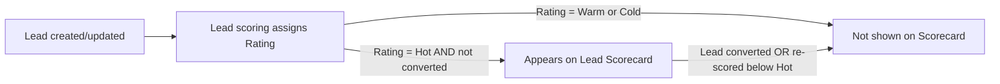

## Overview

The Lead Scorecard is a small card component that sales managers or reps can place on a Home page, App page, or Lead record page to see which leads currently need attention first. It automatically pulls the 25 most recently created, still-open leads that the lead scoring process has rated **Hot**, so users don't have to build or remember a list view filter to find them. The card is read-only — it's a quick glance widget, not a place to edit records.

```callout
type: note
This component only **displays** scores that were already calculated. The scoring logic itself (how a lead becomes Hot/Warm/Cold) is documented separately — see [[lead-scoring]].
```

## Prerequisites

- The **Lead Scorecard** component must be added to a page (Home, App, or Lead record page) via Lightning App Builder — it does not appear anywhere by default.
- Users must have read access to the Lead object and to the Name, Company, Rating, LeadSource, and CreatedDate fields.
- Leads must have gone through the automated scoring process at least once so that `Rating` is populated; leads with no rating yet will never appear on the card.

## Steps to Navigate

1. As an admin, open the Home page, an App page, or the Lead record page you want the card on, and click **Edit Page** (or **Setup gear → Edit Page**).
2. In Lightning App Builder, drag the **Lead Scorecard** component from the Components panel onto the page.
3. Click **Save**, and **Activate** the page if prompted (choose the org default, app default, or app/record-type/profile assignment as needed).
4. Any user who navigates to that page can now see the **Hot Leads** card.

```screenshot
id: lead-scorecard-app-builder
alt: Lightning App Builder with the Lead Scorecard component dragged onto a Home page layout
step: Open Lightning App Builder for a Home page and drag the Lead Scorecard component onto the canvas
url_pattern: /lightning/app/AppLauncher
actions:
  - goto: /lightning/setup/FlexiPageList/home
```

```screenshot
id: lead-scorecard-card-view
alt: Hot Leads card showing a list of lead names, companies, and lead sources
step: View the Home page with the Lead Scorecard component active
url_pattern: /lightning/page/home
```

## Use Cases

### Rep checks the Hot Leads list at the start of the day

1. The rep opens the Home page (or whichever page the admin placed the card on).
2. The **Hot Leads** card shows each open, unconverted lead currently rated Hot, listed as `Name — Company (LeadSource)`, most recently created first, up to 25 leads.
3. The rep uses this list to decide who to call first, without running a report or list view.

### No hot leads exist yet

1. If no lead currently has a Hot rating (or the org has no leads yet), the card renders with its title and icon but no list items underneath.
2. This is expected — it means scoring hasn't rated anything Hot yet, not that the component is broken.

### A lead is converted or its rating drops

1. Once a lead is converted, or a later scoring pass drops its rating below Hot (e.g. after a data update changes industry or revenue), it stops meeting the query criteria.
2. The lead disappears from the card next time it refreshes — the card always reflects the current state of `IsConverted` and `Rating`, not a fixed snapshot.

### More than 25 hot leads exist

1. The underlying query is capped at the 25 most recently created Hot leads.
2. If more than 25 open leads are rated Hot, older ones fall off the bottom of the card; a full picture requires a list view or report rather than this component.

## Validations & Business Rules

- The card calls the cacheable Apex method `LeadScoringService.getRecentHotLeads()`, which queries `Lead` where `IsConverted = false` and `Rating = 'Hot'`, ordered by `CreatedDate DESC`, limited to 25 records.
- Because the method is `cacheable=true`, the Lightning Data Service wire may serve a cached result until the underlying data changes or the cache is refreshed — there can be a short lag between a lead being (re)scored and it appearing on or dropping off the card.
- The component itself performs no scoring, no writes, and has no configurable properties — all filtering is fixed in Apex.



## Related Features

- Lead scoring automation that calculates the score and sets `Rating` (see [[lead-scoring]])
