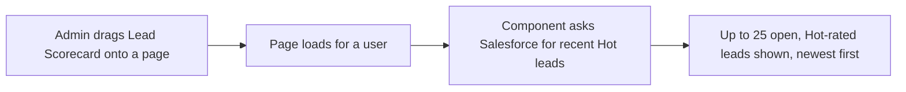

## Overview

The Lead Scorecard is a small "Hot Leads" panel that a Salesforce admin can drop onto a Home page, App
page, or Lead record page using Lightning App Builder. It shows the 25 most recently created leads that
have already been rated **Hot** by the org's automatic lead scoring, giving reps and sales managers a
quick, always-current view of who to call first without running a report or list view. The scoring itself
happens automatically when a lead is created or edited — this component only displays the result.



```callout
type: note
This component only reads and displays data. It does not change a lead's rating, and it does not let
a user filter, sort, or take action from the list — see [[lead-capture-scoring-assignment]] for how a
lead becomes Hot in the first place.
```

## Prerequisites

- Standard read access to Leads (whatever profile/permission set the user already has for viewing leads)
- An admin must place the **Lead Scorecard** component on a page first — it is not visible anywhere until
  that's done

## Steps to Navigate

Placing the component is an admin, one-time setup task. Once placed, every user who opens that page sees
it automatically — there is nothing for an end user to click to "open" it.

1. As an admin, open the page where the panel should appear (for example, a Lead record page or the sales
   Home page) and click the gear icon, then **Edit Page**.
2. In Lightning App Builder, find **Lead Scorecard** in the Components panel on the left.
3. Drag **Lead Scorecard** onto the page layout where it should appear.
4. Click **Save**, and if prompted, **Activate** the page so the change is visible to users.

```screenshot
id: lead-scorecard-app-builder
alt: Lightning App Builder with the Lead Scorecard component dragged onto a Home page layout
step: Open Lightning App Builder for a Home page and drag the Lead Scorecard component onto the layout
url_pattern: /lightning/setup/FlexiPageList/home
```

5. Any user who now opens that page sees a **Hot Leads** card listing each lead's name, company, and lead
   source.

```screenshot
id: lead-scorecard-home-page
alt: Home page showing the Hot Leads card with a list of lead name, company, and lead source
step: Open the Home page that has the Lead Scorecard component and view the Hot Leads card
url_pattern: /lightning/page/home
```

## Use Cases

### Rep checks the Hot Leads panel on Home

1. The rep opens their Salesforce Home page (where an admin has placed the Lead Scorecard).
2. The **Hot Leads** card shows up to 25 leads, most recently created first, each as
   `Name — Company (Lead Source)`.
3. The rep uses this list as a prompt for who to follow up with first; clicking a lead's name elsewhere
   in Salesforce (e.g. a related list) opens the full record.

### No Hot leads exist yet

1. If the org currently has no open leads rated Hot, the card renders with no rows underneath the title.
2. As soon as a new or edited lead is scored Hot by the automatic scoring logic, it appears in the list the
   next time the page loads.

### Lead is converted or re-rated below Hot

1. Once a Hot lead is converted, it is excluded from the list (only open, unconverted leads are shown).
2. If a lead is edited and its score drops below the Hot threshold, it no longer qualifies and drops out of
   the list on the next page load.

## Validations & Business Rules

- The component always shows **open (unconverted) leads rated Hot**, ordered by creation date, newest
  first, capped at 25 records.
- Lead rating (Hot / Warm / Cold) is not computed by this component — it is set automatically by the lead
  scoring logic on create/edit. See [[lead-capture-scoring-assignment]] for the scoring rules and
  thresholds.
- The list is read-only: there are no buttons or links in the panel itself to edit, convert, or reassign a
  lead.
- Because the underlying data request is cacheable, a user may briefly see a slightly stale list until the
  page next refreshes or reloads.

## Related Features

- [[lead-capture-scoring-assignment]] — documents how leads are scored and rated Hot/Warm/Cold, which
  determines what shows up in this scorecard
