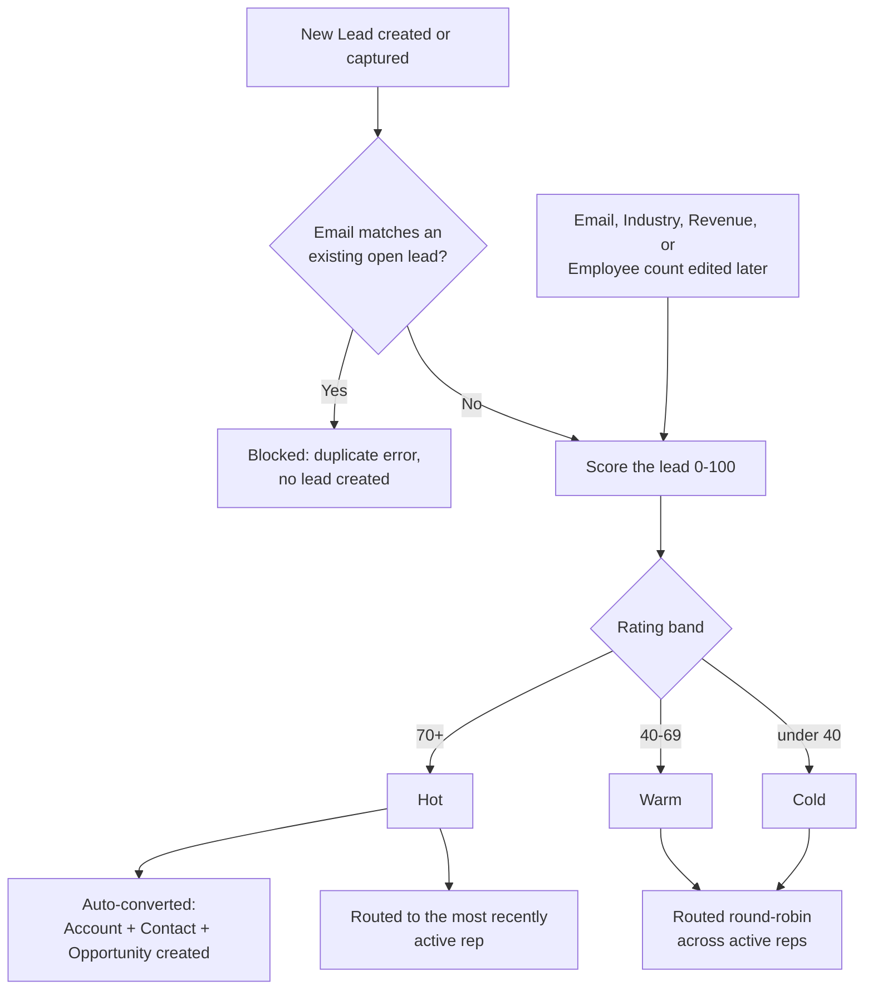

## Overview

Every Lead that comes into Salesforce — whether typed in by hand or captured from the web — is automatically
scored, checked for duplicates, and routed to a rep without anyone having to do it manually. The score is
translated into a **Rating** of Cold, Warm, or Hot, and the moment a lead's Rating reaches Hot, it's
automatically converted into an Account, Contact, and Opportunity so a rep can start working the deal
immediately. Leads that sit untouched for two weeks get an automatic nudge — a follow-up task for their owner
and a check-in email to the lead — so nothing quietly goes cold from neglect.



## Prerequisites

- At least one Lead Status marked as the converted status (Setup > Lead Statuses) — automatic conversion uses whichever status is flagged this way
- At least one active Standard-license user who has logged in at least once, so new leads have somewhere to route to

## Steps to Navigate

1. Click the **App Launcher** and search for **Leads**.
2. Open any Lead record. Its **Rating** field (Cold/Warm/Hot) shows the current auto-computed score band, and **Owner** shows who it was routed to.

```screenshot
id: lead-scoring-record-page
alt: Lead record page showing the Rating field and Owner assigned by automatic routing
step: Open a Lead record to view its Rating and Owner
url_pattern: /lightning/r/Lead/{recordId}/view
actions:
  - open_record: Lead
```

3. To see the org's currently-open Hot leads at a glance, view a page that has the **Hot Leads** scorecard component placed on it (e.g. a sales Home page).

```screenshot
id: lead-scoring-hot-leads-scorecard
alt: Hot Leads scorecard component listing the most recent open Hot leads
step: View a Home page that has the Hot Leads scorecard component placed on it
url_pattern: /lightning/page/home
```

## Use Cases

### A new lead is created with strong fit signals

1. A lead is created (manually, via import, or via the capture API) with a business email, valid phone, an
   Industry of Technology/Finance/Healthcare/Manufacturing, high Annual Revenue, and a large headcount.
2. Each factor adds points: business email domain (not gmail/yahoo/hotmail/outlook) **+25**, a valid phone
   number **+10**, a target industry **+20**, Annual Revenue of $50M+ **+25** (or **+15** for $5M+, **+5** for
   $500K+), 200+ employees **+10**, and a Lead Source of **Web** or **Partner Referral** **+10**.
3. If the total reaches **70 or more**, the Rating is set to **Hot**.
4. Because the lead just became Hot, it's immediately and automatically converted (see below) and routed to
   the single most recently active rep rather than round-robin.

### A duplicate lead is submitted

1. A new lead is created with an email address that matches an existing **open (not yet converted)** lead,
   case-insensitively.
2. The insert is blocked with an error identifying the existing lead's record Id — no new lead is created.
3. This applies the same way whether the lead came from the standard UI, a data import, or the web capture
   API described below (the API returns a 409 response instead of a page error).

### A lead is captured through the web/partner intake API

1. An external system (e.g. a marketing website form) posts `firstName`, `lastName`, `company`, `email`,
   `phone`, and `source` to the lead capture endpoint.
2. If `lastName` or `company` is missing or too short, the API rejects the request (400) with
   `"lastName and company are required"`.
3. If the email isn't in a valid format, the API rejects the request (400) with `"invalid email"`.
4. If the email matches an existing open lead, the API rejects the request (409) with a message identifying
   the duplicate lead instead of creating a new one.
5. Otherwise a new Lead is created with **Lead Source** set to the given `source` (or `Web` if none was
   given), scored, and routed exactly like any other new lead — the new Lead's Id is returned.

### A lead's fit changes after creation, pushing it into Hot

1. A rep updates a lead's Email, Industry, Annual Revenue, or Number of Employees — the four fields the score
   is sensitive to.
2. The lead is automatically re-scored (any other field edit does **not** trigger a re-score).
3. If the new score crosses into Hot (70+) and the lead wasn't previously converted, it's immediately and
   automatically converted into an Account, Contact, and Opportunity — this can happen from what looks like a
   routine field edit, with no separate "Convert" click involved.
4. The new Account created by the conversion is immediately tiered (see the Account Territory & Tiering feature) rather than waiting for its own update.

### A Hot lead overrides a rep's manual assignment

1. A rep manually sets the Owner on a new lead before it's inserted, expecting that assignment to stick.
2. If scoring puts the lead at Hot, the Owner is overridden anyway and routed to the most recently active rep
   — Hot leads always go to that "senior" rep regardless of any pre-set Owner.
3. For Warm/Cold leads, a pre-set Owner is respected and round-robin assignment is skipped.

### A lead goes quiet and gets an automatic nurture nudge

1. A lead remains unconverted and untouched (no field updates) for **14 or more days**.
2. An overnight job picks it up, creates a follow-up **Task** ("Nurture follow-up", due in 2 days) assigned to
   the lead's current Owner, and — if the lead has an email address — sends it a check-in email ("Still
   exploring? We saved your place").
3. This doesn't change the lead's Rating or Status; it only creates the reminder Task and sends the email.

## Validations & Business Rules

- **Duplicate block (hard error):** any Lead insert fails if `Email` case-insensitively matches an existing
  Lead where `IsConverted = false`. Applies to every insert path (UI, import, API) since it runs in the Lead
  trigger; the capture API pre-checks the same rule and returns HTTP 409 instead of a page error.
- **Scoring formula (capped at 100, recalculated whenever `Email`, `Industry`, `AnnualRevenue`, or
  `NumberOfEmployees` changes, or on any new Lead):**
  - Business email domain (not gmail.com/yahoo.com/hotmail.com/outlook.com): +25; any other validly-formatted
    email: +10.
  - Phone number with at least 7 digits: +10.
  - Industry in Technology, Finance, Healthcare, or Manufacturing: +20.
  - Annual Revenue ≥ $50,000,000: +25; ≥ $5,000,000: +15; ≥ $500,000: +5.
  - Number of Employees ≥ 200: +10.
  - Lead Source is Web or Partner Referral: +10.
  - `Rating` = **Hot** at 70+, **Warm** at 40–69, **Cold** below 40.
- **A manually-set Rating can be silently overwritten:** if any of the four scoring fields change in the same
  update, Rating is recalculated and will override a manual edit. A Rating-only edit (none of those four
  fields touched) is left alone.
- **Assignment pool:** up to the 10 most recently logged-in active Standard-license users. If none exist,
  assignment is skipped and Owner is left as-is. Assignment only happens on insert, never on update.
- **Auto-conversion on reaching Hot:** any Lead whose Rating becomes Hot (and isn't already converted) is
  converted automatically — Account, Contact, and an Opportunity are always created (an Opportunity is never
  skipped). This uses whichever Lead Status is marked as the org's converted status. Conversion runs in
  partial-success mode, so one failing lead doesn't block others converting in the same batch.
- **Nurture sweep:** runs as part of the nightly sales-ops jobs (see Nightly Sales Ops Jobs & Audit Trail) and selects any unconverted Lead whose `LastModifiedDate` is 14+ days old, regardless of its Rating.
- **Hot Leads scorecard component:** shows the 25 most recently created open Hot leads (Name, Company, Lead
  Source) — it's read-only and can be placed on any record, Home, or app page via Lightning App Builder.

## Related Features

- Account Territory & Tiering — the new Account created by lead conversion is immediately tiered using the same logic described there.
- Nightly Sales Ops Jobs & Audit Trail — runs the nurture sweep described above.
