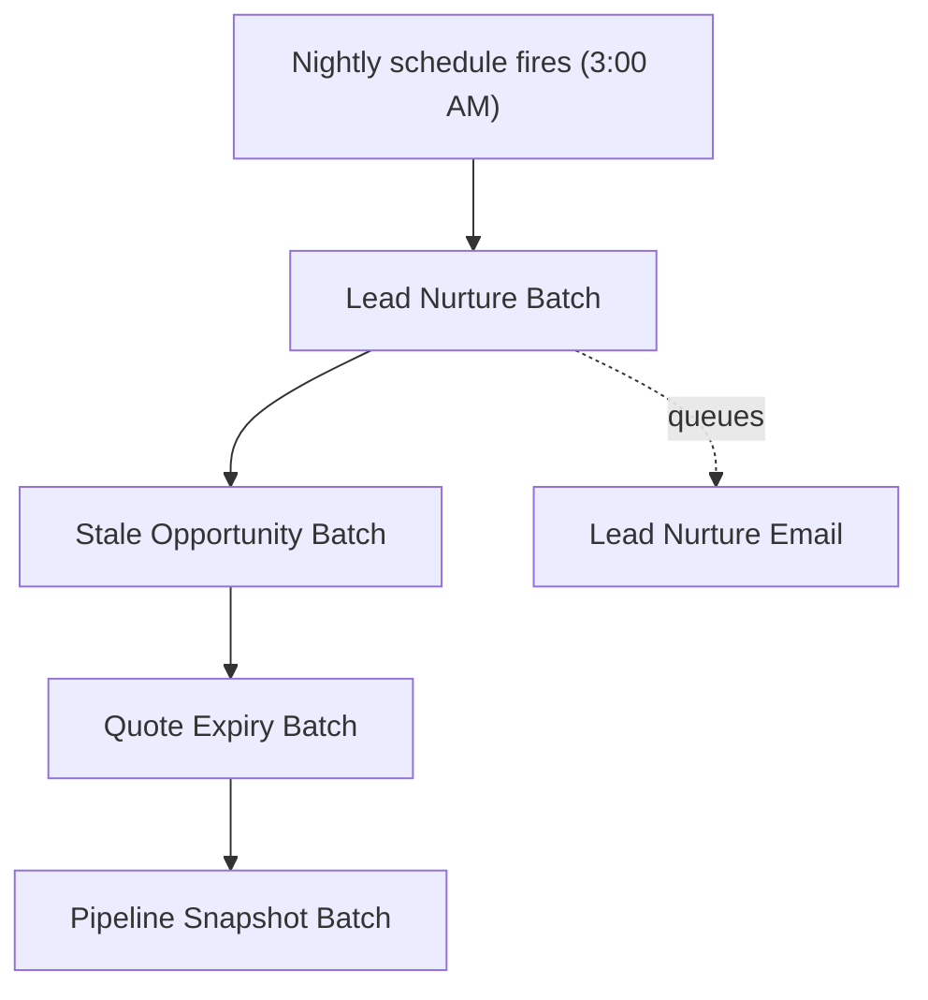

## Overview

Every night, one scheduled job kicks off a chain of four batch processes that keep the sales
pipeline clean without anyone lifting a finger. It follows up on leads nobody has touched in two
weeks, nudges (or auto-closes) opportunities whose close date has slipped into the past, expires
quotes that were presented but never signed, and logs a same-day snapshot of open pipeline by
stage. Sales reps see the results as new Tasks on their leads and deals, an updated Quote status,
or a deal that quietly moved to Closed Lost — sales and RevOps leadership get the pipeline
snapshot as a lightweight, no-dashboard audit trail of how the funnel moved day over day.

```callout
type: warning
This job does not run out of the box. An admin must schedule `NightlyPipelineJobsSchedulable`
once (Setup > Apex Classes > Schedule Apex, or an anonymous Apex `System.schedule(...)` call)
before any of these nightly behaviors take effect.
```



## Prerequisites

- System Administrator access to schedule and monitor Apex jobs
- `NightlyPipelineJobsSchedulable` scheduled via Setup or anonymous Apex — it does not fire on its own
- Email deliverability enabled so the lead nurture email in `LeadNurtureQueueable` can send
- Standard Task and Opportunity/Quote/Lead access for the users who will receive follow-up Tasks

## Steps to Navigate

1. Click the gear icon in the top-right, then click **Setup**.
2. In the Quick Find box, type **Apex Classes** and select it.
3. Confirm `NightlyPipelineJobsSchedulable` is deployed.
4. In the Quick Find box, type **Scheduled Jobs** and select it, or open **Developer Console >
   Debug > Open Execute Anonymous Window** and run:
   `System.schedule('Nightly sales jobs', '0 0 3 * * ?', new NightlyPipelineJobsSchedulable());`
5. Verify the job appears under **Scheduled Jobs** with the next run time.

```screenshot
id: nightly-pipeline-maintenance-jobs-scheduled-jobs
alt: Setup Scheduled Jobs list showing the Nightly sales jobs entry with its next run time
step: Open Setup and navigate to Scheduled Jobs
url_pattern: /lightning/setup/ScheduledJobs/home
```

6. The next morning (or after the scheduled time passes), open a Lead, Opportunity, or Quote
   that matched the criteria below to see the Task or status change the job created.

```screenshot
id: nightly-pipeline-maintenance-jobs-lead-task
alt: Lead record page showing a "Nurture follow-up" Task created by the nightly batch
step: Open a Lead that was untouched for 14+ days and view its Activity Timeline
url_pattern: /lightning/r/Lead/{recordId}/view
```

## Use Cases

### Lead nurture follow-up

1. A Lead is not converted and has not been modified in 14 or more days.
2. `LeadNurtureBatch` picks it up in its nightly scope and inserts a "Nurture follow-up" Task on
   the Lead, assigned to the Lead's owner with an activity date two days out.
3. The batch queues `LeadNurtureQueueable` with the matched Lead IDs, which sends a "Still
   exploring? We saved your place" email to every one of those leads that has an email address.
4. Leads without an email address still get the Task, but no email is sent for them.

### Stale opportunity — revive nudge

1. An open Opportunity has a Close Date more than 30 days in the past but 90 days or less.
2. `StaleOpportunityBatch` inserts a "Stale deal — revive or close" Task on the Opportunity,
   assigned to its owner with an activity date three days out. The Opportunity itself is not changed.

### Stale opportunity — automatic close

1. An open Opportunity has a Close Date more than 90 days in the past.
2. `StaleOpportunityBatch` sets its Stage to **Closed Lost** and updates the record directly
   (no revive Task is created for these — they're closed outright).
3. The update runs with the Opportunity trigger bypassed via `TriggerControl`, so this automated
   close does not re-fire standard Opportunity automation.

### Quote expiry and requote

1. A Quote is in **Presented** status with an Expiration Date before today.
2. `QuoteExpiryBatch` flips the Quote's Status to **Denied** (this org's way of representing
   "expired") and inserts a "Quote expired — requote" Task for the owner, due in two days.
3. The Quote status update runs with the Quote trigger bypassed via `TriggerControl` so the
   automated expiry does not trigger standard Quote automation a manual status change would.

### Daily pipeline snapshot

1. Every open (not closed) Opportunity is summed by Stage.
2. `PipelineSnapshotBatch` posts a completed Task titled "Pipeline snapshot \<date\>" whose
   description lists the total Amount for each open stage — a running, queryable log of how
   pipeline composition changes day over day with no dashboard required.

## Validations & Business Rules

- **Lead nurture threshold:** unconverted Leads with `LastModifiedDate` older than 14 days are in
  scope; each run processes them in batches of 200 records.
- **Stale opportunity thresholds:** open Opportunities with `CloseDate` more than 30 days in the
  past get a revive Task; those more than 90 days in the past are auto-set to Closed Lost instead.
  Batch size is 100.
- **Quote expiry rule:** only Quotes with `Status = 'Presented'` and `ExpirationDate` before today
  are expired to `Status = 'Denied'`. Batch size is 100.
- **Automation bypass:** both the Quote status change and the Opportunity auto-close run through
  `TriggerControl.bypass(...)` / `clearBypass(...)`, so standard triggers on those objects do not
  re-run for these nightly, system-driven updates.
- **Email suppression:** `LeadNurtureQueueable` only emails Leads that have a non-null Email
  field; Leads without one still receive the follow-up Task.
- **Execution order:** the scheduler always runs Lead Nurture, then Stale Opportunity, then Quote
  Expiry, then Pipeline Snapshot, in that fixed order, each as its own batch job (batch sizes
  200 / 100 / 100 / 500 respectively).
- **No automatic trigger:** none of these classes run unless `NightlyPipelineJobsSchedulable` has
  been scheduled by an admin — there is no Flow, trigger, or other entry point that invokes it.

## Related Features

- Lead conversion and lead ownership rules that determine who receives nurture Tasks
- Opportunity stage management, since the stale-deal sweep changes Stage directly
- Quote lifecycle and quote status values, since expiry changes Status outside the normal quoting flow
