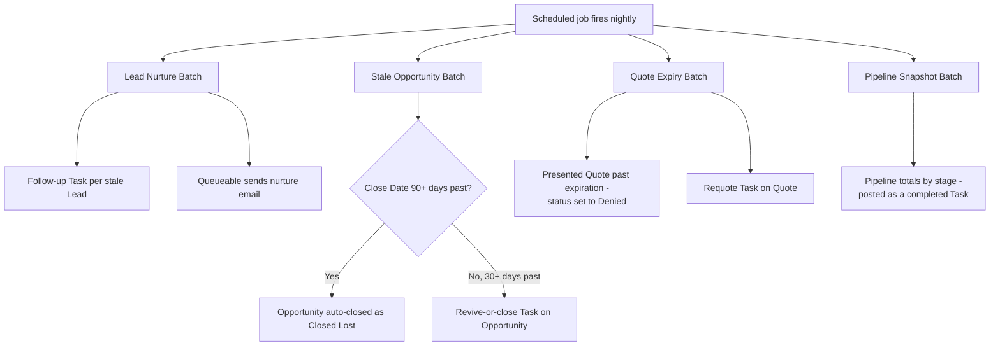

## Overview

Nightly Pipeline Maintenance Jobs is a single scheduled Apex job that kicks off four independent
cleanup batches every time it runs. It exists so sales operations doesn't have to manually chase
cold leads, track pipeline movement, close out expired quotes, or clean up dead deals — the org
does it automatically overnight. Sales reps and managers see the results the next morning as new
Tasks on their records, updated Quote and Opportunity statuses, and a daily pipeline snapshot Task.

```callout
type: note
This job is defined in code but is not wired to any automatic trigger — it must be scheduled by an
admin (once) before any of the nightly behavior described on this page will actually run.
```



## Prerequisites

- System Administrator access (or a profile with **Author Apex** and **Schedule Jobs** permission)
  to schedule or manage the job
- The `NightlyPipelineJobsSchedulable` class must be scheduled in Setup — nothing runs until an
  admin schedules it (see Steps to Navigate)
- Email deliverability must be enabled for the org so the lead nurture emails sent by
  `LeadNurtureQueueable` are not silently dropped

## Steps to Navigate

This feature is a backend scheduled job — there is no end-user screen to launch it from. An admin
schedules it once, and from then on it runs automatically every night with no manual action needed.

1. Click the gear icon in the top-right, then click **Setup**.
2. In the Quick Find box, type **Apex Classes** and select it.
3. Click **Schedule Apex**.
4. Enter a **Job Name**, for example `Nightly Pipeline Maintenance`.
5. Under **Apex Class**, search for and select **NightlyPipelineJobsSchedulable**.
6. Choose a **Frequency** of **Weekly** or set a specific recurring time (for example, 3:00 AM daily).
7. Click **Save**.

```screenshot
id: nightly-pipeline-maintenance-jobs-schedule-apex
alt: Schedule Apex setup page with NightlyPipelineJobsSchedulable selected as the class to run
step: Open Setup > Apex Classes > Schedule Apex and select NightlyPipelineJobsSchedulable
url_pattern: /lightning/setup/ScheduledJobs/home
```

Once scheduled, the job appears under **Setup > Scheduled Jobs** and runs unattended at the
configured time every night.

## Use Cases

### Nightly run kicks off all four maintenance batches

1. At the scheduled time, `NightlyPipelineJobsSchedulable` fires and starts four separate batch
   jobs one after another: lead nurture, stale opportunity cleanup, quote expiry, and pipeline
   snapshot.
2. Each batch runs independently against its own record set — one batch failing does not stop the
   others from running.
3. The next morning, users see the combined results as new Tasks, updated Quote/Opportunity
   records, and a pipeline snapshot Task, described in the scenarios below.

### Stale lead gets a nurture Task and follow-up email

1. `LeadNurtureBatch` finds every Lead that is not converted and has not been modified in 14 or
   more days.
2. For each stale Lead, a **Not Started** Task named "Nurture follow-up" is created, assigned to
   the Lead's owner, due in 2 days.
3. After the Task records are inserted, the batch queues `LeadNurtureQueueable` with the affected
   Lead Ids so the emails are sent in a separate transaction (keeping the batch itself fast and
   within limits).
4. The queueable job re-queries those Leads for a non-blank **Email**, then sends each one a
   "Still exploring?" nurture email. Leads without an email address are skipped silently — no
   error, no Task, just no email sent.

### Long-idle opportunity gets a revive-or-close nudge

1. `StaleOpportunityBatch` finds every open (not closed) Opportunity whose **Close Date** is more
   than 30 days in the past.
2. For an Opportunity between 30 and 90 days past its Close Date, the batch inserts a **Not
   Started** Task titled "Stale deal — revive or close", assigned to the owner, due in 3 days. The
   Opportunity itself is left untouched.

### Opportunity is auto-closed after 90 days of neglect

1. For an Opportunity whose Close Date is more than 90 days in the past, the batch instead sets
   **Stage** to **Closed Lost** directly — no nudge Task is created for these records.
2. This update runs with the standard Opportunity trigger bypassed (via `TriggerControl`), so
   normal save-time automation on Opportunity does not re-fire for this system cleanup update.
3. The rep will see the deal has moved to Closed Lost on their next login, with no advance warning
   Task — the 30/90-day split is the only signal a user gets before this happens.

### Presented Quote expires and prompts a requote

1. `QuoteExpiryBatch` finds every Quote with **Status = Presented** whose **Expiration Date** has
   already passed.
2. For each one, the batch sets **Status** to **Denied** (this org's way of marking a quote
   expired) and creates a **Not Started** "Quote expired — requote" Task on the Quote, assigned to
   the owner, due in 2 days.
3. The Quote status update runs with the Quote trigger bypassed via `TriggerControl`, so any
   save-time Quote automation does not fire for this batch-driven status change.
4. A Quote still in **Draft**, **Accepted**, or any status other than Presented is left alone by
   this batch regardless of its Expiration Date.

### Nightly pipeline snapshot is posted

1. `PipelineSnapshotBatch` totals the **Amount** of every open Opportunity, grouped by
   **Stage**, across the whole org.
2. Once all records are processed, it inserts a single **Completed** Task named "Pipeline snapshot
   `<today's date>`" whose Description lists the total dollar amount per stage.
3. This gives managers a lightweight, queryable day-over-day audit trail of how the pipeline moved,
   without needing a separate reporting object.

## Validations & Business Rules

- `NightlyPipelineJobsSchedulable.execute` is the single entry point — it calls
  `Database.executeBatch` for `LeadNurtureBatch` (batch size 200), `StaleOpportunityBatch` (100),
  `QuoteExpiryBatch` (100), and `PipelineSnapshotBatch` (500), in that order.
- Lead nurture selection: `IsConverted = false AND LastModifiedDate < Today - 14 days`.
- Stale opportunity selection: `IsClosed = false AND CloseDate < Today - 30 days`; records past
  `Today - 90 days` are auto-closed instead of nudged.
- Quote expiry selection: `Status = 'Presented' AND ExpirationDate < Today`; matching Quotes are
  set to `Status = 'Denied'`.
- Pipeline snapshot selection: all Opportunities where `IsClosed = false`, aggregated by
  `StageName`.
- `QuoteExpiryBatch` and `StaleOpportunityBatch` both bypass their object's trigger automation
  (via `TriggerControl.bypass` / `clearBypass`) around their `update` DML, so other declarative or
  Apex automation on Quote/Opportunity does not run for these system-driven changes.
- `LeadNurtureQueueable` only emails Leads that have a non-null **Email** address; Leads without
  one still get the follow-up Task but no email.
- The scheduled job itself is not called anywhere else in the codebase — nothing runs unless an
  admin schedules `NightlyPipelineJobsSchedulable` via Setup or `System.schedule`.

## Related Features

- Lead Followup Reminder — related lead follow-up automation
- Quote Expiry Alert — a separate, flow-based mechanism that watches for Quotes entering
  Presented status; this batch instead acts on Quotes that have already passed their expiration
