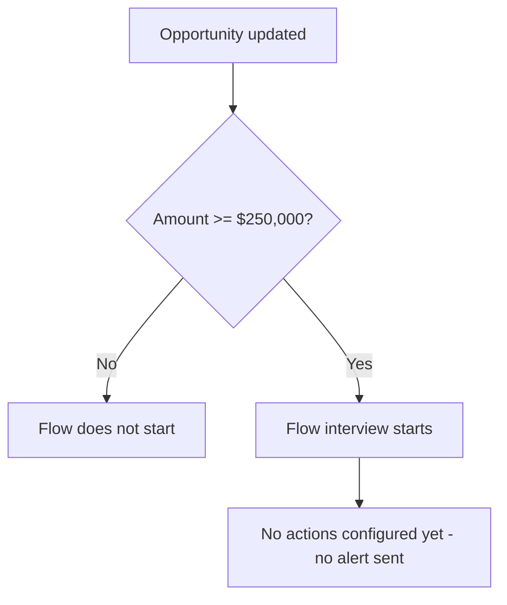

## Overview

Big Deal Alert is a background automation that watches Opportunity records for large deals. Whenever
an Opportunity is updated and its Amount is $250,000 or more, the flow's entry criteria fire. The intent
is to give sales and operations visibility into high-value deals as soon as they cross that threshold,
without anyone having to manually check Opportunity amounts.

```callout
type: warning
This flow currently defines only its entry criteria — the trigger fires, but no notification, field
update, or other action has been configured inside it yet. Updating an Opportunity's Amount to
$250,000 or more will not currently produce a visible alert, email, or Chatter post. Treat this page
as documentation of the intended trigger condition until the flow's actions are built out.
```

## Prerequisites

- Standard edit access to the Opportunity object (any user who can update an Opportunity's Amount can trigger the entry criteria).
- The Opportunity's `Amount` field must be set — the flow evaluates `Amount >= 250,000` and does nothing if Amount is blank.

## Steps to Navigate

There is no dedicated screen for this feature — it runs automatically in the background whenever an
Opportunity is saved with a qualifying Amount.

1. Open any Opportunity record.
2. Edit the **Amount** field.

```screenshot
id: big-deal-alert-amount-field
alt: Opportunity edit form with the Amount field highlighted
step: Open an Opportunity and edit the Amount field
url_pattern: /lightning/r/Opportunity/{recordId}/view
actions:
  - open_record: Opportunity
```

3. Click **Save**.

## Use Cases

### Updating Amount to $250,000 or more

1. Open an existing Opportunity where Amount is below $250,000.
2. Edit **Amount** and set it to $250,000 or higher.
3. Click **Save**.
4. The record saves normally. The flow's entry criteria are met and the flow starts an interview, but
   since no actions are currently configured inside it, there is no visible outcome for the user beyond
   the normal save.

### Updating Amount to a value below $250,000

1. Open an existing Opportunity.
2. Edit **Amount** and set it to a value under $250,000.
3. Click **Save**.
4. The flow's entry criteria are not met (`Amount < 250,000`), so the flow does not start at all.

### Updating an Opportunity without changing Amount

1. Edit any other field on the Opportunity (e.g. Stage or Close Date) without touching Amount.
2. Click **Save**.
3. Because this flow only runs on record update and evaluates the saved Amount value, it still
   re-evaluates the entry criteria against the current Amount on every update — if Amount already sits
   at $250,000 or more, the flow starts again on this save too.

## Validations & Business Rules

- Automation: `Big_Deal_Alert` is an auto-launched, record-triggered flow on Opportunity.
- Trigger: fires **after save**, only on **record update** (does not run on Opportunity creation).
- Entry condition: `Amount >= 250000`.
- As currently built, the flow contains no downstream actions (no email alert, task creation, Chatter
  post, or field update) — it only evaluates the entry criteria. No user-facing alert is produced today.



## Related Features

- None documented yet.
