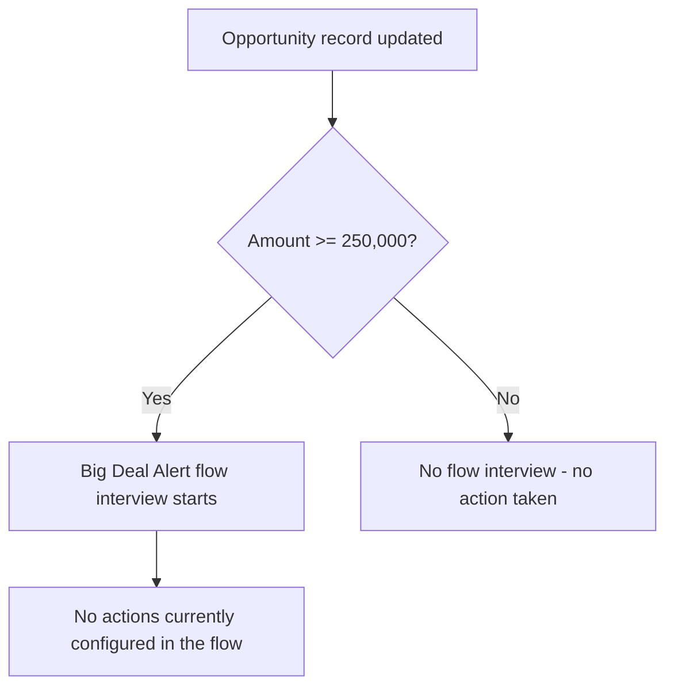

## Overview

Big Deal Alert is a background automation that watches Opportunity records for large deals. Whenever an
existing Opportunity is saved with an **Amount** of $250,000 or more, the flow's entry criteria are met and
the flow interview starts. It runs silently in the background — there is no button or page a user opens to
use it; it simply reacts to Opportunity edits made anywhere in the org (Lightning UI, related list inline
edit, API, or data load).

```callout
type: warning
This flow currently defines only its trigger and entry criteria — no email, task, Chatter post, or
notification action is configured inside it yet. Saving a qualifying Opportunity update fires the flow
interview, but no visible alert is produced for users at this time.
```

## Prerequisites

- User must have standard edit access to the Opportunity object (this is an automated, unlisted flow — it is
  not assigned through a permission set of its own).
- No custom fields, record types, or Flow/Apex dependencies are required for the entry criteria to evaluate.

## Steps to Navigate

This flow has no user interface of its own — it runs automatically after an Opportunity update. To reach the
condition that triggers it:

1. Open any existing **Opportunity** record.
2. Click **Edit**.
3. Set or change the **Amount** field to **250,000** or greater.
4. Click **Save**.

```screenshot
id: big-deal-alert-amount-field
alt: Opportunity edit form with the Amount field set to a value of 250,000 or more
step: Open an Opportunity, click Edit, and set Amount to 250000 or higher
url_pattern: /lightning/r/Opportunity/{recordId}/view
actions:
  - open_record: Opportunity
  - click_button: Edit
  - fill_field: { field: Amount, value: "250000" }
  - click_button: Save
```

An admin can view or edit the flow's definition itself in Setup:

1. Click the gear icon in the top-right, then click **Setup**.
2. In the Quick Find box, type **Flows** and select **Flows**.
3. Click **Big Deal Alert** to open the flow in Flow Builder.

## Use Cases

### Update pushes an Opportunity to $250,000 or more

1. A user edits an Opportunity that currently has an Amount below $250,000.
2. The user raises **Amount** to $250,000 or higher and saves.
3. The record-triggered flow fires after the save (`RecordAfterSave`) because the entry criteria
   (`Amount >= 250000`) are now met.
4. No further action is currently visible to the user — the flow interview completes without sending a
   notification, since no downstream actions are defined.

### Opportunity is created directly at $250,000 or more

1. A user creates a brand-new Opportunity and enters an Amount of $250,000 or higher on save.
2. The flow does **not** fire, because its trigger is configured for **Update** only (`recordTriggerType:
   Update`), not for record creation.
3. The entry criteria are only evaluated on a later edit/save of that same record.

### Amount is edited but stays below the threshold

1. A user edits an Opportunity and changes the Amount, but the new value remains under $250,000.
2. The entry criteria (`Amount >= 250000`) evaluate to false, so the flow interview does not start.

## Validations & Business Rules



- Trigger: `AutoLaunchedFlow`, fires **after save** (`RecordAfterSave`) on the **Opportunity** object.
- Trigger type: **Update** only — the flow does not evaluate on Opportunity creation, only on subsequent
  edits to an existing record.
- Entry criteria (filter formula): `{!$Record.Amount} >= 250000`.
- The flow contains no elements beyond its start/entry criteria — no email alert, record update, task, or
  Chatter post is currently defined, so meeting the criteria has no user-visible effect yet.

## Related Features

None documented yet.
