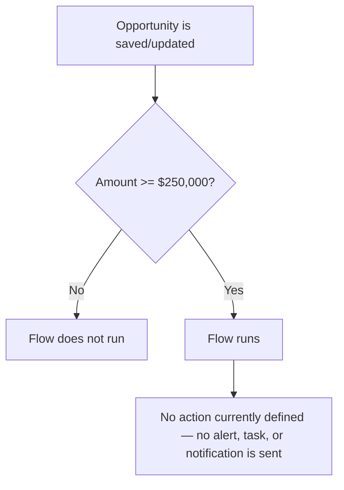

## Overview

Big Deal Alert is a background automation intended to flag high-value Opportunities as they move through the pipeline, so sales leadership can be aware of deals worth $250,000 or more. It runs automatically in the background whenever an existing Opportunity record is saved — no user action is required to trigger it.

```callout
type: note
As currently built, this Flow only defines *when* it should run (an Opportunity update where Amount is $250,000 or more). No notification, task, Chatter post, or other action has been added to it yet, so activating this automation does not currently produce any visible alert, email, or record change for users.
```

## Prerequisites

- An Opportunity record must exist and be edited (the automation does not run on new-record creation, only on updates)
- The Opportunity's Amount field must be populated
- The Flow must be left **Active** in Setup for the trigger to evaluate at all

## Steps to Navigate

There is nothing for an end user to click to "use" this feature — it runs automatically in the background whenever an Opportunity is saved. To review or confirm its configuration, an admin can open it in Setup:

1. Click the gear icon in the top-right, then click **Setup**.
2. In the Quick Find box, type **Flows** and select **Flows**.
3. Locate **Big Deal Alert** in the list of flows and click it to open the flow.

```screenshot
id: big-deal-alert-flow-list
alt: Setup Flows list showing the Big Deal Alert flow
step: Open Setup, search for Flows, and view the flow list
url_pattern: /lightning/setup/Flows/home
actions:
  - goto: /lightning/setup/Flows/home
```

4. Review the **Start** element to confirm the object (Opportunity), trigger type (record update), and entry condition (Amount is greater than or equal to $250,000).

## Use Cases

### Opportunity updated at or above the threshold

1. A user opens an existing Opportunity and edits any field (for example, updating Stage or Close Date), then clicks **Save**.
2. If the Opportunity's Amount is $250,000 or more at the time of save, the entry condition is met and the Flow fires.
3. Because no downstream elements are defined in the Flow, no notification, field update, or record is created as a result — the save completes normally with no visible difference to the user.

### Opportunity updated below the threshold

1. A user edits and saves an Opportunity whose Amount is less than $250,000.
2. The entry condition is not met, so the Flow does not fire at all.

### Bulk update crossing the threshold

1. An admin or integration performs a mass update that changes many Opportunity records at once (for example, a data load or mass Amount correction).
2. Each individual Opportunity record that is saved with an Amount of $250,000 or more independently meets the entry condition and triggers its own Flow run.
3. As with a single-record update, no visible alert or notification currently results from any of these runs.



## Validations & Business Rules

- Entry condition: the Flow only runs on **Update** of an existing Opportunity (`RecordAfterSave`) — it does not run when an Opportunity is first created.
- Filter formula: `{!$Record.Amount} >= 250000` — the Opportunity's Amount must be $250,000 or greater for the Flow to fire.
- The Flow is currently **Active**, but contains no elements after its Start node — no email alert, task, Chatter post, or field update is configured, so there is no user-visible outcome when it runs today. Anyone relying on this automation to actually notify a team should confirm with the Salesforce admin whether the alert action still needs to be built.

## Related Features

No related business features are documented yet.
