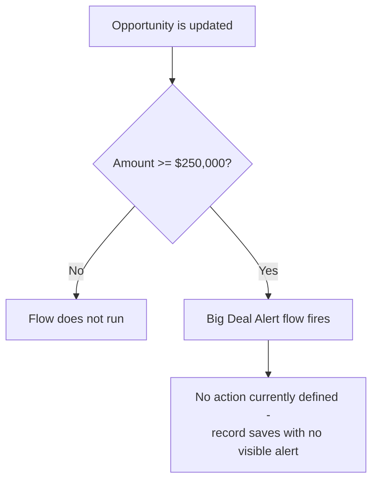

## Overview

Big Deal Alert is a record-triggered flow on the Opportunity object. It is meant to flag "big deals" —
Opportunities whose value crosses a significant threshold — the moment that threshold is reached, so the
business can react to large deals as they occur rather than discovering them later in a report.

```callout
type: warning
As currently configured, this flow only defines its **entry criteria** (when it fires). It does not yet
contain any downstream action — no email alert, Chatter post, Task, or field update is created when the
criteria are met. Until an action is added to the flow, saving a qualifying Opportunity will not produce
any visible notification to users.
```

## Prerequisites

- Edit access to the Opportunity record (the flow runs automatically after an Opportunity is saved)
- The **Big Deal Alert** flow must be Active in Setup > Flows

## Steps to Navigate

This is a background automation — it is not opened or run manually from the UI. It fires automatically
whenever an Opportunity is updated and its criteria are met.

1. Open any existing Opportunity record.
2. Edit the **Amount** field and set it to a value of $250,000 or more.
3. Click **Save**.

```screenshot
id: big-deal-alert-amount-field
alt: Opportunity edit form with the Amount field set to a value at or above the big-deal threshold
step: Edit an Opportunity's Amount field to $250,000 or more and save
url_pattern: /lightning/r/Opportunity/{recordId}/view
actions:
  - open_record: Opportunity
  - fill_field: { field: Amount, value: "250000" }
  - click_button: Save
```

## Use Cases

### Opportunity amount crosses the big-deal threshold

1. A user edits an Opportunity and changes the **Amount** field to $250,000 or more.
2. The user clicks **Save**.
3. Because the Amount on the saved record is $250,000 or more, the Big Deal Alert flow's entry criteria
   are met and the flow runs in the background.
4. No further action currently occurs — the flow has no configured actions, so the record simply saves
   normally with no visible alert, message, or additional field change.

### Opportunity amount stays below the threshold

1. A user edits an Opportunity and sets or leaves the **Amount** below $250,000.
2. The user clicks **Save**.
3. The flow's entry criteria are not met, so the flow does not run at all.



## Validations & Business Rules

- Entry criteria: the flow runs after save, only on **Update** of an Opportunity, only when
  `Amount >= 250000`.
- The flow does not run on Opportunity **creation** — only on subsequent updates to an existing record.
- The flow currently defines no actions (no email, Task, Chatter post, or field update), so meeting the
  criteria has no observable effect for end users today. Any future notification behavior (e.g. an email
  alert to the sales manager or a Chatter post on the record) would need to be added to the flow.

## Related Features

- None documented yet.
