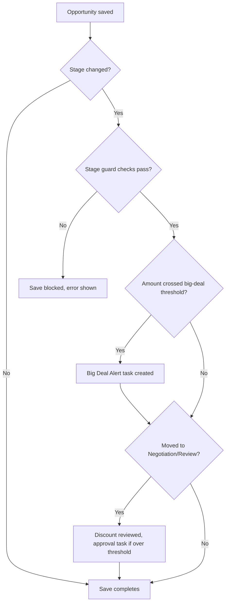

## Overview

Every time a sales rep updates an opportunity or adds/edits a product line, Salesforce automatically checks that the deal is being progressed correctly, flags big deals for leadership, routes steep discounts for approval, and refreshes pricing so volume-based discounts stay accurate as quantities change. Reps don't run any of this manually — it fires silently in the background on save, and only surfaces to the user as an on-screen error (if a rule is broken) or a follow-up Task (if a review is needed).



## Prerequisites

- Standard access to edit Opportunities and Opportunity Products (no special permission set required — this automation runs for every user).
- A Pricebook and price rules must already be configured for repricing to produce meaningful unit prices.

```callout
type: note
This automation cannot be skipped from the UI. If a save is blocked, the error message explains exactly what to fix (add a product, set an Amount, or attach an accepted quote).
```

## Steps to Navigate

This is background automation with no dedicated screen of its own — it runs wherever opportunities and their products are edited.

1. Open an **Opportunity** record.
2. Edit the **Stage** field (via the path bar or Edit) and click **Save** — stage guard rules run automatically.
3. Go to the **Products** related list to add or edit an **Opportunity Line Item**, then **Save** — repricing runs automatically.

```screenshot
id: opportunity-line-item-automation-stage-path
alt: Opportunity record page showing the sales path with the Stage field being changed
step: Open an opportunity and change its Stage on the path bar
url_pattern: /lightning/r/Opportunity/{recordId}/view
```

```screenshot
id: opportunity-line-item-automation-products-related-list
alt: Opportunity Products related list showing line items to be added or edited
step: Open the Products related list on an opportunity
url_pattern: /lightning/r/Opportunity/{recordId}/related/OpportunityLineItems/view
```

## Use Cases

### Standard stage progression

1. Rep moves an opportunity one stage forward at a time (e.g. Qualification → Needs Analysis).
2. On save, `OpportunityStageGuardService` confirms the move is only one step forward and lets it through.
3. If the new stage is **Proposal/Price Quote** or later, the system checks the opportunity has at least one product; if it does, the save proceeds with no visible change to the user.

### Blocked: stage skipped or missing requirement

1. Rep tries to jump an opportunity from **Qualification** straight to **Negotiation/Review**.
2. The save is blocked and the rep sees: *"Stages cannot be skipped: move one stage at a time (from Qualification)."*
3. Separately, if a rep tries to move an opportunity to **Proposal/Price Quote** or beyond with zero products, the save is blocked with: *"Add at least one product before moving to Proposal/Price Quote."*
4. Rep corrects the issue (adds a product, or moves one stage at a time) and re-saves.

### Closing a deal

1. Rep sets Stage to **Closed Won**.
2. The system requires a positive **Amount** — if it's blank or zero, the save is blocked with: *"Closed Won requires a positive Amount."*
3. The system also requires an **Accepted** quote already exists on the opportunity — if none is found, the save is blocked with: *"Closed Won requires an Accepted quote on this opportunity."*
4. Once both checks pass, the opportunity closes.

### Big deal alert

1. Rep raises an opportunity's **Amount** to $250,000 or more for the first time (it was below that threshold before this edit).
2. If the opportunity is still open (not closed), a high-priority **Task** — "Big deal alert: [Opportunity Name]" — is automatically created and assigned to the opportunity owner, due the next day.
3. Lowering the amount back below the threshold and raising it again re-triggers the alert, since the check only looks at whether this specific save crossed the line.

### Discount approval on entering negotiation

1. Rep moves an opportunity's Stage to **Negotiation/Review**.
2. The system calculates the blended discount across all of that opportunity's line items (comparing list price to actual sold price).
3. If the blended discount is **over 30%**, or **over 20% on a deal larger than $100,000**, a high-priority approval **Task** — "Discount approval needed (X%): [Opportunity Name]" — is created for the opportunity owner, and the request is logged to the sales ops audit trail.
4. If the discount is within policy, no task is created and the stage change completes silently.
5. This check only fires when the stage newly changes *to* Negotiation/Review — re-saving an opportunity that is already in that stage does not re-trigger it.

### Bulk repricing when line items change

1. Rep adds a new product line to an opportunity, or edits Quantity on an existing line (e.g. moving into a higher volume band).
2. On save, `OpportunityLineItemTriggerHandler` collects every affected opportunity and calls `OpportunityPricingService`, which reprices **all** line items on those opportunities together — not just the one just edited — so quantity-based discount tiers stay consistent across the whole deal.
3. Lines whose calculated unit price didn't change are left alone; only lines with a new unit price are updated.
4. This repricing update happens with the line item trigger bypassed, so it does not recursively re-fire this same automation.
5. A line with no List Price (or a List Price of zero) is skipped and left at its current price.

## Validations & Business Rules

- Validation (before-update, stage change only): stages cannot be skipped more than one step forward, except when moving directly to **Closed Won**.
- Validation: moving to **Proposal/Price Quote** or any later stage requires at least one Opportunity Line Item.
- Validation: moving to **Closed Won** requires a positive **Amount**.
- Validation: moving to **Closed Won** requires an opportunity-linked quote with status **Accepted** (see Quote Approval feature).
- Automation (after-update): an opportunity crossing the **$250,000** Amount threshold, while still open, creates a "Big deal alert" Task for the owner.
- Automation (after-update): moving to **Negotiation/Review** calculates the blended discount (list vs. sold price across all lines) and creates an approval Task when discount **> 30%**, or **> 20% on deals over $100,000**; the request is also written to the sales ops audit log.
- Automation (after-insert/after-update on Opportunity Line Item): any line insert or update reprices every line item on the related opportunity(ies) via the pricing engine, factoring in account tier and product family margin floors.
- All of the above automation can be bypassed object-by-object via `TriggerControl` (used internally by repricing to avoid recursive triggers) — this is a developer-only mechanism, not user-facing.

## Related Features

- Quote Approval — supplies the "Accepted quote" check required to close an opportunity as Closed Won.
- Pricing Engine / Price Rules — determines list price, margin floors, and account-tier pricing used during repricing.
- Sales Ops Audit Log — records every discount approval request generated by this automation.
