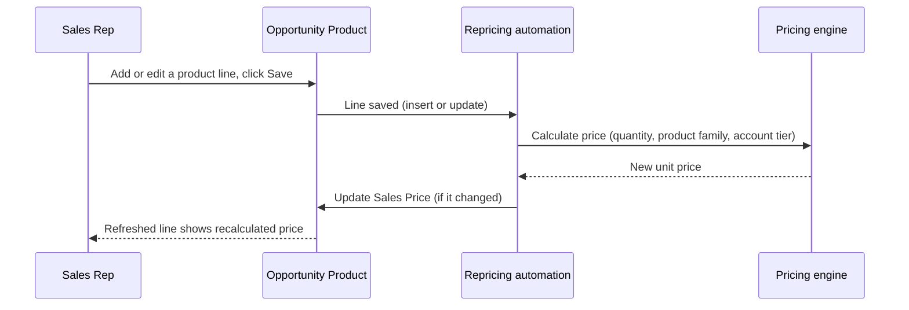

## Overview

Whenever a sales rep adds a product to an Opportunity, or edits an existing Opportunity Product line, Salesforce automatically recalculates that line's Unit Price in the background. This keeps pricing consistent with company pricing policy — volume discounts, customer-tier discounts, and margin protection — without the rep having to calculate a discount by hand. The reprice happens silently on save: the rep sees the line's Sales Price update to the newly calculated value once the record is saved and the page refreshes.

This same repricing logic also runs automatically as part of the quote-and-order journey (for example, when a deal moves from Opportunity to Quote), so the price a rep sees on the Opportunity is the same price that carries through to the quote.



## Prerequisites

- An Opportunity must have at least one Opportunity Product (line item) with a List Price populated — lines with no list price (or a list price of zero) are skipped and left as entered
- The related Account should have a Rating value (Hot/Warm/Cold) if tier-based discounting should apply to that deal
- The Pricebook Entry's Product Family should be set on each line, since the volume-discount bands and margin floor both vary by product family

## Steps to Navigate

There are no settings for a user to configure — repricing runs automatically. A rep interacts with it simply by working with Opportunity Products as usual:

1. Open an **Opportunity** record.
2. Scroll to the **Products** related list (or open the **Opportunity Products** tab if using the standard opportunity product editor).
3. Click **Add Product**, choose a product from the pricebook, and enter a **Quantity** and **Sales Price**.
4. Click **Save**.

```screenshot
id: opportunity-line-item-repricing-products-related-list
alt: Opportunity Products related list showing line items with Sales Price values
step: Open an Opportunity and view the Products related list
url_pattern: /lightning/r/Opportunity/{recordId}/view
actions:
  - open_record: Opportunity
```

5. After the save completes, reopen or refresh the Products related list — the **Sales Price** on the line reflects the recalculated, discounted price rather than the price originally entered.

## Use Cases

### Adding a new product line to a deal

1. A rep adds a new Opportunity Product with a quantity that qualifies for a volume discount (for example, 150 units of a Hardware product).
2. On save, the automation recalculates that line's price using the applicable volume discount, the account's tier discount (if any), and any product-family adjustment.
3. The rep sees the line's Sales Price update to the discounted amount — no manual discount entry was needed.

### Editing quantity on an existing line

1. A rep increases the quantity on an existing line so it now crosses into a higher volume-discount band (for example, moving from 80 to 120 units of Hardware, crossing the 100-unit band).
2. Saving the edit triggers a reprice of every line on that Opportunity, not just the one edited — this keeps all lines on the deal consistent whenever any line changes.
3. The edited line's price drops to reflect the deeper volume discount; other lines on the same Opportunity are also recalculated in case their pricing depends on shared context (such as account tier).

### Deal with a Hot or Warm account tier

1. A rep adds a product line to an Opportunity whose Account has a Rating of **Hot** or **Warm**.
2. The reprice looks up the account's tier and stacks an additional tier discount (8% for Hot, 4% for Warm) on top of any volume discount.
3. The combined discount is capped at 40% overall, so very large stacked discounts do not exceed that ceiling.

### Discount would cut below the margin floor

1. A line's stacked discounts (volume + tier + family adjustment) would push the price below the minimum allowed margin for that product family (60% of list price by default; 75% for Services; 55% for Hardware).
2. The engine overrides the stacked discount and floors the price at the family's minimum margin instead — the rep sees a smaller discount than the raw rule stack would suggest, and the line is marked internally as floored by the margin rule.

### No pricing change needed

1. A rep edits a line item field that doesn't change the calculated price (for example, correcting a Description), or the recalculated price comes out the same as the current Sales Price.
2. No update is made to that line — the automation only writes back lines whose calculated price actually differs from the current value, so unrelated edits don't generate unnecessary field history.

### Bulk-loaded or mass-updated lines

1. An integration or a data load inserts or updates many Opportunity Product records across one or more Opportunities in a single operation.
2. All affected Opportunities are repriced together in one pass — the automation groups lines by Opportunity and looks up each related Account's tier once, rather than once per line, to stay efficient at scale.

### Repricing as part of the quote flow

1. Instead of (or in addition to) editing lines directly, a rep progresses the deal to quoting.
2. Before the quote is generated, the same pricing engine reprices every line on the Opportunity, so the quote is built from up-to-date, policy-correct prices.

## Validations & Business Rules

- **Trigger scope:** repricing runs on **after insert** and **after update** of Opportunity Product (Opportunity Line Item) records. It does not run on delete.
- **Skipped lines:** a line with no List Price, or a List Price of `0`, is left untouched and excluded from the reprice pass.
- **Pricing rules applied, in order:**
  1. Volume discount by quantity band, keyed by Product Family:
     - Hardware: 6% at 25+, 12% at 100+, 18% at 500+
     - Software / Subscription: 8% at 50+, 15% at 250+, 25% at 1,000+
     - All other families: 5% at 20+, 10% at 100+
  2. Account-tier discount, from the related Account's Rating: 8% for **Hot**, 4% for **Warm**, 0% otherwise
  3. Product-family strategic adjustment: **Subscription** lines get an extra 2% discount; **Services** lines get a 3% price *increase* (reduced discount) to protect services margin
  4. The combined discount from steps 1–3 is capped at **40%** maximum
  5. **Margin floor:** the final price can never drop below a floor percentage of list price — 75% for Services, 55% for Hardware, 60% for every other family — even if the stacked discount would otherwise go lower
- **Recursion protection:** the automation temporarily suspends the same Opportunity Product automation while writing its own price updates, so writing back a recalculated price does not re-trigger an infinite repricing loop.
- **Only changed lines are updated:** if the recalculated Unit Price matches the line's current price, no DML is issued for that line.
- **Shared engine:** the same pricing engine and rule stack is used everywhere a line is priced — Opportunity Products, quote lines, and order items — so a given quantity/family/tier combination produces the same price regardless of which object it's priced on.
- **Discounts above 30% (or above 20% on deals over $100,000) are flagged as requiring approval** by the pricing engine's approval check; this flag is evaluated the same way wherever the engine is used, though whether an approval process is actually attached is configured separately per object.

## Related Features

- Big Deal Alert — a separate automation that flags high-value Opportunities, independent of this repricing logic
- Quote generation from an Opportunity, which reuses this same pricing engine when building quote lines
