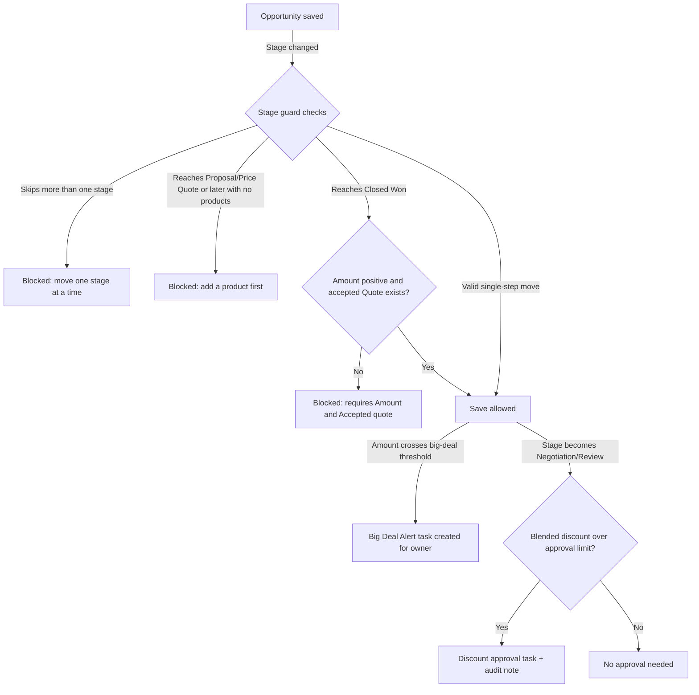

## Overview

When a salesperson updates an Opportunity or adds/edits its products, several checks and follow-up actions
happen automatically on save. Stage changes are checked for hygiene (no skipping stages, no reaching
Proposal without products, no Closed Won without an accepted quote and a valid Amount), big deals crossing
a dollar threshold get an alert task for visibility, deals moving into negotiation are checked for
discounts steep enough to need approval, and any time a line item is added or changed the whole opportunity
is repriced so volume-based pricing stays accurate. This keeps deal data trustworthy for forecasting without
requiring sales reps to remember every rule themselves.



## Prerequisites

```callout
type: note
These automations run on every Opportunity and Opportunity Product save — there is no setup step to turn
them on for a single record. Admins can suspend them org-wide via `TriggerControl` bypass for scripted
data loads.
```

- Standard access to edit Opportunities and add Opportunity Products (line items)
- A Pricebook with active Pricebook Entries for the products being quoted
- Account records used on opportunities should have a Rating set, since it drives pricing tier

## Steps to Navigate

1. Open an **Opportunity** record.
2. To change the deal stage, click the stage on the path at the top of the page, or edit the **Stage** field directly, then click **Save**.
3. To add products, scroll to the **Products** related list and click **Add Product**.
4. Select a product from the Pricebook, enter **Quantity**, and click **Save**.

```screenshot
id: opportunity-management-record-page
alt: Opportunity record page showing the stage path and Products related list
step: Open an Opportunity record
url_pattern: /lightning/r/Opportunity/{recordId}/view
```

```screenshot
id: opportunity-management-add-product
alt: Add Products screen for an Opportunity with quantity field highlighted
step: From an Opportunity, click Add Product in the Products related list
url_pattern: /lightning/r/Opportunity/{recordId}/view
```

## Use Cases

### Move a deal forward one stage at a time

1. On an Opportunity in **Needs Analysis**, change **Stage** to **Proposal/Price Quote** and save.
2. If the opportunity has at least one product, the save succeeds.
3. If it has no products yet, the save is blocked with **"Add at least one product before moving to Proposal/Price Quote."**

### Attempt to skip stages

1. On an Opportunity in **Qualification**, try to set **Stage** directly to **Negotiation/Review**.
2. The save is blocked with **"Stages cannot be skipped: move one stage at a time."**
3. The rep must move the opportunity through each intermediate stage in order. Jumping straight to **Closed Won** from any stage is exempt from this specific check but still must pass the Closed Won checks below.

### Close a deal as Won

1. Set **Stage** to **Closed Won** and save.
2. If **Amount** is blank or zero, the save is blocked with **"Closed Won requires a positive Amount."**
3. If there is no Quote on the opportunity with status **Accepted**, the save is blocked with **"Closed Won requires an Accepted quote on this opportunity."**
4. Once both an Amount and an Accepted quote are in place, the save succeeds.

### Big deal crosses the alert threshold

1. Edit an Opportunity's **Amount** so it moves from below $250,000 to at or above $250,000 (and the opportunity is not already closed).
2. On save, a **Task** titled "Big deal alert: [Opportunity Name]" is automatically created, assigned to the opportunity owner, due the next day.
3. Lowering the amount back below the threshold does not remove a previously created alert task.

### Discount approval on entering Negotiation/Review

1. Add products to an opportunity and discount the **Sales Price** below list price.
2. Change **Stage** to **Negotiation/Review** and save.
3. The blended discount across all line items is calculated. If it exceeds 30%, or exceeds 20% on a deal over $100,000, a **Task** titled "Discount approval needed ([X]%): [Opportunity Name]" is created for the owner, and an audit note is recorded.
4. If the blended discount is within policy, no approval task is created and the stage change proceeds silently.

### Add or update a product line (reprice)

1. On an Opportunity's Products related list, click **Add Product**, choose a product, and enter a **Quantity**, then save.
2. Every line item on that opportunity is repriced through the pricing engine (volume bands depend on the total quantity across all lines, not just the new one), so previously added lines may also update their **Sales Price**.
3. This reprice runs silently in the background; no confirmation screen appears, but updated Sales Price values are visible on the Products related list after the page refreshes.

## Validations & Business Rules

- Automation: `OpportunityTrigger` (before update) calls `OpportunityStageGuardService.enforce`, which blocks:
  - Skipping more than one stage in a single save (except moving directly to `Closed Won`).
  - Reaching `Proposal/Price Quote` or a later stage with zero opportunity line items.
  - Reaching `Closed Won` without a positive `Amount`, or without a related `Quote` whose `Status = 'Accepted'`.
- Automation: `OpportunityTrigger` (after update) calls `OpportunityForecastService.flagBigDeals`, which creates a High-priority Task when `Amount` crosses **$250,000** for an open (not closed) opportunity.
- Automation: `OpportunityTrigger` (after update) calls `OpportunityDiscountApprovalService.reviewDiscounts` whenever an opportunity's Stage changes to `Negotiation/Review`. It computes a blended discount (`1 - sold total / list total`) across all lines and requires approval when the discount is over 30%, or over 20% on deals over $100,000 (per `PriceRuleEngine.requiresApproval`); a Task is created for the owner and the request is logged via `SalesOpsAuditService`.
- Automation: `OpportunityLineItemTrigger` (after insert/update) calls `OpportunityPricingService.repriceOpportunities`, which reprices every line on the affected opportunity(ies) through `PriceRuleEngine`, using the related Account's Rating as the pricing tier and the product's Family for margin-floor rules. Reprice updates bypass the line item trigger to avoid recursive repricing.
- All of the above are skipped entirely if `TriggerControl.isBypassed` is set for `Opportunity` or `OpportunityLineItem` (used for bulk data loads and migrations).

## Related Features

- Quote generation and approval — the accepted-quote check that gates Closed Won
- Pricing and discount rules — the pricing engine and approval thresholds referenced by both automations above
