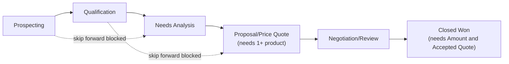

## Overview

Reps move opportunities through the sales stages from the record page, but the system enforces some hygiene
along the way: stages can't be skipped, a deal can't reach Proposal without products on it, and it can't be
marked Closed Won without a positive amount and an accepted quote. Along the way, crossing the $250,000 mark
flags the deal as a big deal for the owner, and pricing on the line items is kept in sync automatically —
using the same volume, account-tier, and margin-floor rules used everywhere else in the pipeline — so a large
blended discount gets flagged for a sales-ops review before the deal goes further.



## Prerequisites

- Standard User (or higher) profile to edit Opportunities and add Opportunity Products
- The opportunity's Account should already have a tier (Rating) set — see [[account-tiering-territory]] — since that tier feeds directly into line pricing

## Steps to Navigate

1. Open an existing Opportunity record.
2. Click the **Stage** field (or use the path component) and select the next stage.
3. Click **Save**.
4. Under the **Products** related list, click **Add Product** to attach line items before advancing past Needs Analysis.

```screenshot
id: opportunity-guardrails-stage-path
alt: Opportunity record page showing the sales stage path component
step: Open an Opportunity record and view the stage path at the top of the page
url_pattern: /lightning/r/Opportunity/{recordId}/view
actions:
  - open_record: Opportunity
```

## Use Cases

### Progress an opportunity through stages normally

1. Open an Opportunity currently in an early stage (for example, Qualification).
2. Change **Stage** to the very next stage in order (for example, Needs Analysis) and click **Save**.
3. The change saves with no errors, since it only moved one stage forward.

### Try to skip a stage (blocked)

1. Open an Opportunity in **Prospecting**.
2. Change **Stage** directly to **Needs Analysis** (skipping Qualification) and click **Save**.
3. The save is blocked with: **"Stages cannot be skipped: move one stage at a time (from Prospecting)."**
4. The rep must move it to Qualification first, save, then advance again.

### Move to Proposal without products (blocked)

1. Open an Opportunity with no Opportunity Product lines.
2. Change **Stage** to **Proposal/Price Quote** (or any later stage) and click **Save**.
3. The save is blocked with: **"Add at least one product before moving to Proposal/Price Quote."**
4. The rep adds at least one product via the Products related list, then retries the stage change.

### Close Won without an accepted quote (blocked)

1. Open an Opportunity in **Negotiation/Review** that has a positive Amount but no Quote with Status `Accepted`.
2. Change **Stage** to **Closed Won** and click **Save**.
3. The save is blocked with: **"Closed Won requires an Accepted quote on this opportunity."** (A missing/zero Amount is instead blocked with **"Closed Won requires a positive Amount."**)
4. The rep must get a quote to Accepted status (see [[quote-generation-approval]]) before Closed Won will save.

### Opportunity crosses the big-deal threshold

1. An open Opportunity's **Amount** is edited from below $250,000 to $250,000 or more.
2. On save, a task **"Big deal alert: {Opportunity Name}"** is created for the opportunity owner, due the next day, Priority High.
3. Amounts that were already at or above $250,000 before the edit don't create a duplicate task — only the crossing triggers it.

### Opportunity discount triggers an approval review

1. Products are added or repriced on an Opportunity such that the blended discount across all lines (versus list price) is large.
2. If the blended discount is over 30%, or over 20% on a deal worth more than $100,000, a task **"Discount approval needed ({pct}%): {Opportunity Name}"** is created for the owner, due the next day, Priority High, and an audit note is logged (see [[nightly-sales-operations]]).
3. This task doesn't block the opportunity itself — but the same discount threshold blocks the related **Quote** from being presented until a completed approval task exists (see [[quote-generation-approval]]).

## Validations & Business Rules

- Validation: stage changes may only move one step forward in the order Prospecting → Qualification → Needs Analysis → Proposal/Price Quote → Negotiation/Review → Closed Won (jumping straight to Closed Won from anywhere is allowed); otherwise **"Stages cannot be skipped: move one stage at a time (from {priorStage})."**
- Validation: reaching Proposal/Price Quote or later requires at least one Opportunity Product line, else **"Add at least one product before moving to {StageName}."**
- Validation: Closed Won requires a positive Amount (**"Closed Won requires a positive Amount."**) and an Accepted quote linked to the opportunity (**"Closed Won requires an Accepted quote on this opportunity."**).
- Automation: crossing the $250,000 Amount threshold (and not already closed) creates a "Big deal alert" task for the owner.
- Automation: adding or updating Opportunity Product lines automatically reprices every line on that opportunity using the pricing engine below (so stacked volume bands stay correct as quantity accumulates).
- Pricing engine (applies to opportunity lines, quote lines, and order lines alike):
  - **Volume discount** by product family and quantity — Hardware: 18% at 500+, 12% at 100+, 6% at 25+; Software/Subscription: 25% at 1,000+, 15% at 250+, 8% at 50+; all other families: 10% at 100+, 5% at 20+.
  - **Account-tier discount** (from the account's Rating): Hot +8%, Warm +4%, Cold +0%.
  - **Family adjustment**: Subscription +2%, Services −3%, others +0%.
  - Total discount is capped between 0% and 40%.
  - **Margin floor**: the final price never drops below a floor percentage of list — 75% for Services, 55% for Hardware, 60% for everything else — even if the stacked discount would otherwise go lower.
- Automation: a blended discount above 30%, or above 20% on a deal over $100,000, requires approval (creates a Task and an audit note here; blocks Quote presentation elsewhere).

```callout
type: tip
Account tier is the biggest lever most reps can influence indirectly: since it comes from the account's Annual
Revenue/Employee Count (see [[account-tiering-territory]]), keeping those fields current on the Account keeps
pricing accurate on every open opportunity for that account.
```

## Related Features

- [[account-tiering-territory]] — supplies the account tier used in the discount calculation.
- [[quote-generation-approval]] — the Accepted-quote requirement for Closed Won, and where large discounts actually block progress.
- [[opportunity-renewal-cloning]] — renewal opportunities re-enter the pipeline at Qualification and are subject to these same guardrails.
