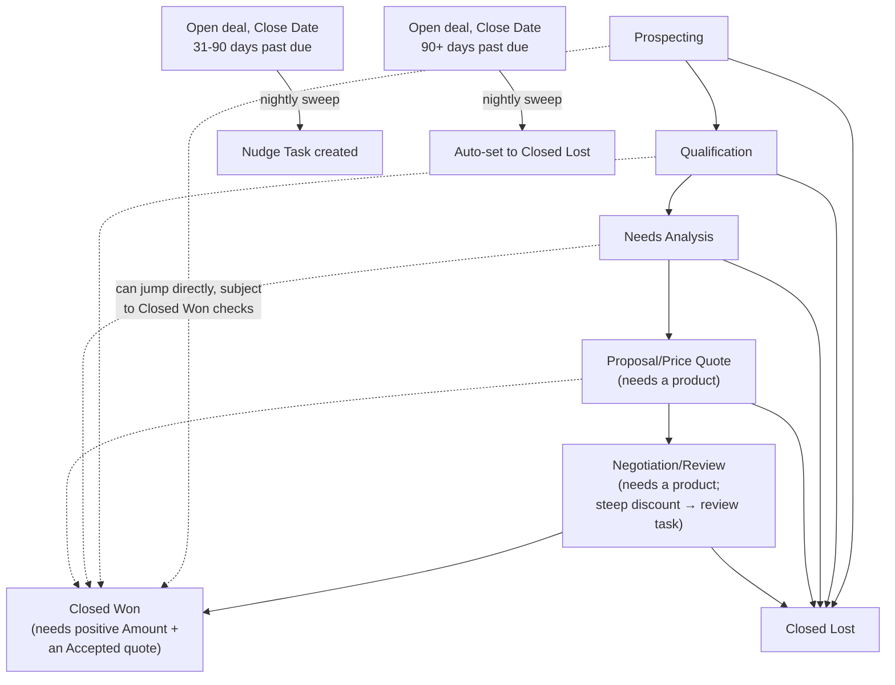

## Overview

This feature keeps the sales pipeline honest by enforcing a handful of rules directly on the Opportunity as
reps move deals forward: stages can't be skipped, products must be added before a deal reaches Proposal, and
Closed Won requires both a positive Amount and a quote the customer has actually accepted. Along the way, big
deals and steep discounts get automatically flagged for visibility (without blocking the rep), and product
line prices are automatically kept in sync with current volume/tier pricing any time products change. Deals
that sit open long after their close date passed are nudged, and eventually closed out automatically, so
stale pipeline doesn't linger in forecasts.



## Prerequisites

- Edit access to Opportunities and their product line items
- A Quote associated with the Opportunity, with its Status set to Accepted, before the deal can be marked Closed Won

## Steps to Navigate

1. Click the **App Launcher** and search for **Opportunities**.
2. Open the Opportunity record and use the **Stage** picklist (or path) to change its stage — any blocked
   transition shows an inline error explaining what's missing.

```screenshot
id: opportunity-guardrails-record-page
alt: Opportunity record page showing the Stage field and Products related list
step: Open an Opportunity record to view its Stage and Products
url_pattern: /lightning/r/Opportunity/{recordId}/view
actions:
  - open_record: Opportunity
```

## Use Cases

### Moving a deal forward one stage at a time

1. A rep advances an Opportunity from one recognized stage to the very next one (e.g. Qualification to Needs
   Analysis).
2. The change saves normally, subject to whatever other guard applies to the destination stage (products
   required, etc. — see below).

### Trying to skip a stage

1. A rep tries to jump an Opportunity more than one stage ahead in the recognized order — Prospecting,
   Qualification, Needs Analysis, Proposal/Price Quote, Negotiation/Review, Closed Won — for example jumping
   straight from Qualification to Negotiation/Review.
2. The save is blocked: *"Stages cannot be skipped: move one stage at a time (from `<PriorStage>`)."*
3. Moving an Opportunity **backward** to an earlier stage is always allowed, with no such check.
4. Jumping directly to **Closed Won** from any earlier stage is explicitly exempt from this skip check (it's
   still subject to the Closed Won requirements below).

### Entering Proposal, Negotiation, or Closed Won without products

1. A rep tries to move an Opportunity into Proposal/Price Quote, Negotiation/Review, or Closed Won, but it
   has no product line items yet.
2. The save is blocked: *"Add at least one product before moving to `<StageName>`."*

### Marking a deal Closed Won

1. A rep tries to move an Opportunity to Closed Won.
2. The save is blocked unless **both** are true: the Opportunity's **Amount** is a positive number, and it has
   a related **Quote** with **Status = Accepted**.
3. If either is missing, the corresponding error is shown (*"Closed Won requires a positive Amount."* or
   *"Closed Won requires an Accepted quote on this opportunity."*) and the stage doesn't change.
4. Moving to **Closed Lost** has no such requirements — it's unrestricted from this feature's perspective.

### A deal crosses the "big deal" threshold

1. An Opportunity's Amount is updated to **$250,000 or more**, having previously been below that (and the
   deal isn't already closed).
2. A high-priority Task ("Big deal alert…") is automatically created for the Opportunity Owner. Nothing is
   blocked — this is a visibility flag only.

### A deal's discount is reviewed on entering Negotiation

1. An Opportunity's Stage changes into **Negotiation/Review**.
2. The blended discount across its product lines is calculated. If it's over 30% (or over 20% on a deal worth
   more than $100,000), a high-priority Task ("Discount approval needed…") is created for the Opportunity
   Owner, and an audit note is logged.
3. This is advisory only at the Opportunity level — it does not block the stage change. (Discount approval is
   actually enforced later, when the related Quote is moved to Presented — see Quote Builder.)

### Product lines are automatically repriced

1. A product line is added to, or changed on, an Opportunity.
2. Every product line on that Opportunity is immediately recalculated using the same volume/tier/family
   pricing rules used for quotes (see Quote Builder) — reps can't hold onto a stale unit price once another
   line on the same deal changes the picture.

### A deal goes stale past its close date

1. An open Opportunity's **Close Date** is 31–90 days in the past.
2. A Task ("Stale deal — revive or close…") is created for the Opportunity Owner, due in 3 days. The stage
   isn't changed.
3. If the Close Date is **more than 90 days** in the past, the Opportunity is automatically moved to **Closed
   Lost** instead of just being nudged.

## Validations & Business Rules

- **No skipping stages:** blocked when the destination stage is more than one step ahead of the current stage
  in the recognized order (Prospecting → Qualification → Needs Analysis → Proposal/Price Quote →
  Negotiation/Review → Closed Won) — except a direct jump to Closed Won, which is allowed.
- **Products required** before entering Proposal/Price Quote, Negotiation/Review, or Closed Won.
- **Closed Won requires** a positive Amount and an associated Quote with Status = Accepted.
- **Big deal alert:** Amount crossing $250,000 (from below, while the deal is still open) creates a
  high-priority Task for the Owner — informational only, never blocks.
- **Discount review on Negotiation entry:** blended line discount over 30%, or over 20% on deals over
  $100,000, creates a review Task and an audit log entry when Stage changes into Negotiation/Review —
  informational only at this stage.
- **Automatic repricing:** every product line on an Opportunity is recalculated (using the same volume, tier,
  and family rules as Quote Builder) whenever any line on that Opportunity is inserted or updated.
- **Stale-deal sweep** (nightly): open deals with a Close Date 31–90 days overdue get a reminder Task; deals
  overdue by more than 90 days are automatically set to Closed Lost.
- All the blocking rules above surface as standard save errors; the alert/review/stale Tasks are Salesforce
  Tasks assigned to the Opportunity Owner, visible in the Opportunity's Activity related list.

## Related Features

- Quote Builder — shares the same pricing engine, and its Accepted-quote requirement is what actually gates Closed Won.
- Account Territory & Tiering — an account's tier (Rating) feeds the customer-tier discount used when repricing Opportunity products.
