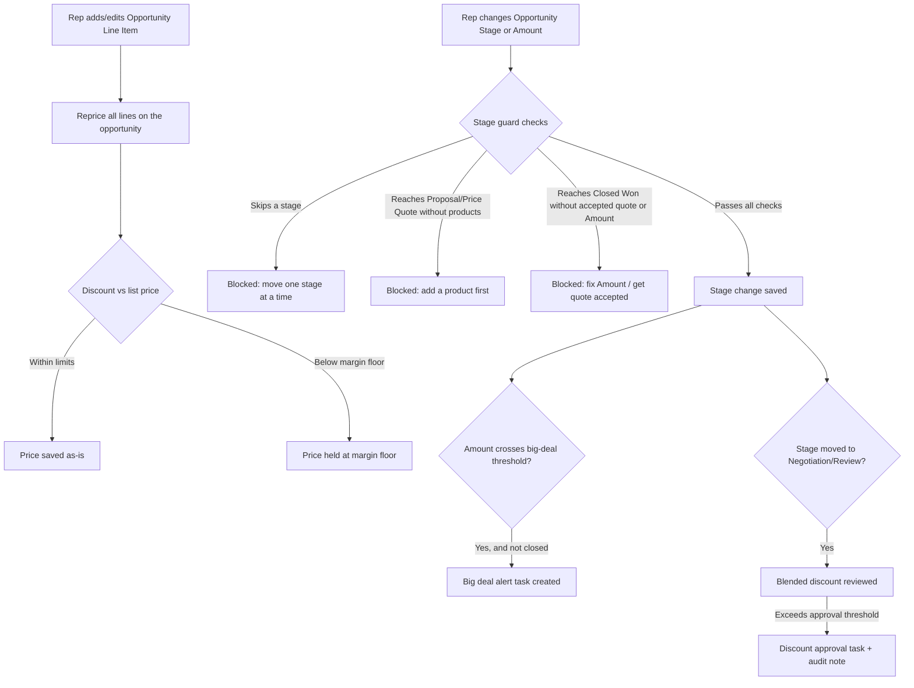

## Overview

This feature keeps opportunity pricing, pipeline forecasting, and stage discipline consistent without
manual policing by sales operations. Whenever a sales rep adds or changes products on an opportunity,
the system automatically reprices every line through the shared pricing rules so volume, customer-tier,
and margin-floor discounts are always applied the same way. Separately, whenever an opportunity's stage
or amount changes, a set of guardrails runs before the record saves: big deals are flagged for leadership
visibility, heavily discounted deals are routed for approval, and stage moves are blocked if they skip
steps, lack products, or lack an accepted quote. Sales reps see the effect of these rules as validation
errors, automatically-created approval tasks, and updated unit prices — not as anything they configure.



## Prerequisites

- Profile or permission set with edit access to Opportunities and Opportunity Products.
- Pricebook entries must have a Product2 with a **Family** value (Hardware, Software, Subscription,
  Services) — pricing and margin-floor rules are keyed off this field.
- Account **Rating** (Hot/Warm/other) should be set for accounts that qualify for a tier discount.
- A quote approval process must exist so `Closed Won` can be validated against an accepted quote.

```callout
type: note
These rules run automatically on save — there is no setup screen for sales reps. This page documents
what to expect and how to work around the validation errors it produces.
```

## Steps to Navigate

1. Open an **Opportunity** record.
2. Go to the **Products** related list and click **Add Product** (or edit an existing line's **Quantity**).

```screenshot
id: opportunity-pricing-add-product
alt: Opportunity Products related list with the Add Product button visible
step: Open an Opportunity and view the Products related list
url_pattern: /lightning/r/Opportunity/{recordId}/view
```

3. Enter a **Quantity** and **Sales Price** (or leave Sales Price blank to accept list price), then click **Save**.
4. Reopen the Products related list — the **Sales Price** may differ from what was entered if a volume,
   tier, or margin-floor rule adjusted it.
5. To change stage, open the opportunity and update the **Stage** field via the path or the record detail.

```screenshot
id: opportunity-pricing-stage-path
alt: Opportunity stage path showing the current stage and next stage option
step: Open an Opportunity and view the stage path at the top of the record
url_pattern: /lightning/r/Opportunity/{recordId}/view
```

6. Click **Save**. If a stage-guard rule blocks the change, an error banner appears on the field or page
   explaining what must be fixed first.

## Use Cases

### Automatic repricing when products are added

1. Rep adds a line item with Quantity 150 for a Hardware product priced at $1,000 list.
2. On save, `OpportunityLineItemTriggerHandler` detects the new line and calls
   `OpportunityPricingService.repriceOpportunities` for the opportunity.
3. The service looks up the account's tier (via `Account.Rating`) and re-runs every line on the
   opportunity through `PriceRuleEngine` — not just the newly added one — so quantity bands that only
   become valid once totals add up are applied consistently.
4. The 12% volume discount for 100+ Hardware units is applied, plus any tier discount, and the result is
   capped at 40% combined discount before the margin floor is checked.
5. Only lines whose computed unit price actually changed are updated, and this update is done with the
   Opportunity Product trigger bypassed so it does not recursively re-fire the repricing logic.

### Margin floor protects a deeply discounted line

1. Rep manually discounts a Services line far below list price, or stacked volume/tier discounts would
   push the price down aggressively.
2. `PriceRuleEngine` computes the stacked discount, then checks it against the family's margin floor —
   75% of list for Services, 55% for Hardware, 60% for everything else.
3. If the discounted price would fall below that floor, the price is held at the floor price instead,
   and the result is marked as floored so downstream reporting can flag it as a margin exception.

### Big deal flagged for leadership visibility

1. Rep updates an open opportunity's **Amount** to $260,000, crossing the $250,000 big-deal threshold for
   the first time (it was previously below the threshold or blank).
2. `OpportunityForecastService.flagBigDeals` detects the crossing on save and creates a **Task** — "Big
   deal alert" — assigned to the opportunity owner, due the next day.
3. The alert only fires once per crossing: if the amount is edited again while still above the threshold,
   no duplicate task is created. Closed opportunities are excluded even if their Amount is above the
   threshold.

### Stage blocked for skipping steps

1. Rep tries to move an opportunity directly from **Qualification** to **Negotiation/Review**, skipping
   **Needs Analysis** and **Proposal/Price Quote**.
2. `OpportunityStageGuardService.enforce` runs in before-update, detects the stage jump is more than one
   step, and adds a validation error: "Stages cannot be skipped: move one stage at a time."
3. The record does not save. The rep must advance the opportunity one stage at a time (moving straight to
   **Closed Won** is exempt from this specific check, but is still subject to the Closed Won checks below).

### Stage blocked for missing products

1. Rep tries to move an opportunity to **Proposal/Price Quote** (or any later stage) with no Opportunity
   Line Items on the record.
2. The stage guard checks for at least one line item and, finding none, adds an error: "Add at least one
   product before moving to Proposal/Price Quote."
3. Rep adds a product on the Products related list, then retries the stage change.

### Stage blocked for missing accepted quote or Amount at Closed Won

1. Rep tries to move an opportunity to **Closed Won**.
2. Two checks run together: the **Amount** must be a positive number, and the opportunity must have at
   least one quote in **Accepted** status (checked via `QuoteApprovalService`).
3. If either check fails, the record is blocked with the corresponding error ("Closed Won requires a
   positive Amount." and/or "Closed Won requires an Accepted quote on this opportunity.") and the rep must
   resolve both before the stage change can be saved.

### Discount approval triggered on move to Negotiation/Review

1. Rep moves an opportunity's stage to **Negotiation/Review** for the first time.
2. In after-update, `OpportunityDiscountApprovalService.reviewDiscounts` calculates the blended discount
   across all line items on the opportunity (list total vs. sold total).
3. If the blended discount exceeds 30%, or exceeds 20% on a deal over $100,000, a **Task** — "Discount
   approval needed" — is created for the opportunity owner, and an audit note is recorded via
   `SalesOpsAuditService`.
4. If the rep later moves the opportunity out of and back into Negotiation/Review, the discount review
   runs again and can create another approval task if the discount is still over the threshold.
5. This is a notification/audit mechanism, not a hard block — the opportunity itself is not prevented from
   saving while an approval task is outstanding.

## Validations & Business Rules

- Entry points: `OpportunityTrigger` fires on Opportunity **before update** and **after update** (not on
  insert) and delegates to `OpportunityTriggerHandler`; `OpportunityLineItemTrigger` fires on Opportunity
  Line Item **after insert** and **after update** and delegates to `OpportunityLineItemTriggerHandler`.
  Both handlers exit immediately if their object's automation is bypassed via `TriggerControl`.
- Automation (before-update trigger, `OpportunityStageGuardService`):
  - Stage cannot advance more than one step at a time (exception: jumping straight to Closed Won bypasses
    the skip check, but not the Closed Won-specific checks).
  - Reaching **Proposal/Price Quote** or later requires at least one Opportunity Line Item.
  - Reaching **Closed Won** requires a positive **Amount** and at least one **Accepted** quote.
- Automation (after-update trigger, `OpportunityForecastService`): a "Big deal alert" Task is created the
  first time an open opportunity's Amount crosses $250,000; it does not re-fire on subsequent edits above
  the threshold, and never fires for closed opportunities.
- Automation (after-update trigger, `OpportunityDiscountApprovalService`): moving into **Negotiation/Review**
  triggers a blended-discount check; a discount approval Task and audit note are created when the discount
  exceeds 30%, or exceeds 20% on deals over $100,000 (thresholds owned by `PriceRuleEngine.requiresApproval`).
- Automation (after-insert/update trigger on Opportunity Line Item, `OpportunityLineItemTriggerHandler`):
  any line item add or edit triggers a full reprice of every line on the opportunity via
  `OpportunityPricingService`, so quantity-band discounts stay correct as totals change.
- Pricing rules (`PriceRuleEngine`), applied in order and shared with quotes and orders:
  1. Volume discount by quantity band, per product family (Hardware, Software/Subscription, other).
  2. Customer-tier discount from `Account.Rating` (Hot = 8%, Warm = 4%).
  3. Product-family strategic adjustment (Subscription +2%, Services −3%).
  4. Combined discount is capped at 40%, then the margin floor is enforced (75% of list for Services, 55%
     for Hardware, 60% for everything else) — the final price never drops below the floor regardless of
     stacked discounts.
- All of the above trigger logic can be bypassed via `TriggerControl` (used internally, e.g. by the pricing
  service when writing back adjusted prices) so automated updates don't recursively re-trigger themselves.

## Related Features

- Quote generation and approval — the accepted-quote check that gates the Closed Won stage move is enforced
  by the quote approval process referenced above.
- Order and line-item pricing on other Lead-to-Cash objects share the same `PriceRuleEngine` used here.
