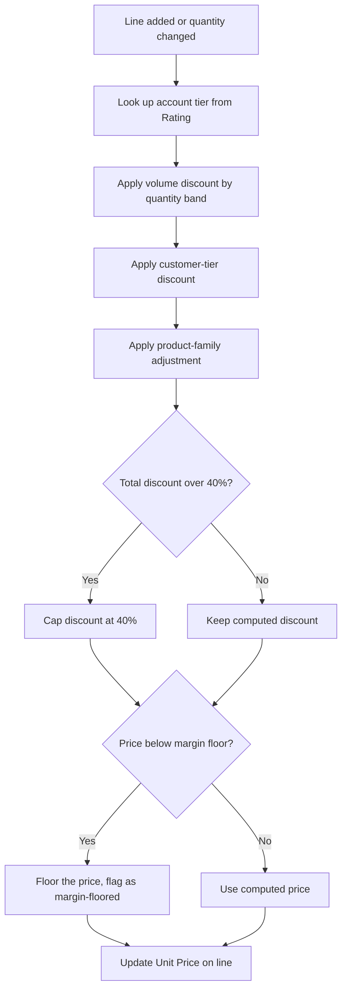
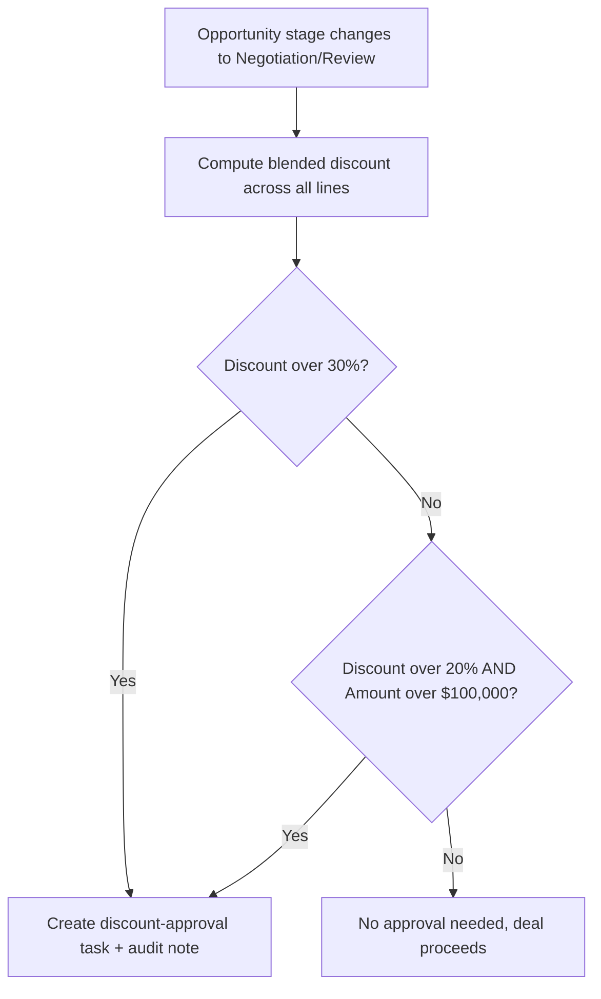

## Overview

This feature keeps opportunity pricing, forecasting, and stage progression consistent without
sales reps doing manual math. Whenever products are added or changed on an opportunity, prices are
automatically recalculated using the same pricing engine used for quotes and orders, so the numbers
never drift between what's on the deal and what ends up on a quote. As deals grow or discount deeply,
the system quietly does two other things: it alerts leadership when a deal crosses a "big deal"
dollar threshold, and it flags deep discounts for approval when the opportunity enters
Negotiation/Review. It also stops reps from skipping stages or closing a deal that isn't actually
ready. Sales reps, sales managers, and deal desk/approval staff all interact with the results of this
automation, even though none of it requires a manual click to run — it fires on save.

## Prerequisites

- Standard access to Opportunities and the Products related list
- Account tier is read from the Account's **Rating** field — set it before adding products if tier
  discounts should apply
- A Quote record linked to the opportunity, with **Status = Accepted**, is required before the
  opportunity can be set to Closed Won

## Steps to Navigate

1. Open an **Opportunity** record.
2. Scroll to the **Products** (Opportunity Line Items) related list.
3. Click **Add Product**, choose a product from the price book, enter **Quantity** and confirm the
   **Sales Price**, then click **Save**.
4. Pricing recalculates automatically after save — no further action is needed to see the updated
   **Sales Price** on the line.

```screenshot
id: opportunity-pricing-products-related-list
alt: Opportunity record page showing the Products related list with line items and their sales prices
step: Open an Opportunity record and scroll to the Products related list
url_pattern: /lightning/r/Opportunity/{recordId}/view
```

5. To advance the deal, change the **Stage** field on the opportunity and click **Save**.

```screenshot
id: opportunity-pricing-stage-field
alt: Opportunity record page with the Stage picklist open, showing available stage values
step: Open the Stage field dropdown on an Opportunity record
url_pattern: /lightning/r/Opportunity/{recordId}/view
actions:
  - open_record: Opportunity
```

## Use Cases

### Standard reprice when a product is added

1. Rep adds a new product line (or edits quantity) on an open opportunity.
2. `OpportunityLineItemTriggerHandler` fires after the line save, collects the opportunity Ids, and
   calls `OpportunityPricingService.repriceOpportunities`.
3. For every line on the opportunity, the engine looks up the account's tier (from `Account.Rating`)
   and applies, in order: a volume discount banded by quantity and product family, a customer-tier
   discount, a product-family strategic adjustment, then caps the total discount at 40% and never
   lets the price fall below the product family's margin floor (75% of list for Services, 55% for
   Hardware, 60% for everything else).
4. Only lines whose computed Unit Price actually changed are updated, and the update is done with
   the Opportunity Line Item trigger bypassed so it doesn't loop back into another reprice.
5. The rep sees the new **Sales Price** on the line moments after saving — no manual repricing step
   is needed.



### Deal crosses the big-deal threshold

1. A field update on the opportunity (e.g. Amount increases via a repricing update or a manual
   edit) pushes **Amount** to $250,000 or more, where it was below that threshold before the update.
2. `OpportunityForecastService.flagBigDeals` detects the crossing and, as long as the opportunity
   isn't already closed, creates a **Task** ("Big deal alert: <Opportunity Name>") assigned to the
   opportunity owner, due the next day, with High priority.
3. The alert only fires once — on the update where Amount *crosses* the threshold, not on every
   subsequent save while it stays above $250,000.
4. If the opportunity is already closed (won or lost) when the threshold is crossed, no alert task
   is created.

### Deep discount triggers approval on entering Negotiation/Review

1. Rep moves the opportunity's **Stage** to **Negotiation/Review**.
2. `OpportunityTriggerHandler` detects the stage change into Negotiation/Review (not out of it, and
   not on opportunities that were already in that stage) and calls
   `OpportunityDiscountApprovalService.reviewDiscounts`.
3. The service computes a blended discount percentage across all of the opportunity's line items
   (comparing total list price implied by each line to its actual sold total).
4. If the blended discount is **over 30%**, or **over 20% and the opportunity Amount is over
   $100,000**, a **Task** ("Discount approval needed (X%): <Opportunity Name>") is created for the
   opportunity owner, and the request is recorded via `SalesOpsAuditService` for audit history.
5. If the blended discount is within policy, no approval task is created and the rep sees nothing
   extra — the deal proceeds normally.



### Stage-skip prevented

1. Rep tries to jump the **Stage** field more than one step forward at once (for example,
   Prospecting straight to Proposal/Price Quote, skipping Qualification and Needs Analysis).
2. `OpportunityStageGuardService.enforce` runs in the before-update context, detects the gap, and
   blocks the save with the error: *"Stages cannot be skipped: move one stage at a time (from
   <prior stage>)."*
3. Jumping straight to **Closed Won** from any earlier stage is exempt from this one-step rule (a
   deal can be closed won without walking every intermediate stage) but is still subject to the
   quote and amount checks below.
4. The rep corrects the Stage value to the next stage in sequence and saves again.

### Blocked: advancing to Proposal without products

1. Rep tries to move Stage to **Proposal/Price Quote** (or any stage at or beyond it) while the
   opportunity has zero Opportunity Line Items.
2. The guard blocks the save with: *"Add at least one product before moving to
   <target stage>."*
3. Rep adds at least one product on the Products related list, then changes Stage again — the check
   passes once a line item exists.

### Blocked: Closed Won without an accepted quote or a positive Amount

1. Rep sets Stage to **Closed Won** on an opportunity that has no **Quote** with **Status =
   Accepted** related to it.
2. The guard blocks the save with: *"Closed Won requires an Accepted quote on this opportunity."*
3. Separately, if **Amount** is blank or zero (or negative), the save is also blocked with:
   *"Closed Won requires a positive Amount."* Both checks are independent — either failure alone
   blocks the save.
4. Rep (or deal desk) marks the correct Quote as Accepted and/or corrects the Amount, then retries
   Closed Won — the save succeeds once both conditions are satisfied.

## Validations & Business Rules

- Automation: `OpportunityLineItemTriggerHandler` (after insert/update on Opportunity Line Item)
  calls `OpportunityPricingService.repriceOpportunities`, which reprices every line on the affected
  opportunities via `PriceRuleEngine`.
- Pricing rule (`PriceRuleEngine`): stacked discount = volume band (by product family and quantity)
  + tier discount (Hot = 8%, Warm = 4%) + family adjustment (Subscription +2%, Services −3%),
  capped at 40% total, then floored so price never drops below 75% of list for Services, 55% for
  Hardware, or 60% for all other families.
- Automation: `OpportunityTriggerHandler.afterUpdate` calls `OpportunityForecastService.flagBigDeals`
  on every update, creating a High-priority Task when Amount crosses $250,000 on an opportunity that
  isn't closed.
- Automation: `OpportunityTriggerHandler.afterUpdate` calls
  `OpportunityDiscountApprovalService.reviewDiscounts` only when Stage changes *into*
  Negotiation/Review, creating an approval Task and audit note when blended discount exceeds 30%
  (or exceeds 20% on deals over $100,000 Amount).
- Validation (`OpportunityStageGuardService`, before-update): Stage cannot advance more than one
  step at a time, except a direct jump to Closed Won.
- Validation: Stage cannot reach Proposal/Price Quote (or later) without at least one Opportunity
  Line Item.
- Validation: Stage cannot be set to Closed Won unless there is an Accepted Quote linked to the
  opportunity.
- Validation: Stage cannot be set to Closed Won unless Amount is a positive value.
- All of this trigger logic can be bypassed via `TriggerControl` (e.g. by data migration or
  integration jobs) — if automation appears not to have run, check whether the Opportunity or
  Opportunity Line Item trigger was bypassed for that operation.

## Related Features

- Quote lifecycle and approval — governs the Accepted Quote required to close a deal
- Order and pricing on down-stream Orders, which reuse the same `PriceRuleEngine`
